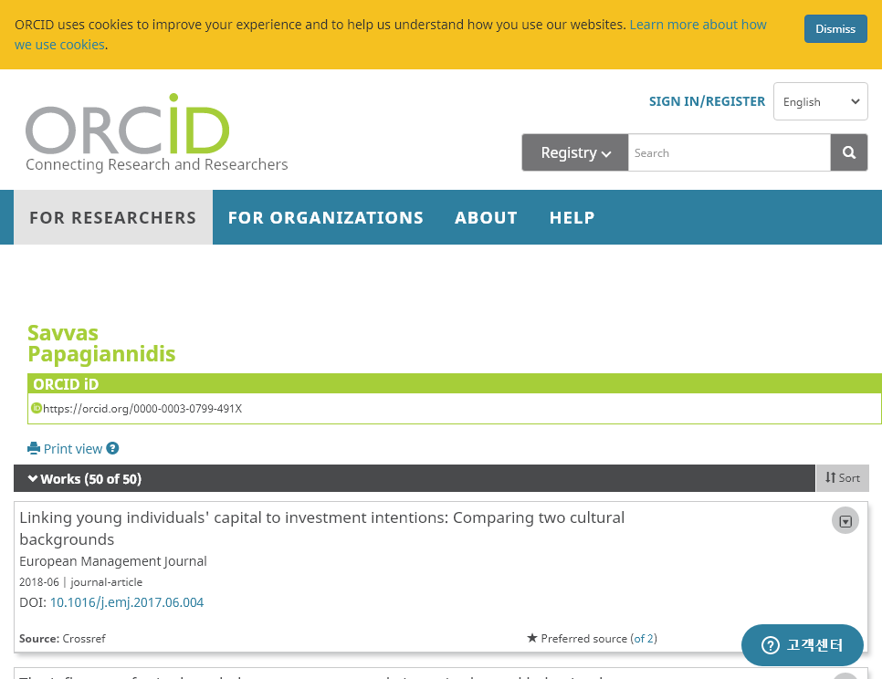

```{r setup, include=FALSE}
knitr::opts_chunk$set(echo = TRUE, message=FALSE, warning=FALSE,
                      comment="", digits = 3, tidy = FALSE, prompt = FALSE, fig.align = 'center')

library(tidyverse)
```


# ORCID [^ORCID] [^rorcid-walkthrough] {#orcid-identifier}

[^ORCID]: [Paul Oldham (2018/07/13), Introduction to ORCID Researcher Identifiers in R with rorcid](https://www.pauloldham.net/introduction-to-orcid-with-rorcid/)

[^rorcid-walkthrough]: [Clarke Iakovakis, rorcid walkthrough, FSCI 2020 W24 Session ](https://ciakovx.github.io/rorcid.html)

ORCID(영어: Open Researcher and Contributor ID)는 과학자와 다른 학문 저작자를 인식하기 위한 비영리 숫자 코드로 디지털 객체 식별자(DOI, Digital Object Identifier)와 비슷한 역할을 한다.

- rOpenSci [`fulltext`](https://docs.ropensci.org/fulltext/index.html)
- [`rorcid`](https://github.com/ropensci/rorcid): 과학자와 다른 학문 저작자를 인식하기 위한 비영리 숫자 코드

## ORCID API {#orcid-api}

`rorcid` 팩키지를 설치하게 되면 `orcid_auth()` 명령어를 통해서 API KEY를 획득하게 된다.
`[1] "Bearer XXXXXXXXXXXXXXXXXXXXXX"` 에서 `XXXXXXXXXXXXX`에 해당되는 문자를 복사하여 `usethis::edit_r_environ()` 명령어로 `.Renviron` 파일에 API KEY를 `ORCID_TOKEN="4dsw1e14-7212-4129-9f07-aaf7b88ba88f"`와 같이 저장시켜둔다.

```{r rorcid-api}
library(tidyverse)
library(rorcid)

orcid_auth(reauth = TRUE)

# orcid_auth()
# 
# no ORCID token found; attempting OAuth authentication
# 
# Adding .httr-oauth to .gitignore
# Waiting for authentication in browser...
# Press Esc/Ctrl + C to abort
# Authentication complete.
# 
# [1] "Bearer XXXXXXXXXXXXXXXXXXXXXX"

# usethis::edit_r_environ()
# ORCID_TOKEN="4dsw1e14-7212-4129-9f07-aaf7b88ba88f"
```

## 헬로 월드 {#hello-world-orcid}

[Mohsen Attaran](https://scholar.google.com/citations?user=v2_17kMAAAAJ)를 특정하여 과학자 정보를 특정해보자.
`orcid_search()` 함수에 성과 이름을 통해서 `orcid`를 특정할 수 있다. 특별한 정보를 찾을 수 없다.

```{r rorcid-api-helloworld}
mohsen_attaran <- rorcid::orcid_search(given_name = "Mohsen",  family_name = "Attaran")
mohsen_attaran
```

Smart offices 관련 논문[@papagiannidis2020smart]을 Newcastle University Business School의 Savvas Papagiannidis 교수가 저술했기에 이에 대한 내용을 찾아보자.


```{r rorcid-api-helloworld2}
papagiannidis <- rorcid::orcid_search(given_name = "Savvas",  family_name = "Papagiannidis")
papagiannidis
```

[Savvas Papagiannidis, ORCID iD](https://orcid.org/0000-0003-0799-491X)를 웹브라우져를 통해 확인이 가능하다.

```{r check-papagiannidis}
# webshot2::webshot(url = "https://orcid.org/0000-0003-0799-491X", file = "fig/papagiannidis.png")

```

# 과학연구자 프로필 {#orcid-identifier-go-deeper}

`rorcid::browse(papagiannidis$orcid)` 명령어를 통해 관련 내용을 좀더 깊이 들어갈 수 있다.
특별한 정보가 하들리 위컴(Hadley Wickham)으로 바꿔 한걸음 더 들어가보자.

```{r hadley-wickham-orcid}
hadley <- orcid_search(given_name = "hadley", family_name = "wickham")
#   first  last    orcid              
#   <chr>  <chr>   <chr>              
# 1 Hadley Wickham 0000-0003-4757-117X

hadley_list <- rorcid::orcid_person(hadley$orcid)

listviewer::jsonedit(hadley_list)
```

상기 정보를 통해 개인 프로필을 작성할 수 있다. 꼭 필요하다고 생각되는 값만 추출하여 데이터프레임으로 작성한다. `purrr::pluck` 함수를 사용해서 꼭 필요한 Attribute 만 추출하여 데이터프레임으로 제작한다.

```{r hadley-wickham-about}
hadley_df <- hadley_list %>% {
    dplyr::tibble(
      created_date = purrr::map_dbl(., purrr::pluck, "name", "created-date", "value", .default=NA_character_),
      given_name = purrr::map_chr(., purrr::pluck, "name", "given-names", "value", .default=NA_character_),
      family_name = purrr::map_chr(., purrr::pluck, "name", "family-name", "value", .default=NA_character_),
      orcid_identifier_path = purrr::map_chr(., purrr::pluck, "name", "path", .default = NA_character_),
      biography = purrr::map_chr(., purrr::pluck, "biography", "content", .default=NA_character_),
      emails = purrr::map(., purrr::pluck, "emails", "email", "email", .default=NA_character_),
      keywords = purrr::map(., purrr::pluck, "keywords", "keyword", "content", .default=NA_character_),
      researcher_urls = purrr::map(., purrr::pluck, "researcher-urls", "researcher-url", "url.value",  .default=NA_character_)
    )
  } %>% 
  mutate(created_date = as.POSIXct(created_date /1e3, tz = "UTC", origin="1970-01-01 00:00:00" ))

hadley_df %>% 
  unnest(researcher_urls)
```

`rorcid::works()` 함수를 사용해서 과학연구자 해들리 위컴이 저술한 논문에 대해 추출하여 정리한다.

```{r hadley-works}
hadley_works <- rorcid::works(hadley$orcid)

hadley_works_df <- hadley_works %>% 
  as.data.frame() %>% 
  janitor::clean_names() %>% 
  select(put_code, type, date = publication_date_year_value, journal = journal_title_value, 
         title = title_title_value, doi = url_value) %>% 
  mutate(doi = str_remove(doi, "https://doi.org/")) %>% 
  as_tibble() %>% 
  arrange(desc(date))

hadley_works_df
```

# `tidyverse` 관련 논문 {#tidyverse-papers}

해드리 위컴이 `tidyverse` 생태계 구축에 지대한 영향을 미쳤기 때문에 관련 논문을 찾아 공저자를 찾아보자.
"Welcome to the Tidyverse"[@Wickham2019] 논문을 시작점으로 시작해보자. 먼저, DOI가 "10.21105/joss.01686"이라 함께 작업한 공저자를 찾아낸다. 

```{r tidyverse-ecosystem}
orcid(query = 'digital-object-ids:"10.21105/joss.01686"') 
```


다른 방식은 논문 제목을 "Welcome to the Tidyverse" 동일하게 `query = `에 넣어 확인한다.

```{r tidyverse-ecosystem-search}
tidyverse_orcid <- orcid(query = 'work-titles:"Welcome to the Tidyverse"')
tidyverse_orcid
```


# `tidyverse` 공동저자 {#tidyverse-papers-coworkers}

`tidyverse` 논문 저작에 참여한 공저자를 함께 찾아보자. 
"Welcome to the Tidyverse" 논문저작에 참여한 공저자의 ORCID를 추출하여 앞서 해들리 위컴과 마찬가지로 정보를 추출한다.

```{r tidyverse-coworkers}
tidyverse_team <- rorcid::orcid_person(tidyverse_orcid$`orcid-identifier.path`)

listviewer::jsonedit(tidyverse_team)
```

추출한 데이터가 JSON에 기반한 리스트 형식 데이터라 이를 데이터프레임으로 변환시킨다.

```{r json-to-dataframe}
tidyverse_member_info <- tidyverse_team %>% {
    dplyr::tibble(
      created_date = purrr::map_dbl(., purrr::pluck, "name", "created-date", "value", .default=NA_character_),
      given_name = purrr::map_chr(., purrr::pluck, "name", "given-names", "value", .default=NA_character_),
      family_name = purrr::map_chr(., purrr::pluck, "name", "family-name", "value", .default=NA_character_),
      orcid_identifier_path = purrr::map_chr(., purrr::pluck, "name", "path", .default = NA_character_),
      biography = purrr::map_chr(., purrr::pluck, "biography", "content", .default=NA_character_),
      researcher_urls = purrr::map(., purrr::pluck, "researcher-urls", "researcher-url", .default=NA_character_),
      emails = purrr::map_chr(., purrr::pluck, "emails", "email", "email", .default=NA_character_),
      keywords = purrr::map(., purrr::pluck, "keywords", "keyword", "content", .default=NA_character_),
      external_ids = purrr::map(., purrr::pluck, "external-identifiers", "external-identifier", .default=NA_character_)
    )
  } %>%
  dplyr::mutate(created_date = anytime::anydate(created_date/1000)) %>% 
  arrange(created_date)
tidyverse_member_info
```

