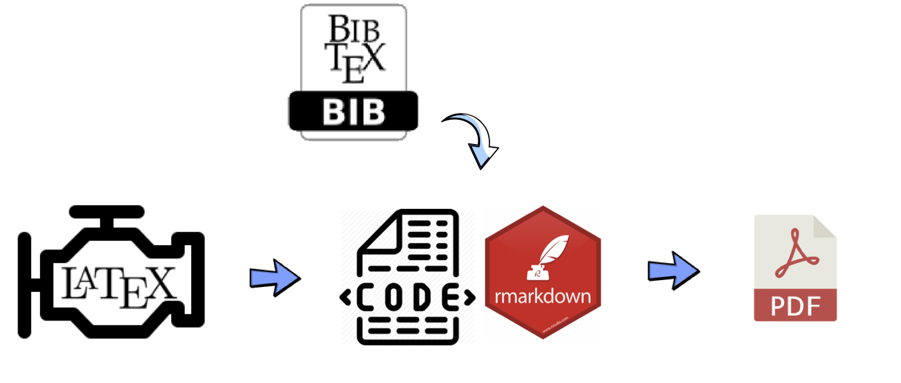
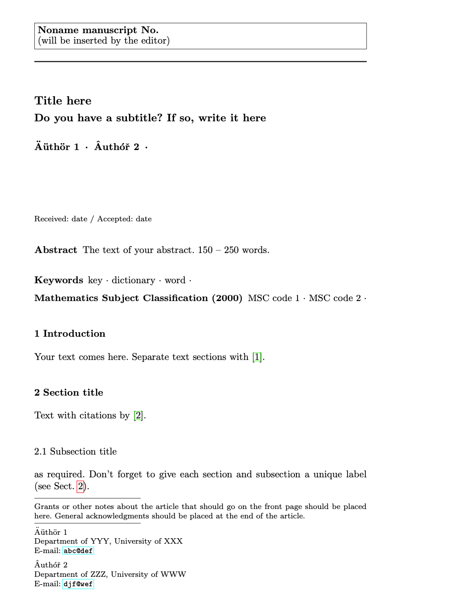
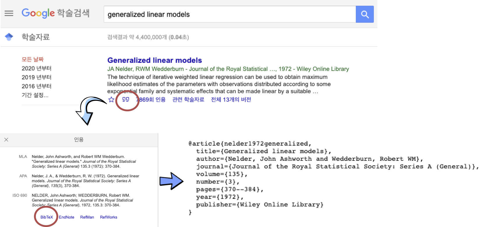
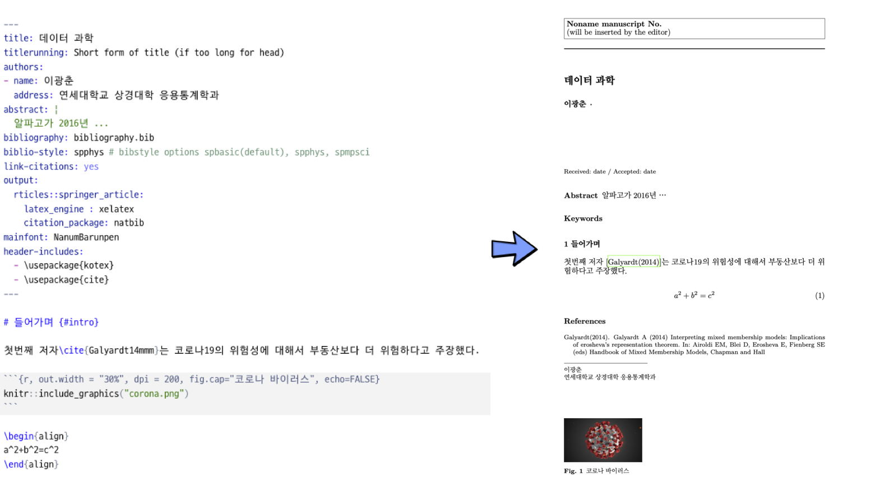

```{r setup2, include=FALSE}
knitr::opts_chunk$set(echo = TRUE, message=FALSE, warning=FALSE,
                      comment="", digits = 3, tidy = FALSE, prompt = FALSE, fig.align = 'center')

library(reticulate)
# use_condaenv("anaconda3")
# reticulate::repl_python()
```

# 보고서 &rarr; 논문 {#report-to-paper}

[한국디지털경영학회](http://kasdba.or.kr/)는 "21세기 혁신적인 디지털 전환기에 디지털경영에 대한 다양한 이론과 실무 연구를 통하여 디지털경영에 관한 이론과 실제적 지식을 개발하여 새로운 학문발전에 기여하고, 산업계 및 정부에 디지털 전환의 전략적 방향성을 제시하고자 창립되었다"고 설립목적을 밝히고 있다. 투고할 학술지를 선택한 후에 발표할 논문이 준비되었다면 이를 투고할 수 있는 형식으로 바꾸는 방법을 살펴보자.

- [블로그: ~~로봇~~ 자동화가 빼앗는 일자리 그리고 나](https://statkclee.github.io/ds-authoring/ds-bundang-2019.html)
- [한국디지털경영학회 투고 논문 ](https://github.com/statkclee/comp_document/blob/gh-pages/tutorial/paper/paper.pdf)
- [한국디지털경영학회 게재 논문](http://journal.kasdba.or.kr/journal/article.php?code=70468&vol=6&no=2&start_page=39&end_page=50): [**다운로드**](data/00006_002_39.pdf)
    - Lee Kwang-Chun,Yong-Woo Joo (2020), "Competitive Factors and Collaboration Methods for Jobs between People and AI", Digital Management Review Vol.6 No.2 pp.39-50
    - 이광춘, 주용우 (2020), "사람과 인공지능의 일자리 경쟁 요인과 협업 방안" 디지털경영연구 Vol.6 No.2 pp.39-50 
    
    
{#id .class width="100%"}

목표를 정리하면 `이광춘, 주용우 (2020), "자동화에 따른 노동시간 변화 분석", 한국디지털경영학회`와 같이 논문을 게시하는 것이다.


# `.Rmd`기반 논문 제작 아키텍처 {#rmd-paper-architecture}

`.Rmd`기반 아키텍처는 $\LaTeX$을 엔진으로 삼아 R마크다운으로 literate programming으로 기계코드와 일반 텍스트를 뒤섞어서 제작한다. 논문을 구성하는 다양한 요소 중 참고문헌을 위해서 $BibTeX$을 통해 서지관리를 한다. $\LaTeX$ 환경설정 관련 참고 문서로 다음이 있다.

- [Computational Document: $\LaTeX$ PDF 문서](https://statkclee.github.io/comp_document/comp_doc_pdf.html)
- [유닉스 환경 한글 LaTeX 사전준비](https://statkclee.github.io/comp_document/latex.html)
- [`rocker` 도커 컨테이너](https://statkclee.github.io/comp_document/cd-docker-rstudio.html)

{#id .class width="57%"}

```{r yaml-rmd, eval=FALSE}
---
title: "사람과 기계 일자리 경쟁 요인과 협업 방안"
subtitle: 
titlerunning: 
authorrunning: 
authors: 
- name: 이광춘
  address: 연세대학교 상경대학 응용통계학과
  email: kwangchun.lee.7@gmail.com
- name: 주용우
  address: 연세대학교 상경대학 응용통계학과
  email: yongwoo96@yonsei.ac.kr
keywords:
- 자동화
- 데이터 과학
- 인공지능
- 일자리
- 기계와 사람의 업무분장
abstract: |
  알파고가 2016년 바둑 인간 챔피언 이세돌 9단을 현격한 기량차이로 격파하면서 인공지능에 대한 
  관심이 급격히 증가하였다. 그와 동시에 기계가 인간의 일자리 잠식을 가속화하면서 막연한 불안감이 
  삽시간에 전파되었다. 기계와의 일자리 경쟁은 컴퓨터의 출현이전부터 시작되었지만 인간만의
  고유한 영역으로 알고 있던 인지, 창작 등 다양한 분야에서 오히려 인간보다 더 우수한 
  성능과 저렴한 가격 경쟁력을 보여주면서 기존 인간의 일자리가 기계에 대체되는 것이 가시권에 들었다.
  이번 문헌조사와 실증 데이터 분석을 통해서 기계가 인간의 일자리를 대체하는 자동화의 본질에
  대해서 살펴보고, 인간과 기계의 업무 분장을 통해 더 생산성을 높일 수 있는 방안을 제시하고자 한다.
bibliography: bibliography.bib
biblio-style: spmpsci # bibstyle options spbasic(default), spphys, spmpsci
link-citations: yes
output: 
  rticles::springer_article:
    latex_engine : xelatex
    citation_package: natbib
mainfont: NanumBarunpen
header-includes:
  - \usepackage{kotex}
  - \usepackage{cite}
editor_options: 
  chunk_output_type: console
---
```

# 논문 - 헬로월드 {#yaml-header}

YAML 헤더에 해당 R마크다운 문서가 목표를 `PDF` 파일로 논문을 작성한다고 명시한다.
먼저, [`rticles`: LaTeX Journal Article Templates for R Markdown](https://github.com/rstudio/rticles)을 팩키지로 사용하게 되면 투고하고자 하는 저널에 템플릿을 받아 바로 논문제작에 몰입할 수 있다. 이를 위해서 `rticles` 팩키지를 설치한다. `rticles` 팩키지를 설치하게 되면 RStudio 개발도구에서 `File &rarr; New file &rarr; R Markdown...`으로 이동하게 되면 ACM을 비록하여 통계학과 데이터 과학 관련 주요 학술지에 대한 논문 템플릿을 설정하여 저작을 시작할 수 있다.

- ACM articles
- ACS articles
- AEA journal submissions
- AGU journal submissions
- AMS articles
- ...
- Taylor & Francis articles

{#id .class width="57%"}

아래와 같은 `rticles::springer_article`을 선택하게 되면 아래와 같은 YAML 헤더가 자동으로 선택된다. 가벼운 마음으로 뜨게질(`Ctrl + Shift + K`)하게 되면 그럴듯한 PDF 논문이 제작된다. 이제 논문에 대한 헬로월드를 찍게 되면 다음으로 넘어갈 수 있게 된다.

```{r rticles, eval = FALSE}
---
title: Title here
subtitle: Do you have a subtitle? If so, write it here
titlerunning: Short form of title (if too long for head)
authorrunning: Short form of author list if too long for running head
thanks: | 
    Grants or other notes about the article that should go on the front 
    page should be placed here. General acknowledgments should be placed at the
    end of the article.

authors: 
- name: Äüthör 1
  address: Department of YYY, University of XXX
  email: abc@def
  
keywords:
- key
- dictionary
- word

abstract: |
  The text of your abstract.  150 -- 250 words.

bibliography: bibliography.bib
bibstyle: spphys
output: rticles::springer_article
---
```

{#id .class width="57%"}

# 한국어 논문 {#paper-korean}

논문을 한국어 학술지에 맞춰 형태를 갖추기 위해서 몇가지 점에 대해 기본적인 설정을 해줘야만 된다.

- 논문에 한국어 반영
- 참고문헌 서지관리
- `ggplot2` 그래프 산출물
- 외부 이미지 삽입
- 마크다운 표 등

## 한국어 {#paper-korean-important}

$\LaTeX$ 등 코드로 PDF 문서를 뽑아낼 때 가장 첫 난관이 아마도 한국어 설정이다. 이 부분을 할 수 있다면 나머지 부분에 대해서는 그다지 문제될 것이 없기도 하다.
이를 위해서 먼저 YAML 헤더에 `latex_engine`을 `xelatex`으로 명시해둔다. 이렇게 엔진을 설정하게 되면 `CJK` 2바이트 문자권에서 제작된 문서를 생성할 수 있다. 
추가로 `NanumBarunpen`와 같이 PDF 문서에서 적용될 한글폰트를 지정해야만 한국어를 $\LaTeX$에서 제대로 읽어 `.pdf`문서로 생성할 수 있다.
특히, `header-includes`에 필히 `\usepackage{kotex}`을 지정하여 한국어를 $\LaTeX$를 추가시켜 `.tex`파일이 `.pdf`파일을 생성시킬 수 있도록 한다.

```{r yaml-korean, eval=FALSE}
### YAML 헤더...
output: 
  rticles::springer_article:
    latex_engine : xelatex
    citation_package: natbib
mainfont: NanumBarunpen
header-includes:
  - \usepackage{kotex}
```

## 참고문헌 관리 {#paper-korean-bibtex}

`rticles`팩키지 학술지 템플릿을 기본으로 제작하게 되면 다음과 같이 `bibliography.bib` 파일이 포함되어 있고 이 파일에 BibTeX형식으로 참고문헌을 정리하고 나중에 논문 `paper.Rmd`에서 이를 `\cite{}`을 통해 참조하게 된다.

```{bash yaml-header-bibtex}
ls -al tutorial/paper 
```

`bibliography.bib` 파일은 다음과 같은 형식으로 저장되어 있다.  

```{bash yaml-bibtex-inside}
cat tutorial/paper/bibliography.bib | head -n 7
```

`brynjolfsson2014second`가 참고문헌을 이어주는 연결고리 역할을 해서 `\cite{brynjolfsson2014second}`와 같이 `.Rmd`파일에서 링크를 걸어두게 되면 **References** 참고문헌 절에 다음과 같이 자동으로 붙게 된다.

> Brynjolfsson and McAfee(2014). Brynjolfsson E, McAfee A (2014) The second machine age: Work, progress, and prosperity in a time of brilliant technologies. WW Norton & Company

BibTeX 파일에 포함될 서지목록을 정리하는 방식은 다음과 같다.

1. [구글 학술검색](https://scholar.google.com/) 웹사이트에 접속한다.
1. 검색창에 검색어를 입력한다. 이번 경우에는 "generalized linear models", "일반화 선형 모형".
1. 해당 논문을 하는데 다음 아이콘을 클릭하여 `BibTeX`을 추적하면 평문 텍스트로 연결된다.
1. 이를 복사하여 `bibliography.bib` 파일에 추가시킨다.
1. 다시 `.Rmd` 파일로 돌아가서 `\cite{nelder1972generalized}`와 같이 `nelder1972generalized`을 키값으로 인용할 곳에 추가시킨다.
1. 추후 References절에 **APA** 인용형태로 추가된 것을 확인한다.

> Nelder, J. A., & Wedderburn, R. W. (1972). Generalized linear models. Journal of the Royal Statistical Society: Series A (General), 135(3), 370-384.

{#id .class width="77%"} 

특히, `citation_package`로 `natbib`을 지정해야 `\cite{참고문헌 키값}`를 했는데 `[?]`와 같은 대참사가 나는 것을 미연에 방지할 수 있다. `bibstyle`로 `spphys`으로 지정하면 `spphys.bst` 파일을 참조하여 참고문헌 서식을 원하는 방식으로 표현시킬 수 있게 된다. `header-includes`에도 `\usepackage{cite}`을 지정하여 포함시켜준다.

```{r yaml-bibtex-header, eval=FALSE}
### YAML 헤더...
output: 
  rticles::springer_article:
    citation_package: natbib
bibstyle: spphys
# bibstyle options spbasic(default), spphys, spmpsci
header-includes:
  - \usepackage{cite}
```

[구글 학술검색](https://scholar.google.com/)에서 검색이 되지 않는 한국어 논문의 경우 [네이버 학술정보](https://academic.naver.com/)에서 찾아봤으나 BibTeX지원이 되고 있지 않다.

- [이광춘 (2002), "웨블릿기반의 Value-at-Risk 및 expected shortfall을 이용한 위험관리", 
연세대학교 석사학위 논문](https://academic.naver.com/article.naver?doc_id=79374119)

## `ggplot2` 그래프 삽입 {#ggolot-embed}

탐색적 데이터 분석과정에서 데이터로부터 영감을 받을 수 있는 그래프를 `ggplot` 객체로 만들게 되면 이를 PDF 논문에 삽입시키고자 할 때 `.Rmd` 파일의 R 코드 덩어리에 뭔가 다른 작업을 해주어야 한다.
주의할 점은 R 코드 덩어리에 `dev="cairo_pdf`을 넣어 PDF에 들어갈 그래프임을 명시해준다.

````markdown
`r ''````{r fred-data-labor-participation, dev="cairo_pdf", out.width="100%"}
library(fredr)
library(xts)
fredr_set_key(FRED_KEY)

## Labor Force Participation Rate (CIVPART)	데이터 가져오기
labor_participation <- fredr(
  series_id = "CIVPART",
  observation_start = as.Date("1948-01-01")
) %>% 
  mutate(value = value/100)

labor_participation %>% 
  ggplot(aes(x=date, y=value)) +
    geom_line() +
    geom_point(size=.3) +
    labs(title = "미국 노동참여율 연도별 추이 (1948 - 2018)", 
         y = "노동참여율(%)") +
    scale_y_continuous(labels = scales::percent) +
    theme_bw(base_family="NanumBarunpen")
```
````

# R마크다운 표 {#rmarkdown-table}

R마크다운으로 작성된 표를 PDF 파일에 넣기 위해서 $\LaTeX$ 표형식에 맞춰 넣는 것은 그다지 좋은 방식이 아니다. [Stackoverflow, "Markdown table to data frame in R"](https://stackoverflow.com/questions/48087762/markdown-table-to-data-frame-in-r)을 참고하여 우선 R마크다운 표를 데이터프레임으로 변환시킨 후에 `knitr`팩키지 `kable()`함수를 사용해서 $\LaTeX$ 표를 만드는데, `kableExtra` 팩키지 `kable_styling()` 함수를 사용해서 표외양을 보기 좋게 꾸민다.

```{r human-comparison-rmarkdown}
library(tidyverse)
library(knitr)
library(kableExtra)

# 마크다운 표 --> 데이터프레임 변환 도우미 함수
# https://stackoverflow.com/questions/48087762/markdown-table-to-data-frame-in-r
read_markdown <- function(file, trim_ws = TRUE, ...){
    if (length(file) > 1) {
        lines <- file
    } else {
        lines <- readr::read_lines(file)
    }
    lines <- lines[!grepl('^[[:blank:]+-=:_|]*$', lines)]
    lines <- gsub('(^\\s*?\\|)|(\\|\\s*?$)', '', lines)
    readr::read_delim(paste(lines, collapse = '\n'), delim = '|', 
                      trim_ws = trim_ws, ...)
}

md_tbl <- "|   속성  |        사람         |         기계        |
|:---------:|:---------------------:|:---------------------:|
|   속도  |  상대적으로 느림    |        탁월함       |
| 경격출력 | 상대적으로 약함    | 일관된 작업에 우수성을 보임 |
| 일관성  | 믿을 수 없는 학습능력과 피로 | 일관되고 반복적인 작업에 이상적임 |
| 정보처리능력 | 주로 한개 채널   | 멀티 채널 |
| 기억     | 원칙과 전략에 좋음. 다재다능하고 혁신적임 |문자 그대로 재현하는데 이상적임, 형식적임 |
| 추론 계산 | 귀납적, 프로그램하기 더 좋고, 느리고, 오류 수정 좋음 | 연역적, 프로그램하기 귀찮고, 빠르고 정확, 오류 수정 나쁨 |
| 감지(sensing) | 넓은 감지 반경, 다기능, 분별력 | 정량적 평가에 좋지만, 패턴인식에는 나쁨 |
| 인지(perceiving) | 변화에 더 잘 대응 | 잡음에 취약하여 변화에 잘 대응 못함. |"

read_markdown(md_tbl) %>% 
  knitr::kable(format = "latex", booktabs = TRUE) %>% 
  kable_styling(latex_options = c("striped", "scale_down"))
```

## 외부 그림 삽입 {#embed-image}

외부그림을 포함시키고자 할 경우 `knitr` 팩키지 `include_graphics()`함수를 사용해서 PDF 논문에 추가시킬 수가 있다. 크기와 위치, 해상도, 그림 설명도 아래와 같은 형식으로 포함시킬 수가 있다.

````markdown
`r ''````{r, out.width = "100%", dpi = 200, fig.cap="세무 업무 변천사"}
knitr::include_graphics("fig/tax-preparation.png")
```
````

# 한장 예제 {#one-page-example}

앞서 정리한 내용을 한장의 PDF 에 담아 보면 다음과 같다.

