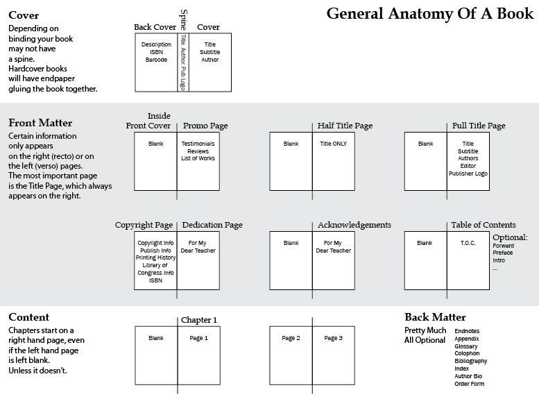

```{r setup2, include=FALSE}
knitr::opts_chunk$set(echo = TRUE, message=FALSE, warning=FALSE,
                      comment="", digits = 3, tidy = FALSE, prompt = FALSE, fig.align = 'center')

library(reticulate)
library(tidyverse)
library(slickR)
library(pdftools)
```


# 책의 명칭 및 편집 일반 용어 [^book-standard] {#book-standard}

[^book-standard]: [국가기술표준원 (2009-12-28), "책의 명칭 및 편집 일반 용어", KS X 0003](https://www.standard.go.kr/KSCI/standardIntro/getStandardSearchView.do?menuId=919&topMenuId=502&upperMenuId=503&ksNo=KSX0003&tmprKsNo=KSX0003&reformNo=03)

 [국가기술표준원 (2009-12-28), "책의 명칭 및 편집 일반 용어", KS X 0003](https://www.standard.go.kr/KSCI/standardIntro/getStandardSearchView.do?menuId=919&topMenuId=502&upperMenuId=503&ksNo=KSX0003&tmprKsNo=KSX0003&reformNo=03) 내용을 참조하여 책에 대한 한국어 표준용어 사전을 이해한다.

책의 명칭과 편집 일반용어가 필요한 곳은 일반 **책**을 비롯하여 신문, 잡지, 교과서, 사전, 리플릿, 문서, 인쇄 광고물 등 **종이 출판물**과 웹북, 웹진, 모바일 콘텐츠 등 **전자적 표기에 널리 쓰이는 모든 표현 매체**를 아우른다.

```{r about-book, out.height = "85%", eval = FALSE}
library(tidyverse)
library(slickR)
library(pdftools)

book_pdf <- pdf_convert("data/KSX0003_20091228.pdf",format = 'png',verbose = FALSE)
```

한국어 표준책 용어 및 편집 일반 용어를 직접 살펴볼 수 있도록 준비한다.

```{r book-tbl}
# book_pdf_tbl <- tibble(page = glue::glue("fig/book/{book_pdf}") )
# 
# book_pdf_tbl %>% 
#   write_rds("data/book_pdf_tbl.rds")

book_pdf_tbl <- read_rds("data/book_pdf_tbl.rds")

  
slickR(book_pdf_tbl$page, height = 600)
```


# 책의 명칭 및 편집 일반 용어 [^book-standard] {#book-standard-name}

책은 다음과 같은 구성을 갖고 있다.

- 책의 외부 명칭(1) : 책의 명칭은 출판, 인쇄, 편집의 여러 용어 중에서 가장 기본적이고 중요한 사항으로서 표지 등 장정을 구성하고 있는 요소들로 이루어져 있다.
- 책의 외부 명칭(2) : 책의 표지를 펼치면 책의 제목, 저자명, 출판사명과 더불어 책 속의 면지, 띠지, 책날개 등이 나오는데 이 모든 것을 책의 외무 명칭(2)에서 다룬다.
- 책의 내부 명칭 : 책의 내용에 관계되는 사항들의 명칭이다. 본문 편집 순서에 따라 머릿그림, 머리말, 추천사, 차례, 본문, 부록 등 책의 내용을 구성하는 요소들이다.
- 본문 편집 판면의 명칭(1) : 제목이나 사진 등이 들어가는 본문의 내용을 편집할 때 알아야할 명칭들이다. 큰제목, 중간 제목, 캡션, 단간 등을 담고 있다.
- 본문 편집 판면의 명칭(2) : 본문의 내용을 편집할 때 알아야 할 명칭들이다. 판면의 편집에 필요한 면주, 쪽번호, 행길이, 행간, 여백 등으로 이루어져 있다.
- 편집 일반 용어 : 책을 편집할 때 기본적으로 알아야 할 용어와 현장에서 많이 쓰이고 있는 용어들이다.



## PDF 에서 표 추출 {#book-outer-extract}

PDF에서 바로 표를 추출할 경우 기계판독 가능한 표이기는 하지만 형태가 뭉개져서 제대로 사용할 수 없다.

```{r pdf-extract-table-extrtaction}
library(tabulizer)

table_result <- list()

# locate_areas(file = "data/KSX0003_20091228.pdf", pages = 5)

for (i in c(5, 7, 9, 10:11, 13, 15:21)){
  out <- extract_tables("data/KSX0003_20091228.pdf", 
                        page = i, 
                        encoding = "UTF-8",
                        guess = FALSE,
                        method = 'stream',
                        area = list(c(108.70328,  65.78973, 697.26248, 527.02796)))
  
  table_result[[i]] <- as.data.frame(out)
}

table_result[[5]] %>% 
  reactable::reactable()
```

## 책 외부 명칭 {#book-outer}

이런 문제를 PDF 파일으로 워드로 변환시킨 후에 워드에서 표를 추출하는 방식을 동원한다. 자세한 사항은 [워드 파일에서 표(table) 추출](https://statkclee.github.io/pdf/word-table-extraction.html) 하는 방식을 참고한다.


