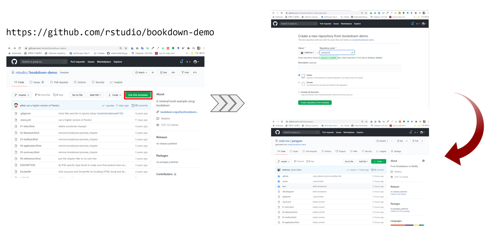
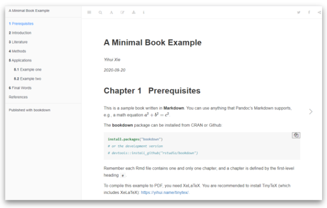
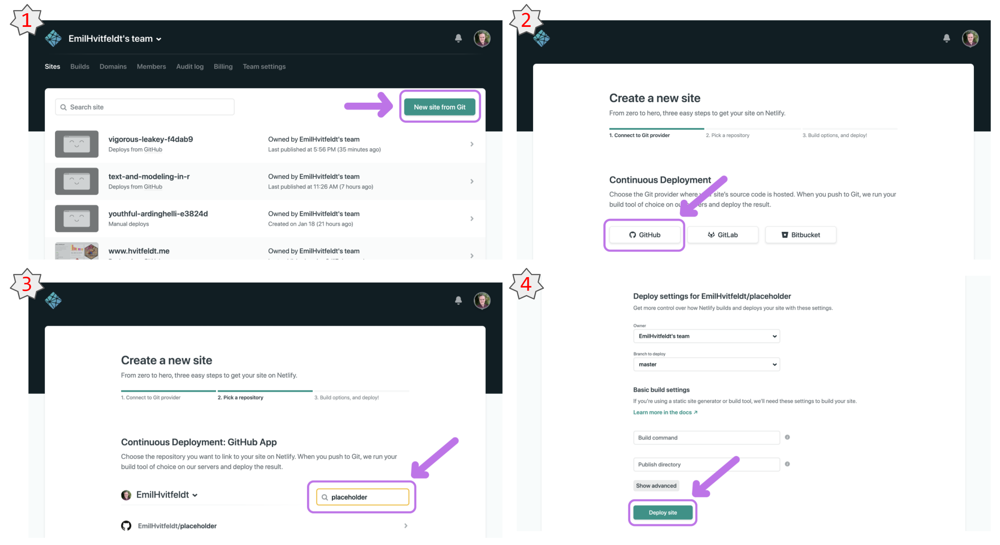
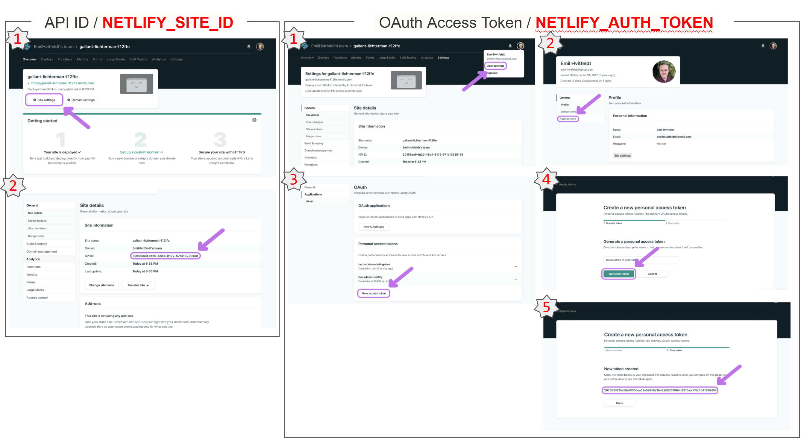
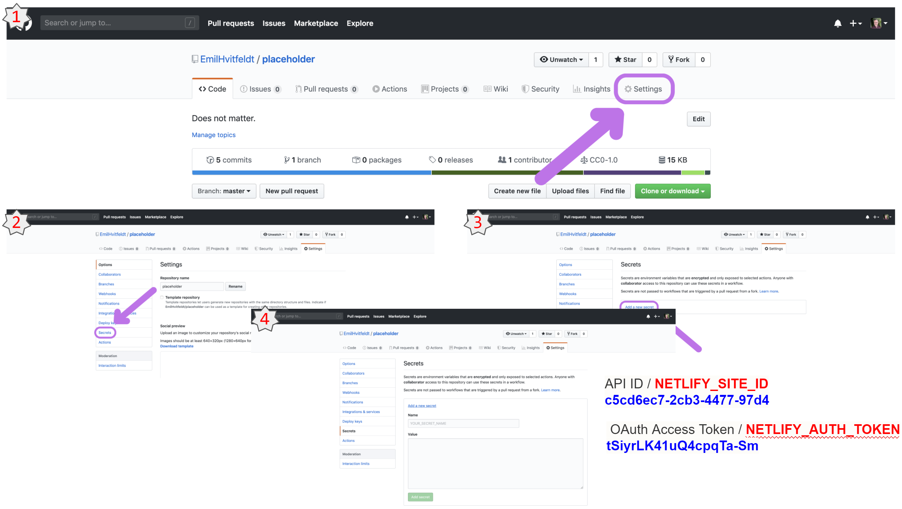
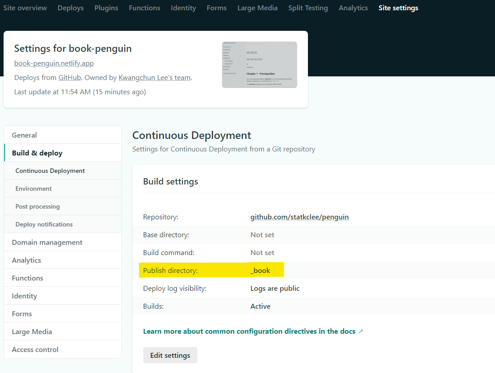
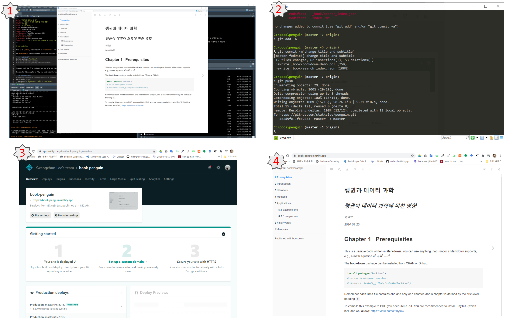

```{r setup, include=FALSE}
knitr::opts_chunk$set(echo = TRUE, message=FALSE, warning=FALSE,
                      comment="", digits = 3, tidy = FALSE, prompt = FALSE, fig.align = 'center')

```


# 북다운 [^rmarkdown] [^bookdown] [^bookdown-book] {#bookdown-reference}

[^rmarkdown]: [R Markdown](http://rmarkdown.rstudio.com/)
[^bookdown]: [bookdown](https://github.com/rstudio/bookdown)
[^bookdown-book]: [Bookdown: Authoring Books with R Markdown](https://bookdown.org/yihui/bookdown/)

[R 마크다운](http://rmarkdown.rstudio.com/)을 활용한 다양한 저작물이 [bookdown](https://bookdown.org/) 웹사이트를 통해 공유되고 있다.
GitHub Actions와 연결하여 CI/CD 기능을 통해 [`netlify`](https://www.netlify.com/) 웹사이트에 제작한 책도 출판이 가능하다.

<style>
div.blue { background-color:#e6f0ff; border-radius: 5px; padding: 10px;}
</style>
<div class = "blue">

> ## 북다운이 갖는 주요 기능  {-#bookdown-main-feature}
> 
> * 다양한 출력 양식: HTML, PDF, ePub.
> * 시각적으로 미려한 기능을 갖는 책을 쉽게 만들 수 있다.
> * Gitbook (https://www.gitbook.com), Tufte CSS (http://rstudio.github.io/tufte/), Tufte-LaTeX 스타일이 포함된다.
> * 마크다운 구문을 확장해서 그림/표 번호 매기기, 상호참조 등을 지원한다.
> * 인터랙티브 HTML 위젯과 Shiny 앱을 책에서 지원한다.
> * RStudio IDE와 통합된 개발기능 지원
> * 한번 클릭으로 https://bookdown.org 사이트에 출판

</div>


## 북다운 설치 {#install-bookdown}

북다운을 체험하는 가장 쉬운 방법중에 하나는 이미 북다운으로 개발된 예제 책을 통해 살펴보는 것이다.

1. [https://github.com/rstudio/bookdown-demo](https://github.com/rstudio/bookdown-demo) GitHub에서 포크를 뜨고, `git clone` 하여 로컬 컴퓨터에 저장한다.
1. [RStudio 사전출시 버젼](https://www.rstudio.com/products/rstudio/download/preview/)을 다운로드 해서 설치한다.
1. 클론한 `bookdown-demo` 저장소에서 `bookdown-demo.Rproj` 파일을 클릭해서 연다.
1. **bookdown** 팩키지를 설치한다.

``` {r install-bookdown, eval = FALSE}
devtools::install_github("rstudio/bookdown")
```

5. `index.Rmd` R 마크다운 파일을 열고, RStudio `build` 탭에 `Build Book`을 클릭한다. 혹은 윈도우의 경우 `Ctrl + Shift + B` 단축키로 책을 제작할 할 수 있다.

# `bookdown` 책 배포방법 [^bookdown-authoring] {#bookdown-authoring}

[^bookdown-authoring]: [Emil Hvitfeldt (Sep 4, 2020), "Deploy your bookdown project to Netlify with Github Actions"](https://www.hvitfeldt.me/blog/bookdown-netlify-github-actions/)

[GitHub Actions - Automate your workflow from idea to production](https://github.com/features/actions)을 통해 R에서 그동안 문제가 되었던 Production까지 자동화가 한결 탄력을 받게 되었고, [r-lib/actions](https://github.com/r-lib/actions)에 다양한 R 개발물을 Production으로 자동화시킬 수있는 길이 연리게 되었다. 

## `bookdown` 템플릿 {#bookdown-template}

`bookdown` 저작을 시작하는 가장 좋은 방법 중의 하나는 [`rstudio/bookdown-demo`](https://github.com/rstudio/bookdown-demo) 템플릿으로 시작하는 것이다. 즉, `Use this template`을 클릭하여 본인 GitHub 저장소에 원하는 이름으로 가져온다. 
이 작업을 통해 GitHub 저장소를 하나 만들게 되었고 이를 로컬 작업 컴퓨터로 가져와서 다양한 저작작업을 수행하게 되고, GitHub Action을 통해 CI/CD작업을 자동화시킬 수 있고 마지막으로 Netlify 설정을 통해서 Production으로 책을 온전한 저작물로 서비스가 가능하게 된다.




## 로컬 컴퓨터 작업 {#bookdown-local}

[`rstudio/bookdown-demo`](https://github.com/rstudio/bookdown-demo) 템플릿을 본인 GitHub 계정으로 저장소 명칭을 부여해서 가져온다. 
이를 통해 로컬 컴퓨터에서 작업할 수 있는 기반을 구축한다. 보통 `git clone` 명령어를 통해 로컬 컴퓨터 적당한 디렉토리로 가져오게 된다.

```{r git-clone, eval = FALSE}
$ git clone https://github.com/statkclee/penguin.git
```

`index.Rmd` R 마크다운 파일을 열고, RStudio `build` 탭에 `Build Book`을 클릭한다. 혹은 윈도우의 경우 `Ctrl + Shift + B` 단축키로 원하는 방식대로 책이 저작되는지를 확인한다.



## GitHub Repo를 Netlify 등록 {#bookdown-github-repo}


`Netlify` 웹사이트에 `bookdown`으로 저작한 책을 배포하기 위해서는 먼저 `Netlify` 웹사이트에 GitHub 저장소를 연결시켜야 된다. `GitHub` 계정으로 `Netlify`에 가입하게 되면 `Netlify`에서 GitHub 저장소가 보이게 되고, 필요한 저장소만 `Netlify`로 가져와서 연결 등록작업을 수행한다.



## Netlify 정보 생성 {#bookdown-github-repo-netlify}

`Netlify` 입장에서 GitHub 저장소를 인식하기 위해서 `Netlify`에서 발급한 OAuth Key와 APP ID 두개 정보가 필요하다. 
이를 위해서 다음과 같이 API ID는 연결시킨 GitHub 저장소 `Site Settings` 메뉴를 통해 갈 수가 있다. 
API ID 키값을 얻은 후에 `Netlify` OAuth Key도 User Settings &rarr; Applications &rarr; New access token &rarr; Generate token 순으로 생성시킬 수 있다.





## GitHub Secrets 등록 {#bookdown-github-repo-netlify-register}

`Netlify` 웹사이트에서 발급받은 본인을 인증할 수 있는  OAuth Access Token / NETLIFY_AUTH_TOKEN  과 GitHub 저장소 API ID / NETLIFY_SITE_ID 를 GitHub 저장소 Secrets에 등록시킨다. 이를 통해서 `Netlify` 웹사이트와 GitHub 저장소가 비로소 연결이 된다.



## `_book` 배포 디렉토리 {#bookdown-github-repo-netlify-publish}

`bookdown` 빌드(CTRL + Alt + B)를 할 경우 작업 결과물이 `_book` 디렉토로리 `publish` 된다.
`_book` 디렉토리를 `Publish directory`에 명시적으로 설정한다.



## GitHub workflow 생성 {#bookdown-github-workflow}

[r-lib/actions](https://github.com/r-lib/actions)에 다양한 R 개발물을 활용할 수 있는데 `use_github_action("bookdown.yaml")` 명령어를 통해 bookdown 중심 CI/CD를 구성할 수 있다.

```{r github-workflow-creation, eval = FALSE}
devtools::install_github("r-lib/usethis")
use_github_action("bookdown.yaml")
```

## 의존성 갖는 팩키지 설치 {#bookdown-github-workflow-renv}

`bookdown`과 별개로 책 저작과정에서 설치되는 다양한 팩키지를 `renv::snapshot()` 명령어를 통해 자동으로 통합과 배포를 하여 책을 `netlify`로 Production 시킬 수 있게 된다.

```{r github-workflow-dependency, eval = FALSE}
renv::snapshot()
```

# 책 저작 후 자동 출판 {#bookdown-workflow-penguin}

평소와 다름없이 bookdown 저작에 집중하고 나서 이를 GitHub에 `git add`, `git commit -m`, `git push`를 통해 올리게 되면 `GitHub Actions`가 돌아 이를 `netlify`로 넘기고 자동으로 `netlify`에서 정의한 <https://book-penguin.netlify.app/> 웹사이트에 배포가 된다.



