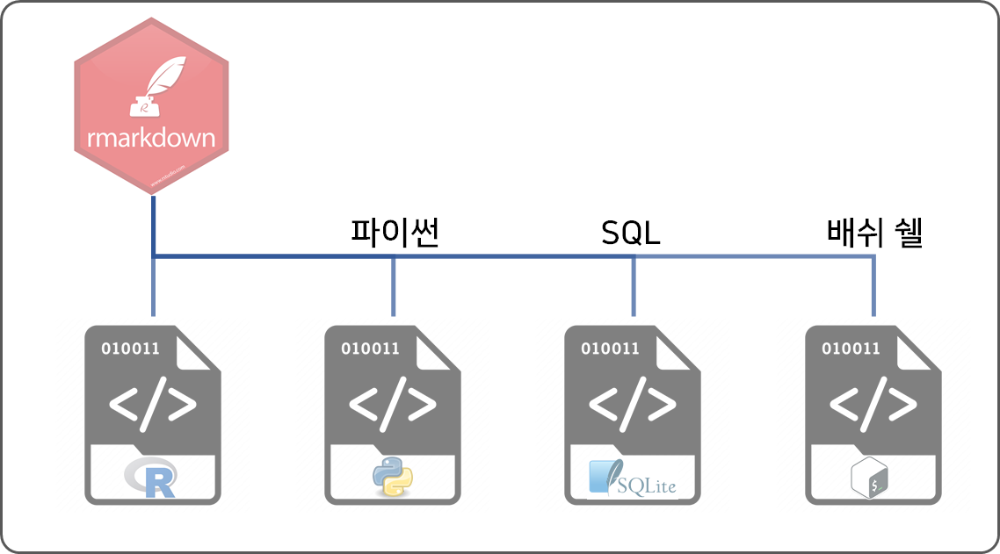

```{r setup2, include=FALSE}
knitr::opts_chunk$set(echo = TRUE, message=FALSE, warning=FALSE,
                      comment="", digits = 3, tidy = FALSE, prompt = FALSE, fig.align = 'center')
```



# R 코드 {#rcode-chunk}

R 코드를 데이터 과학 문서에 임베딩(embedding)할 경우 R 코드를 "R 코드 덩어리(code chunk)"로 작성한다. 다음과 같이 R 코드 덩어리를 다음과 작성했다고 가정하자.

<pre><code>```{r R-code-chunk}
data(cars)
summary(cars)
``` </code></pre>

상기 코드 실행결과는 다음과 같다.

``` {r R-code-chunk}
data(cars)
summary(cars)
```

# 파이썬 코드 {#python-code-chunk}

데이터 과학의 양대 축을 이루는 언어인 파이썬 코드도 R마크다운에서 파이썬 코드 덩어리로 실행이 가능하다.

<pre><code>```{python python-code-chunk}
print("파이썬 사랑해요!!!")
```</code></pre>

상기 코드 실행결과는 다음과 같다.

```{python python-code-chunk}
print("파이썬 사랑해요!!!")
```

# 쉘 스크립트 {#shell-code-chunk}

쉘(shell) 스크립트는 물론이고 자주 사용하는 쉘 명령어도 적용이 가능하다.

<pre><code>```{bash shell-code-chunk}
echo "배쉬 쉘 사랑해요!"
```</code></pre>

상기 코드 실행결과는 다음과 같다.

```{bash shell-code-chunk}
echo "hello world!"
```

특히, 윈도우에서 배쉬 쉘스크립트를 실행시키기 위해서는 다음 작업이 필요하다.
[`Cygwin`](https://www.cygwin.com/)을 설치하하고 "환경설정" 경로명에 `C:\cygwin64\bin`을 추가하여 R마크다운에서 `bash` 명령어를 실행시킬 수 있도록 준비한다.

# `SQL` 코드 {#sqlite3-sql-code-chunk}

R마크다운 SQL 코드 덩어리를 돌리기 위해서는 데이터 생성작업부터 필요하고 R 코드 덩어리 정의부분에 `connection = `에 데이터베이스 객체 명칭을 넣어주어야 한다.

## `sqlite3` DB 생성 {#sqlite3-sql-db-creation}

`sqlite3` 예제 데이터베이스를 다운로드 받는다.

```{r donwload-sqlite3, eval = FALSE}
download.file(url = "https://raw.githubusercontent.com/lerocha/chinook-database/master/ChinookDatabase/DataSources/Chinook_Sqlite.sql", destfile = "data/Chinook_Sqlite.sql")
```

이제 `sqlite3` 데이터베이스를 생성시킨다. 이를 위해서 다음 두가지 작업을 수행한다.

1. 터미널을 열고 `Chinook_Sqlite.sql` 파일을 다운로드 받은 디렉토리로 이동한다.
2. `sqlite3` 명령어를 실행시켜 데이터베이스를 생성한다.
    - `$ sqlite3 Chinook.db`
3. 다운로드받은 `Chinook_Sqlite.sql` 스크립트를 실행하여 `Chinook` 데이터베이스를 생성시킨다.
    - `sqlite> .read Chinook_Sqlite.sql`

## `sqlite3` DB를 R에 연결 {#sqlite3-sql-db-creation-r}

생성된 SQLite3 데이터베이스를 `DBI` 커넥터를 이용하여 데이터베이스에 연결시킨다.

```{r database-connection}
library(DBI)
library(RSQLite)

chinook <- dbConnect(RSQLite::SQLite(), dbname = "data/chinook.db")
```

R마크다운에서 SQL 문을 데이터베이스에 연결시켜 돌리기 위해서는 다음과 같이 코드를 작성한다. SQL 코드 본문에는 당연히 SQL 문이 들어가고,  `connection = chinook`을 통해 SQL 문을 돌리는데 필요한 데이터베이스를 정의시킨다.

<pre><code>```{sql sql-code-chunk, connection = chinook}
SELECT * FROM Artist LIMIT 10;
```</code></pre>


상기 코드 실행결과는 다음과 같다.

```{sql sql-code-chunk, connection = chinook}
SELECT * FROM Artist LIMIT 10;
```
