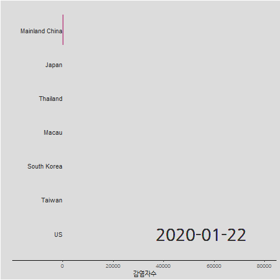

```{r setup, include=FALSE}
library(flexdashboard)
library(tidyverse)
```


전세계 {data-icon="fa-globe"}
===================================

Row {data-width=150} 
--------------------------------------------


```{r ingest-corona}
library(coronavirus)
data('coronavirus')

coronavirus <- coronavirus %>% 
  janitor::clean_names() %>% 
  rename(country = country_region,
         province = province_state)

cv_stat <- coronavirus %>% 
  group_by(type) %>% 
  summarise(합계 = sum(cases))

```

### 확진자수

```{r infected}
infected <- cv_stat %>% filter(type=='confirmed') %>% pull
valueBox(scales::comma(infected), 
         icon = "fa-procedures",
         color = "warning")
```

### 사망자수

```{r death}
death <- cv_stat %>% filter(type=='death') %>% pull
valueBox(scales::comma(death), 
         icon = "fa-skull",
         color = "danger")
```

### 회복자수

```{r recovered}
recovered <- cv_stat %>% filter(type=='recovered') %>% pull
valueBox(scales::comma(recovered), 
         icon = "fa-walking",
         color = "success")
```

Column {data-height=350}
-------------------------------------

### Chart 1

```{r time-series-plot, eval=FALSE}
library(gganimate) 
options(gganimate.nframes = 100)

## 데이터 
corona_ranked_by_date <- coronavirus %>% 
  filter(type == 'confirmed') %>% 
  group_by(country, date) %>% 
  summarise(confirmed = sum(cases)) %>% 
  ungroup() %>% 
  group_by(country) %>% 
  arrange(date) %>% 
  mutate(cum_confirmed = cumsum(confirmed)) %>% # 국가별 누적환자수
  ungroup() %>% 
  group_by(date) %>% 
  arrange(date, -cum_confirmed) %>% # 일별 상위 국가 선정
  mutate(rank = 1:n()) %>% 
  filter(rank <=7) %>% 
  ungroup()

## 테마
library(extrafont)
loadfonts()

corona_theme <- theme_classic(base_family = "NanumGothic") +
  theme(legend.position = "none") +
  theme(axis.text.y = element_blank()) +
  theme(axis.ticks.y = element_blank()) +
  theme(axis.line.y = element_blank()) +
  theme(legend.background = element_rect(fill = "gainsboro")) +
  theme(plot.background = element_rect(fill = "gainsboro")) +
  theme(panel.background = element_rect(fill = "gainsboro"))

corona_plot <- corona_ranked_by_date %>% 
  ggplot() +
    aes(xmin = 0 ,  
        xmax = cum_confirmed) +  
    aes(ymin = rank - .45,  
        ymax = rank + .45,  
        y = rank) +
    facet_wrap(~date) +
    geom_rect(alpha = .7) +
    aes(fill = country) +
    scale_fill_viridis_d(option = "magma",
                       direction = -1) +
    scale_x_continuous(
      limits = c(-15000, 80000)) +
    geom_text(col = "gray13",  
          hjust = "right",  
          aes(label = country),  
          x = -50) +
    labs(fill = NULL) +  
    labs(x = '감염자수') +  
    labs(y = "") +  
    scale_y_reverse() +
    corona_theme

corona_gif <- corona_plot +
  facet_null() +
  aes(group = country) +
  geom_text(x = 55000 , y = -7,  
          family = "NanumGothic",  
          aes(label = as.character(date) ),  
          size = 10, col = "grey18")  +
  gganimate::transition_time(date)

corona_gif
anim_save("fig/corona.gif", corona_gif, duration=0.1)
```

```{r corona-gif}
 
```


### Chart 2

```{r corona-leaflet}
library(leaflet)
library(janitor)

coronavirus %>% 
  mutate(geo_name = glue::glue("{country} {province}")) %>% 
  select(-country, -province) %>% 
  group_by(geo_name, lat, long, type) %>%
    summarise(cases = sum(cases, na.rm = TRUE)) %>% 
    spread(type, cases, fill=0) %>% 
    leaflet() %>%
    addTiles() %>% 
    addProviderTiles(providers$OpenStreetMap) %>% 
    addMarkers(lng=~long, lat=~lat, clusterOptions = markerClusterOptions(),
                     popup = ~ as.character(paste0("<strong> 코로나19 현황: ", geo_name, "</strong><br>",
    "-----------------------------------------------------------<br>",
                                                   "&middot; 감염: ", scales::comma(confirmed), "<br>",
                                                   "&middot; 사망: ", scales::comma(death), "<br>",
                                                   "&middot; 회복: ", scales::comma(recovered), "<br>")))
```


한국 {data-icon="fa-map"}
===================================
