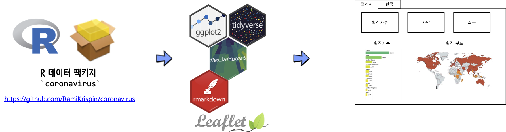
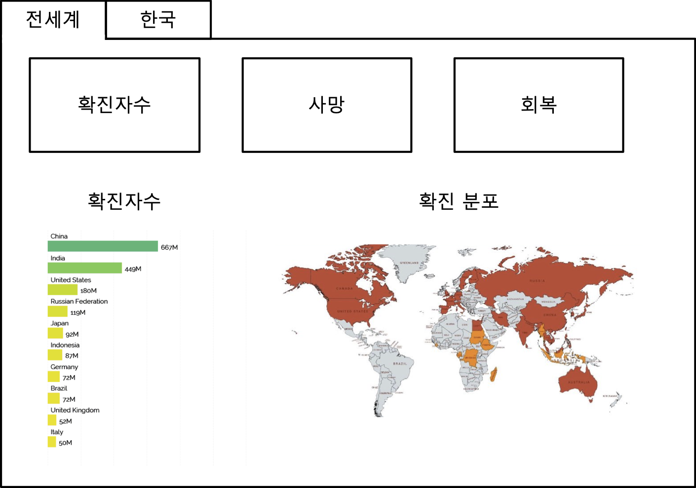
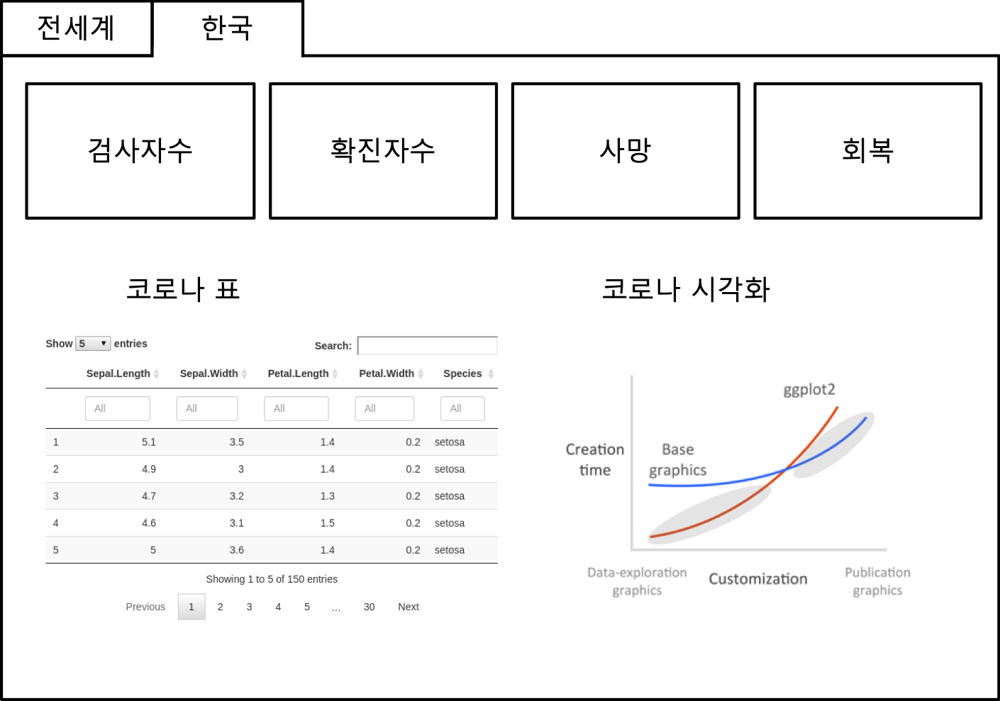

```{r setup2, include=FALSE}
knitr::opts_chunk$set(echo = TRUE, message=FALSE, warning=FALSE,
                      comment="", digits = 3, tidy = FALSE, prompt = FALSE, fig.align = 'center')

library(reticulate)
```

# 대쉬보드 [^dashboard] [^blog-dashboard] {#dashboard}

[^dashboard]: [Marlorie Hughes (2019. 12. 3), "Dashboarding Like a Boss", DC R Conference](https://www.youtube.com/watch?v=yott4quKN6s)

[^blog-dashboard]: [Sagar Kulkarni (Sep 20, 2019), "Building an HR Dashboard in R using Flexdashboard", towrds data science](https://towardsdatascience.com/building-an-hr-dashboard-in-r-using-flexdashboard-76d14ed3f32)

**A 12 Step Program to Quick Emailing Plots & Csvs**

1. Basic Layout
    - [`flexdashboard`](https://rmarkdown.rstudio.com/flexdashboard/)
1. Printing Tables, Descriptive Statistics, Model Summaries
    - `printr`, `summarytools::dfSummary`, `stargazer::stargazer`
    - [list of statistic codes](https://rdrr.io/cran/stargazer/man/stargazer_stat_code_list.html)
1. Interactive Datasets
    - `DT`
1. Interactive Plots
    - `highcharter`
    -  지도(`leaflet`), 시계열(`dygraphs`), `ggplots`(`plotly`)
1. Exporting
    - Datasets with `DT`
    - Highcharter Plots
1. CSS basics
1. Branding: Logos, Fonts, Colors
1. Header/Footer
1. Hosting
1. Automate-ish (Render + System())
1. Replicate (Render with arguments)
1. Automate or App it (cron, shiny runtime)

# 코로나19 대쉬보드 {#corona-virus-dashboard}

코로나19 대쉬보드를 제작하기 위해서 먼저 [코로나19 데이터](https://github.com/RamiKrispin/coronavirus)를 가져온다. 이를 [`flexdashboard`](https://rmarkdown.rstudio.com/flexdashboard/)를 주요 엔진삼아 대쉬보드를 제작하고 이를 `gh-pages` 웹사이트에 배포한다.

다행히 코로나19 데이터의 경우 [`coronavirus`](https://ramikrispin.github.io/coronavirus/) 데이터 팩키지가 제작되어 데이터 입수에 따른 공수를 절약할 수 있다.



## 데이터셋 {#corona-dashboard-dataset}

`r Sys.Date()` 두가지 데이터셋이 대쉬보드를 개발하는데 R 데이터 팩키지로 작성을 진행중에 있다.

- [`coronavirus`: The coronavirus dataset ](https://github.com/RamiKrispin/coronavirus)
    - [`COVID-19`: Novel Coronavirus (COVID-19) Cases, provided by JHU CSSE](https://github.com/CSSEGISandData/COVID-19)
- [`covid`: Novel Coronavirus(2019-nCoV) updates from WHO daily reports](https://github.com/javierluraschi/covid)
    - [PDF WHO 보고서](https://www.who.int/emergencies/diseases/novel-coronavirus-2019/situation-reports)

```{r install-dataset}
library(tidyverse)
# install.packages("coronavirus") 
# devtools::install_github("RamiKrispin/coronavirus")

library(coronavirus)

data("coronavirus")
coronavirus <- coronavirus %>% 
  janitor::clean_names() %>% 
  rename(country = country_region,
         province = province_state)

```

## 대쉬보드 디자인 {#corona-dashboard-design}

데이터 과학 요소가 들어간 대쉬보드 제작을 위한 UI 설계안을 작성한다.

{#id .class width="77%"}


## `flexdashboard` 배치도(layout) {#corona-dashboard-layout}

- [Font Awesome](https://fontawesome.com/icons?from=io)
- [Ionicons](https://ionicons.com/)
- [Bootstrap](https://getbootstrap.com/docs/4.4/components/alerts/)


{#id .class width="77%"}

`wireframe` 작성한 것을 `flexdashboard` 문법에 맞춰 대쉬보드 구성요소를 적절히 배치시킨다.


상기 `flexdashboard` 배치도(layout)를 작성하기 위한 R마크다운 대쉬보드 코드는 다음과 같다.
`valueBox`를 상단에 배치하고 아래 두 그래프 역영에 각기 필요한 그래프를 넣어준다.

<pre><code>
---
layout: page
title: "데이터 과학을 위한 저작도구: Computational Documents"
subtitle: "대쉬보드(Dashboard)"
author:
    name: "[Tidyverse Korea](https://www.facebook.com/groups/tidyverse/)"
date: "`r Sys.Date()`"
output:
  html_document: 
    toc: yes
    toc_float: true
    highlight: tango
    code_folding: show
    number_section: true
    self_contained: true
editor_options: 
  chunk_output_type: console
---

전세계 {data-icon="fa-globe"}
===================================

Row {data-width=150} 
--------------------------------------------

### 확진자수

```{r, eval=FALSE}
infected <- 100
valueBox(infected, icon = "fa-procedures")
```

### 사망자수

```{r, eval=FALSE}
death <- 20
valueBox(death, icon = "fa-skull")
```

### 회복자수

```{r, eval=FALSE}
recovered <- 30
valueBox(recovered, 
         icon = "fa-walking",
         color = ifelse(recovered > 10, "warning", "primary"))
```


Column {data-height=350}
-------------------------------------

### Chart 1


### Chart 2


한국 {data-icon="fa-map"}
===================================

</code></pre>

# 시각화 구성요소 {#dashboard-graph}

## 막대 그래프: `gapminder` [^racing-barchart] {#draw-racing-barchart}

[^racing-barchart]: [Gina Reynolds (April 2019), "Racing Barchart with gganimate - a quick flipbook | made with Xaringan", R-Ladies](https://evamaerey.github.io/little_flipbooks_library/racing_bars/racing_barcharts.html#1)

**경주하는 막대 그래프(Racing Barchart)**는 [GDP 상위 15국 (1970-2017)](https://www.youtube.com/embed/jCNSqEwh7GQ), [글로벌 브랜드 가치 상위 15사 (2000-2018)](https://www.youtube.com/embed/BQovQUga0VE)를 보면 시각적으로 변화를 파악하는데 편리하다. 이를 R로 시각화하며 어떨까? Gina Reynolds가 R-Ladies에서 이를 해냈습니다. 코드도 간결하고 애니메이션도 부드럽고 아름답습니다.


[`gapminder`](https://cran.r-project.org/web/packages/gapminder/index.html) 데이터셋을 사용하여 경주하는 막대그래프를 제작하려면 연도별 국가순위(Rank)를 계산하는 전처리 작업이 필요하다.
그 다음 `facet_wrap()` 함수를 사용하여 년도별 변경사항을 시각화한다. 그리고 나서 `gganimate`로 시각화면 되는 어쩌면 매우 단순한 과정이다.

### 데이터셋 {#racing-barchart-data}

`gapminder` 데이터 팩키지에서 데이터를 가져온다. 그리고 나서 년도별 인구가 많은 상위 10개국을 추려낸다.

```{r gapminder}
library(gapminder)

ranked_by_year <- gapminder %>%  
  select(country, pop, year, continent) %>%  
  group_by(year) %>%  
  arrange(year, -pop) %>%  
  mutate(rank = 1:n()) %>%  
  filter(rank <= 10) 
```


### 정적그래프 {#racing-barchart-ggplot}

정적 그래프 시각화에 사용될 테마(theme)을 한글 폰트와 함께 색상을 적절히 지정한다.

```{r gapminder-theme}
library(extrafont)
loadfonts()

gapminder_theme <- theme_classic(base_family = "NanumGothic") +
  theme(axis.text.y = element_blank()) +
  theme(axis.ticks.y = element_blank()) +
  theme(axis.line.y = element_blank()) +
  theme(legend.background = element_rect(fill = "gainsboro")) +
  theme(plot.background = element_rect(fill = "gainsboro")) +
  theme(panel.background = element_rect(fill = "gainsboro"))
```

`geom_rect()`를 사용해서 국가별 상위 10국에 대한 인구를 막대그래프로 표현하고, 
`facet_wrap`을 활용하여 년도별 인구변화를 작은 그래프로 만들어낸다. 그리고 국가명도 순서에 맞춰 붙여낸다.

```{r gapminder-ggplot}
gapminder_plot <- ranked_by_year %>%  
  ggplot() +  
  aes(xmin = 0 ,  
      xmax = pop / 1000000) +  
  aes(ymin = rank - .45,  
      ymax = rank + .45,  
      y = rank) +  
  facet_wrap(~ year) +  
  geom_rect(alpha = .7) +  
  aes(fill = continent) +  
  scale_fill_viridis_d(option = "magma",  
                       direction = -1) +  
  scale_x_continuous(  
    limits = c(-355, 1400),  
    breaks = c(0, 400, 800, 1200)) +  
  geom_text(col = "gray13",  
            hjust = "right",  
            aes(label = country),  
            x = -50) +  
  scale_y_reverse() +  
  labs(fill = NULL) +  
  labs(x = '인구 (백만)') +  
  labs(y = "") +  
  gapminder_theme

gapminder_plot
```


### 막대그래프 애니 {#racing-barchart-animation}

```{r gapminder-animation}
library(gganimate) 
options(gganimate.nframes = 20)

gapminder_plot +
  facet_null() +  
  geom_text(x = 1000 , y = -10,  
            family = "Times",  
            aes(label = as.character(year)),  
            size = 30, col = "grey18") +  
  aes(group = country) +  
  gganimate::transition_time(year)
```


## 막대그래프: 코로나19 {#corona-19}

[`coronavirus`](https://ramikrispin.github.io/coronavirus/) 데이터 팩키지에서 가져온 코로나 관련 데이터를 "경주하는 막대그프"로 생성하여 그래프 구성요소로 넣기 위해서 앞선 `gapminder` 경주 막대그래프 사례를 참조하여 데이터를 준비하고, 정적그래프에 이어서 애니메이션을 작성하여 `.gif`로 떨구고 이를 대쉬보드에서 불러 그래프 영역에 채워넣는다.


```{r corona19-running-barchart, eval=FALSE}

library(gganimate) 
options(gganimate.nframes = 100)

## 데이터 
corona_ranked_by_date <- coronavirus %>% 
  filter(type == 'confirmed') %>% 
  group_by(country, date) %>% 
  summarise(confirmed = sum(cases)) %>% 
  ungroup() %>% 
  group_by(country) %>% 
  arrange(date) %>% 
  mutate(cum_confirmed = cumsum(confirmed)) %>% # 국가별 누적환자수
  ungroup() %>% 
  group_by(date) %>% 
  arrange(date, -cum_confirmed) %>% # 일별 상위 국가 선정
  mutate(rank = 1:n()) %>% 
  filter(rank <=7) %>% 
  ungroup()

## 테마
library(extrafont)
loadfonts()

corona_theme <- theme_classic(base_family = "NanumGothic") +
  theme(legend.position = "none") +
  theme(axis.text.y = element_blank()) +
  theme(axis.ticks.y = element_blank()) +
  theme(axis.line.y = element_blank()) +
  theme(legend.background = element_rect(fill = "gainsboro")) +
  theme(plot.background = element_rect(fill = "gainsboro")) +
  theme(panel.background = element_rect(fill = "gainsboro"))

corona_plot <- corona_ranked_by_date %>% 
  ggplot() +
    aes(xmin = 0 ,  
        xmax = cum_confirmed) +  
    aes(ymin = rank - .45,  
        ymax = rank + .45,  
        y = rank) +
    facet_wrap(~date) +
    geom_rect(alpha = .7) +
    aes(fill = country) +
    scale_fill_viridis_d(option = "magma",
                       direction = -1) +
    scale_x_continuous(
      limits = c(-15000, 80000)) +
    geom_text(col = "gray13",  
          hjust = "right",  
          aes(label = country),  
          x = -50) +
    labs(fill = NULL) +  
    labs(x = '감염자수') +  
    labs(y = "") +  
    scale_y_reverse() +
    corona_theme

corona_gif <- corona_plot +
  facet_null() +
  aes(group = country) +
  geom_text(x = 55000 , y = -7,  
          family = "NanumGothic",  
          aes(label = as.character(date) ),  
          size = 10, col = "grey18")  +
  gganimate::transition_time(date)

corona_gif # anim_save("fig/corona.gif", corona_gif, duration=0.1)
```

```{r corona-gif}
knitr::include_graphics('fig/corona.gif') 
```


## 공간정보 시각화 {#corona-19-leaflet}

공간정보 시각화를 위해서 `leaflet`을 활용하여 `coronavirus`에 포함된 위경도 정보에 매칭시켜 인터랙티브 시각화 정보를 완성한다.

```{r corona-19-leaflet}
library(leaflet)
library(janitor)

coronavirus %>% 
  mutate(geo_name = glue::glue("{country} {province}")) %>% 
  select(-country, -province) %>% 
  group_by(geo_name, lat, long, type) %>%
    summarise(cases = sum(cases, na.rm = TRUE)) %>% 
    spread(type, cases, fill=0) %>% 
    leaflet() %>%
    addTiles() %>% 
    addProviderTiles(providers$OpenStreetMap) %>% 
    addMarkers(lng=~long, lat=~lat, clusterOptions = markerClusterOptions(),
                     popup = ~ as.character(paste0("<strong> 코로나19 현황: ", geo_name, "</strong><br>",
    "-----------------------------------------------------------<br>",
                                                   "&middot; 감염: ", scales::comma(confirmed), "<br>",
                                                   "&middot; 사망: ", scales::comma(death), "<br>",
                                                   "&middot; 회복: ", scales::comma(recovered), "<br>")))
```

# 한국 {#corona-korea}

## 데이터셋 {#corona-korea-dataset}

한국 코로나19관련 데이터를 MBC 장슬기 기자의 도움으로 [이성규, "미디어고토사"](https://www.mediagotosa.com/korona19-hwagsan-ilbyeol-hyeonhwang-jeongri/)에서 찾을 수 있었다. 문제는 데이터를 `google sheet`에 정리해 두어서 [`googlesheets4`](https://github.com/tidyverse/googlesheets4)의 도움으로 수월하게 입수할 수 있다.

문제는 일자별로 데이터 정리가 체계적으로 되어 있지 않고, 최근에야 코로나 관련 데이터를 모으게 되어서 대쉬보드를 구성할 때 한계가 있다.

```{r mediagotoa-dataset, eval=FALSE}
## 데이터셋 --------------------
library(googlesheets4)
library(tidyverse)
library(lubridate)

cv_kor <- read_sheet('https://docs.google.com/spreadsheets/d/1fODH5PZJw9jxwV2GRe85BRQgc3mxdyyIpQ0I6MDJKXc/edit#gid=0')

cv_kor_df <- cv_kor %>% 
  select(날짜, 확진자=`누적 확진자수`, 검사자 = `누적 검사자수`, 사망자, 회복자=`누적 격리해제`) %>% 
  arrange(날짜) %>% 
  mutate(일자 = as.Date(날짜)) %>% 
  group_by(일자) %>% 
  summarise(검사자 = last(검사자),
               확진자 = last(확진자),
               사망자 = last(사망자),
               회복자 = last(회복자)
            )  %>% 
  padr::pad(.)
```

## 대쉬보드 구성 {#corona-korea-dashboard}

전세계 코로나 사례와 다르게 검사자수가 포함되어 있어 이를 `valueBox`에 포함시킨다. 지역정보가 없기 때문에 이를 `DT` 표로 대신하는데 몇가지 인터랙티브 기능을 추가해서 기본 정렬에 추가하여 칼럼별 검색 및 다양한 파일 형태로 다운로드 가능하도록 한다. 일자별로 구성된 시계열 데이터 특성을 적극 활용하여 선그래프를 인터랙티브하게 구성한다.



## 시각화 구성요소 {#corona-korea-dashboard-component}

시각화 구성요소로 `valueBox`, `DT`, `plotly`를 선택했기 때문에 이를 순차적으로 모듈화시켜 개발한 후에 대쉬보드에 적용시킨다.

### `valueBox()` {#corona-korea-valueBox}

검사자, 확진자, 사망자, 회복자를 `valueBox`로 만들어 현황을 파악하기 편하게 구성한다. `webshot`을 사용하면 굳이 화면을 캡쳐하지 않아도 R마크다운 코드에서 직접 가능하게 된다.

```{r interactive-valueBox, eval=FALSE}
library(webshot)

webshot("https://statkclee.github.io/comp_document/cd-corona.html",
        "fig/korea-valueBox.png", selector = c("#row"))
```


### 인터랙티브 표 {#corona-korea-table}

인터랙티브 표를 사용하게 되면 일단 기본기능으로 들어가 있는 정렬외에 `searchHighlight`를 사용해서 검색 기능을 넣고, `dom = 'Bfrtip'`을 통해 다양한 형태로 데이터를 내려받을 수 있도록 한다.

```{r kor-df-table}
cv_kor_df  <-  
  read_rds("data/cv_kor_df.rds")

cv_kor_df %>%
  arrange(desc(일자)) %>% 
  DT::datatable(filter = 'top',  
          options = list(   searchHighlight = TRUE, pageLength = 15,
                            dom = 'Bfrtip',
                            buttons = c('copy', 'csv', 'excel', 'pdf', 'print')),
          extensions = 'Buttons') %>% 
  DT::formatRound(c("검사자", "확진자", "사망자", "회복자"), digits=0)
```

### 시각화 {#corona-korea-table-viz}

`plotly`를 사용해서 정적 그래프를 간단히 인터랙티브 그래프로 변환시킨다.


```{r kor-df-viz}
korea_theme <- theme_classic(base_family = "NanumGothic") +
  theme(legend.position = "none") +
  theme(legend.background = element_rect(fill = "gainsboro")) +
  theme(plot.background = element_rect(fill = "gainsboro")) +
  theme(panel.background = element_rect(fill = "gainsboro"))

cv_kor_plot <- cv_kor_df %>% 
  gather(유형, 사람수, -일자) %>% 
  mutate(유형 = factor(유형, levels=c("검사자", "확진자", "회복자", "사망자"))) %>% 
  ggplot(aes(x=일자, y=사람수, color=유형)) +
    geom_line() +  
    geom_point() +
    facet_wrap(~유형, scale="fixed") +
    scale_y_continuous(labels = scales::comma_format(scale = 1)) +
    korea_theme +
    labs(x="", y="") +
    scale_color_viridis_d(option = "magma",
                     direction = -1) 

plotly::ggplotly(cv_kor_plot)
```

