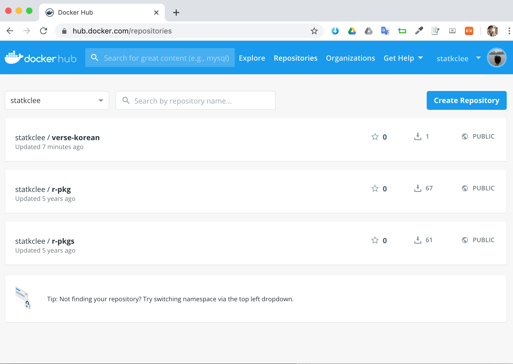

```{r setup2, include=FALSE}
knitr::opts_chunk$set(echo = TRUE, message=FALSE, warning=FALSE,
                      comment="", digits = 3, tidy = FALSE, prompt = FALSE, fig.align = 'center')

library(reticulate)
use_condaenv("anaconda3")
# reticulate::repl_python()
```

# 도커 교재 {#prerequisite-docker}

- [R 도커 - "재현가능한 과학연구를 위한 도커 학습교재"](http://statkclee.github.io/r-docker/)
    - [도커 설치](http://statkclee.github.io/r-docker/00-install.html)
    - [도커는 무엇이고 왜 사용하나](http://statkclee.github.io/r-docker/01-what-and-why.html)
    - [도커 실행](http://statkclee.github.io/r-docker/02-Launching-Docker.html)
    - [도커 이미지 생성 - 팩키지 설치 포함](http://statkclee.github.io/r-docker/03-install-packages.html)
    - [도커허브(Dockerhub)](http://statkclee.github.io/r-docker/04-Dockerhub.html)
    - [도커파일(Dockerfiles)](http://statkclee.github.io/r-docker/05-dockerfiles.html)
    - [분석결과 공유](http://statkclee.github.io/r-docker/06-Sharing-all-your-analysis.html)

도커 컨테이너 기술이 필요한 이유는 재현가능한 데이터 과학 제품 개발을 위해서 반듯이 필요하다. 
현재의 상황을 살펴보면 다양한 운영체제가 존재하고 이에 맞춰 정말 다양한 오픈소스를 동원해서 최종 데이터 과학 제품을 제작해야 하는데 매번 이를 source 코드를 가지고 컴파일해서 환경을 구축해서 작업하는 것은 완전히 시간낭비다.


<style>
div.blue { background-color:#e6f0ff; border-radius: 5px; padding: 10px;}
</style>
<div class = "blue">

**도커 CRUD 명령어** [^docker-crud]

[^docker-crud]: [Melissa Anderson (December 21, 2017), How To Remove Docker Images, Containers, and Volumes](https://www.digitalocean.com/community/tutorials/how-to-remove-docker-images-containers-and-volumes)

- `docker system prune`: 이미지 + 컨테이너 + 볼륨 제거
- `docker rmi` : 이미지 제거
- `docker rm` : 컨테이너 제거
- `docker volume rm` : 볼륨 제거

</div>

# $\LaTeX$ 도커 이미지 {#docker-latex}

## `rocker/verse` $\LaTeX$ 도커 이미지 {#docker-latex-verse}

`docker images` 명령어를 통해서 `rocker/verse`를 그냥 도커 컨테이너로 띄우게 되면 한글 폰트가 설치되지 않아 PDF 문서가 제대로 생성되지 않는 문제가 발생된다.

```{r run-worng-docker-image, eval = FALSE}
statkclee@50-204-120-225-static:~/swc/docker_compendium$ docker images
REPOSITORY          TAG                 IMAGE ID            CREATED             SIZE
verse-korean        latest              b9ca53eb60df        2 days ago          3.32GB
rocker/verse        latest              def324c74d22        3 days ago          3.13GB
rocker/rstudio      latest              a2f92e4ee8db        3 days ago          1.46GB
hello-world         latest              fce289e99eb9        13 months ago       1.84kB

statkclee@50-204-120-225-static:~/swc/docker_compendium$ docker run -d -e PASSWORD=tidyverse --rm --name latex -p 8787:8787 -v   /Users/statkclee/swc/compendium_301:/home/rstudio/compendium rocker/verse

statkclee@50-204-120-225-static:~/swc/docker_compendium$ docker ps -a
CONTAINER ID        IMAGE               COMMAND             CREATED             STATUS                  PORTS                    NAMES
aa7793dca1c2        rocker/verse        "/init"             35 hours ago        Up 35 hours             0.0.0.0:8787->8787/tcp   latex
81c307ba5cff        hello-world         "/hello"            2 days ago          Exited (0) 2 days ago                            hello-docker
```

[One Source Mult-Use - Make (PDF, HTML, docx...)](https://github.com/statkclee/compendium_301) 간단히 `.Rmd` 파일을 컴파일 해서 PDF, HtmL, DOCX 파일을 만들어내는 사례를 도커 이미지를 통해 작업을 할 경우 한글 폰트가 `rocker/verse` 이미지에 포함되지 않아서 PDF 파일을 생성하지 못한다.

```{r wrong-docker-image, eval=FALSE}
rstudio@aa7793dca1c2:~/compendium$ make clean
rm -f analysis/*.html analysis/*.md processed/*
rm -f analysis/*.pdf analysis/*.docx
rstudio@aa7793dca1c2:~/compendium$ make all
Rscript R/make_dataframe.R
── Attaching packages ─────────────────────────────────────────────────────────── tidyverse 1.3.0 ──
✓ ggplot2 3.2.1     ✓ purrr   0.3.3
✓ tibble  2.1.3     ✓ dplyr   0.8.3
✓ tidyr   1.0.2     ✓ stringr 1.4.0
✓ readr   1.3.1     ✓ forcats 0.4.0
── Conflicts ────────────────────────────────────────────────────────────── tidyverse_conflicts() ──
x dplyr::filter() masks stats::filter()
x dplyr::lag()    masks stats::lag()
Warning message:
In dir.create("processed") : 'processed' already exists
Parsed with column specification:
cols(
  X1 = col_character()
)
Rscript R/make_histogram.R
── Attaching packages ─────────────────────────────────────────────────────────── tidyverse 1.3.0 ──
✓ ggplot2 3.2.1     ✓ purrr   0.3.3
✓ tibble  2.1.3     ✓ dplyr   0.8.3
✓ tidyr   1.0.2     ✓ stringr 1.4.0
✓ readr   1.3.1     ✓ forcats 0.4.0
── Conflicts ────────────────────────────────────────────────────────────── tidyverse_conflicts() ──
x dplyr::filter() masks stats::filter()
x dplyr::lag()    masks stats::lag()
Parsed with column specification:
cols(
  word_len = col_double(),
  n = col_double()
)
Saving 7 x 7 in image
Rscript R/make_report.R
── Attaching packages ─────────────────────────────────────────────────────────── tidyverse 1.3.0 ──
✓ ggplot2 3.2.1     ✓ purrr   0.3.3
✓ tibble  2.1.3     ✓ dplyr   0.8.3
✓ tidyr   1.0.2     ✓ stringr 1.4.0
✓ readr   1.3.1     ✓ forcats 0.4.0
── Conflicts ────────────────────────────────────────────────────────────── tidyverse_conflicts() ──
x dplyr::filter() masks stats::filter()
x dplyr::lag()    masks stats::lag()


processing file: report.Rmd
  |..............                                                        |  20%
   inline R code fragments

  |............................                                          |  40%
label: setup (with options)
List of 1
 $ include: logi FALSE

  |..........................................                            |  60%
  ordinary text without R code

  |........................................................              |  80%
label: load-hist-dat (with options)
List of 1
 $ include: logi FALSE

Parsed with column specification:
cols(
  word_len = col_double(),
  n = col_double()
)
  |......................................................................| 100%
   inline R code fragments


output file: report.knit.md

/usr/lib/rstudio-server/bin/pandoc/pandoc +RTS -K512m -RTS report.utf8.md --to html4 --from markdown+autolink_bare_uris+tex_math_single_backslash+smart --output /home/rstudio/compendium/analysis/report.html --email-obfuscation none --self-contained --standalone --section-divs --template /usr/local/lib/R/site-library/rmarkdown/rmd/h/default.html --no-highlight --variable highlightjs=1 --variable 'theme:bootstrap' --include-in-header /tmp/RtmpLuJoAp/rmarkdown-str199799974aa.html --mathjax --variable 'mathjax-url:https://mathjax.rstudio.com/latest/MathJax.js?config=TeX-AMS-MML_HTMLorMML' --lua-filter /usr/local/lib/R/site-library/rmarkdown/rmd/lua/pagebreak.lua --lua-filter /usr/local/lib/R/site-library/rmarkdown/rmd/lua/latex-div.lua

Output created: analysis/report.html


processing file: report.Rmd
  |..............                                                        |  20%
   inline R code fragments

  |............................                                          |  40%
label: setup (with options)
List of 1
 $ include: logi FALSE

  |..........................................                            |  60%
  ordinary text without R code

  |........................................................              |  80%
label: load-hist-dat (with options)
List of 1
 $ include: logi FALSE

Parsed with column specification:
cols(
  word_len = col_double(),
  n = col_double()
)
  |......................................................................| 100%
   inline R code fragments


output file: report.knit.md

/usr/lib/rstudio-server/bin/pandoc/pandoc +RTS -K512m -RTS report.utf8.md --to latex --from markdown+autolink_bare_uris+tex_math_single_backslash --output /home/rstudio/compendium/analysis/report.tex --self-contained --table-of-contents --toc-depth 2 --highlight-style tango --pdf-engine xelatex --variable graphics --lua-filter /usr/local/lib/R/site-library/rmarkdown/rmd/lua/pagebreak.lua --lua-filter /usr/local/lib/R/site-library/rmarkdown/rmd/lua/latex-div.lua --variable mainfont=NanumGothic --variable 'geometry:margin=1in'
TeX Live 2018 is frozen forever and will no
longer be updated.  This happens in preparation for a new release.

If you're interested in helping to pretest the new release (when
pretests are available), please read https://tug.org/texlive/pretest.html.
Otherwise, just wait, and the new release will be ready in due time.
TeX Live 2018 is frozen forever and will no
longer be updated.  This happens in preparation for a new release.

If you're interested in helping to pretest the new release (when
pretests are available), please read https://tug.org/texlive/pretest.html.
Otherwise, just wait, and the new release will be ready in due time.
tlmgr: package repository https://www.texlive.info/tlnet-archive/2019/02/27/tlnet (not verified: gpg unavailable)
[1/1, ??:??/??:??] install: unicode-math [43k]
chmod(420,/opt/TinyTeX/tlpkg/texlive.tlpdb) failed: Operation not permitted at /opt/TinyTeX/tlpkg/TeXLive/TLUtils.pm line 1161.
running mktexlsr ...
done running mktexlsr.
tlmgr: package log updated: /opt/TinyTeX/texmf-var/web2c/tlmgr.log
add_link_dir_dir: destination /usr/local/bin not writable, no links from /opt/TinyTeX/bin/x86_64-linux.
add of symlinks had 1 error(s), see messages above.
tlmgr: An error has occurred. See above messages. Exiting.
TeX Live 2018 is frozen forever and will no
longer be updated.  This happens in preparation for a new release.

If you're interested in helping to pretest the new release (when
pretests are available), please read https://tug.org/texlive/pretest.html.
Otherwise, just wait, and the new release will be ready in due time.

TeX Live 2018 is frozen forever and will no
longer be updated.  This happens in preparation for a new release.

If you're interested in helping to pretest the new release (when
pretests are available), please read https://tug.org/texlive/pretest.html.
Otherwise, just wait, and the new release will be ready in due time.
tlmgr: package repository https://www.texlive.info/tlnet-archive/2019/02/27/tlnet (not verified: gpg unavailable)
[1/1, ??:??/??:??] install: filehook [4k]
chmod(420,/opt/TinyTeX/tlpkg/texlive.tlpdb) failed: Operation not permitted at /opt/TinyTeX/tlpkg/TeXLive/TLUtils.pm line 1161.
running mktexlsr ...
done running mktexlsr.
tlmgr: package log updated: /opt/TinyTeX/texmf-var/web2c/tlmgr.log
add_link_dir_dir: destination /usr/local/bin not writable, no links from /opt/TinyTeX/bin/x86_64-linux.
add of symlinks had 1 error(s), see messages above.
tlmgr: An error has occurred. See above messages. Exiting.
TeX Live 2018 is frozen forever and will no
longer be updated.  This happens in preparation for a new release.

If you're interested in helping to pretest the new release (when
pretests are available), please read https://tug.org/texlive/pretest.html.
Otherwise, just wait, and the new release will be ready in due time.
TeX Live 2018 is frozen forever and will no
longer be updated.  This happens in preparation for a new release.

If you're interested in helping to pretest the new release (when
pretests are available), please read https://tug.org/texlive/pretest.html.
Otherwise, just wait, and the new release will be ready in due time.
TeX Live 2018 is frozen forever and will no
longer be updated.  This happens in preparation for a new release.

If you're interested in helping to pretest the new release (when
pretests are available), please read https://tug.org/texlive/pretest.html.
Otherwise, just wait, and the new release will be ready in due time.
tlmgr: package repository https://www.texlive.info/tlnet-archive/2019/02/27/tlnet (not verified: gpg unavailable)
tlmgr install: package already present: kpathsea
add_link_dir_dir: destination /usr/local/bin not writable, no links from /opt/TinyTeX/bin/x86_64-linux.
add of symlinks had 1 error(s), see messages above.
tlmgr: An error has occurred. See above messages. Exiting.
TeX Live 2018 is frozen forever and will no
longer be updated.  This happens in preparation for a new release.

If you're interested in helping to pretest the new release (when
pretests are available), please read https://tug.org/texlive/pretest.html.
Otherwise, just wait, and the new release will be ready in due time.
TeX Live 2018 is frozen forever and will no
longer be updated.  This happens in preparation for a new release.

If you're interested in helping to pretest the new release (when
pretests are available), please read https://tug.org/texlive/pretest.html.
Otherwise, just wait, and the new release will be ready in due time.
! Package fontspec Error: The font "NanumGothic" cannot be found.

! kpathsea: Running mktextfm NanumGothic
! /opt/TinyTeX/texmf-dist/web2c/mktexnam: Could not map source abbreviation  for NanumGothic.
! /opt/TinyTeX/texmf-dist/web2c/mktexnam: Need to update ?
! mktextfm: Running mf-nowin -progname=mf \mode:=ljfour; mag:=1; nonstopmode; input NanumGothic
! This is METAFONT, Version 2.7182818 (TeX Live 2018) (preloaded base=mf)

! /opt/TinyTeX/texmf-dist/web2c/mktexnam: Could not map source abbreviation  for NanumGothic.
! /opt/TinyTeX/texmf-dist/web2c/mktexnam: Need to update ?
! mktextfm: Running mf-nowin -progname=mf \mode:=ljfour; mag:=1; nonstopmode; input NanumGothic
! This is METAFONT, Version 2.7182818 (TeX Live 2018) (preloaded base=mf)

! /opt/TinyTeX/texmf-dist/web2c/mktexnam: Need to update ?
! mktextfm: Running mf-nowin -progname=mf \mode:=ljfour; mag:=1; nonstopmode; input NanumGothic
! This is METAFONT, Version 2.7182818 (TeX Live 2018) (preloaded base=mf)

! mktextfm: Running mf-nowin -progname=mf \mode:=ljfour; mag:=1; nonstopmode; input NanumGothic
! This is METAFONT, Version 2.7182818 (TeX Live 2018) (preloaded base=mf)

! This is METAFONT, Version 2.7182818 (TeX Live 2018) (preloaded base=mf)

! kpathsea: Running mktexmf NanumGothic

! ! I can't find file `NanumGothic'.
! <*> ...our; mag:=1; nonstopmode; input NanumGothic

! <*> ...our; mag:=1; nonstopmode; input NanumGothic

! Please type another input file name
! ! Emergency stop.
! <*> ...our; mag:=1; nonstopmode; input NanumGothic

! ! Emergency stop.
! <*> ...our; mag:=1; nonstopmode; input NanumGothic

! <*> ...our; mag:=1; nonstopmode; input NanumGothic

! Transcript written on mfput.log.

! grep: NanumGothic.log: No such file or directory

! mktextfm: `mf-nowin -progname=mf \mode:=ljfour; mag:=1; nonstopmode; input NanumGothic' failed to make NanumGothic.tfm.

! kpathsea: Appending font creation commands to missfont.log.

Error: LaTeX failed to compile /home/rstudio/compendium/analysis/report.tex. See https://yihui.org/tinytex/r/#debugging for debugging tips. See report.log for more info.
Execution halted
make: *** [Makefile:8: analysis/report.html] Error 1
```

# 수작업 한글 폰트 설치 {#docker-latex}

`rocker/` 도커 이미지 중 $\LaTeX$ 관련된 이미지가 `verse`다. 
다만, 한글 $\LaTeX$이 없다는 것이 문제라... 이를 해결하기 위해서 다음 과정을 거친다.
먼저 도커 컨테이너를 `latex`이름으로 띄운다. 

```{bash latex-docker, eval = FALSE}
docker run -d -e PASSWORD=tidyverse --rm --name latex -p 8787:8787 -v   /Users/statkclee/swc/compendium_301:/home/rstudio/compendium rocker/verse
```

그리고 나서, `docker exec latex /bin/bash`으로 들어간다. 

```{bash login-bash-latex, eval = FALSE}
docker exec latex /bin/bash
```

컨테이너 배쉬쉘에서 `fc-list`를 사용하면 나눔 폰트가 설치된 것이 확인되지 않는다.
`sudo apt-get update` 명령어에 이어서 나눔 폰트를 설치해준다.
이를 통해서 나눔폰트가 설치된 것을 확인할 수 있다.

```{bash check-fonts, eval=FALSE}
$ fc-list | grep "Nanum"
$ sudo apt-get update
$ sudo apt-get install fonts-nanum fonts-nanum-extra fonts-nanum-coding fonts-baekmuk fonts-unfonts-core fonts-unfonts-extra
$ fc-list | grep "Nanum"

/usr/share/fonts/truetype/nanum/NanumSquareRoundB.ttf: NanumSquareRound,나눔스퀘어라운드,NanumSquareRound Bold,나눔스퀘어라운드 Bold:style=Bold,Regular
/usr/share/fonts/truetype/nanum/NanumSquareRoundR.ttf: NanumSquareRound,나눔스퀘어라운드,NanumSquareRound Regular,나눔스퀘어라운드 Regular:style=Regular
/usr/share/fonts/truetype/nanum/NanumSquareB.ttf: NanumSquare,나눔스퀘어,NanumSquare Bold,나눔스퀘어 Bold:style=Bold
/usr/share/fonts/truetype/nanum/NanumGothicLight.ttf: NanumGothic,나눔고딕,NanumGothic Light,나눔고딕 Light:style=Light,Regular
/usr/share/fonts/truetype/nanum/NanumBrush.ttf: Nanum Brush Script,나눔손글씨 붓:style=Regular
/usr/share/fonts/truetype/nanum/NanumBarunGothic.ttf: NanumBarunGothic,나눔바른고딕:style=Regular
/usr/share/fonts/truetype/nanum/NanumBarunGothicUltraLight.ttf: NanumBarunGothic,나눔바른고딕,NanumBarunGothic UltraLight,나눔바른고딕 UltraLight:style=UltraLight
/usr/share/fonts/truetype/nanum/NanumGothic.ttf: NanumGothic,나눔고딕:style=Regular
/usr/share/fonts/truetype/nanum/NanumBarunpenB.ttf: NanumBarunpen,나눔바른펜,NanumBarunpen Bold:style=Bold
/usr/share/fonts/truetype/nanum/NanumGothicCoding.ttf: NanumGothicCoding,나눔고딕코딩:style=Regular
/usr/share/fonts/truetype/nanum/NanumBarunGothicBold.ttf: NanumBarunGothic,나눔바른고딕:style=Bold
/usr/share/fonts/truetype/nanum/NanumPen.ttf: Nanum Pen Script,나눔손글씨 펜:style=Regular
/usr/share/fonts/truetype/nanum/NanumBarunGothicLight.ttf: NanumBarunGothic,나눔바른고딕,NanumBarunGothic Light,나눔바른고딕 Light:style=Light
/usr/share/fonts/truetype/nanum/NanumSquareRoundL.ttf: NanumSquareRound,나눔스퀘어라운드,NanumSquareRound Light,나눔스퀘어라운드 Light:style=Light,Regular
/usr/share/fonts/truetype/nanum/NanumGothicBold.ttf: NanumGothic,나눔고딕:style=Bold
/usr/share/fonts/truetype/nanum/NanumGothicCoding-Bold.ttf: NanumGothicCoding,나눔고딕코딩:style=Bold
/usr/share/fonts/truetype/nanum/NanumSquareEB.ttf: NanumSquare,나눔스퀘어,NanumSquare ExtraBold,나눔스퀘어 ExtraBold:style=ExtraBold
/usr/share/fonts/truetype/nanum/NanumBarunpenR.ttf: NanumBarunpen,나눔바른펜:style=Regular
/usr/share/fonts/truetype/nanum/NanumSquareR.ttf: NanumSquare,나눔스퀘어:style=Regular
/usr/share/fonts/truetype/nanum/NanumMyeongjo.ttf: NanumMyeongjo,나눔명조:style=Regular
/usr/share/fonts/truetype/nanum/NanumSquareL.ttf: NanumSquare,나눔스퀘어,NanumSquare Light,나눔스퀘어 Light:style=Light
/usr/share/fonts/truetype/nanum/NanumMyeongjoBold.ttf: NanumMyeongjo,나눔명조:style=Bold
/usr/share/fonts/truetype/nanum/NanumMyeongjoExtraBold.ttf: NanumMyeongjo,나눔명조,NanumMyeongjoExtraBold,나눔명조 ExtraBold:style=ExtraBold
/usr/share/fonts/truetype/nanum/NanumSquareRoundEB.ttf: NanumSquareRound,나눔스퀘어라운드,NanumSquareRound ExtraBold,나눔스퀘어라운드 ExtraBold:style=ExtraBold,Regular
/usr/share/fonts/truetype/nanum/NanumGothicExtraBold.ttf: NanumGothic,나눔고딕,NanumGothicExtraBold,나눔고딕 ExtraBold:style=ExtraBold
```

마지막 단계로 `localhohst:8787`로 접근한 후에 RStudio 콘솔에서 `make all` 명령어를 실행시키게 되면 `.pdf` 파일도 한글이 정상적으로 출력되는 것을 확인할 수 있다.


# `Dockerfile` - 한글 폰트 추가 {#docker-latex-verse-Dockerfile}

`rocker/verse` 이미지에 한글이 폰트를 설치하게 되면 한글 PDF 파일을 생성할 수 있게 된다.
이를 위해서 한글 $\LaTeX$ 기능이 추가된 `Dockerfile`을 제작해보자.

`rocker/verse:lastest` 도커 이미지에 `https://github.com/statkclee/compendium_301.git` 깃헙 저장소를 클론해서 `/home/rstudio/compendium` 에 복사해서 작업 프로젝트를 준비한다.
그 다음 $\LaTeX$ 한글 폰트를 설치하고, 관련 팩키지도 함께 설치한다. 

```{r nanum-docker-file, eval = FALSE}
FROM rocker/verse:latest
MAINTAINER Kwangchun Lee <kwangchun.lee.7@gmail.com>
ARG DEBIAN_FRONTEND=noninteractive

# Install git
RUN sudo apt-get update

# Clone project
RUN mkdir /home/rstudio/compendium  
RUN cd /home/rstudio/compendium        
RUN git clone https://github.com/statkclee/compendium_301.git

# LaTeX Hangul Font
RUN sudo apt-get install fonts-nanum fonts-nanum-extra fonts-nanum-coding fonts-baekmuk fonts-unfonts-core fonts-unfonts-extra

# LaTeX Hangul Packages
RUN tlmgr install filehook \
    unicode-math \
    lm-math
```

위와 같이 도커 파일(`Dockerfile`)을 만든 후에 `docker build`하여 이미지를 만들고 재사용하면 참 좋다.
[Docker Compendium](https://github.com/statkclee/docker_compendium)에 관련 내용을 정리했다. `Dockerfile` 외에는... 아무것도 없다. 
도커 이미지 이름을 `verse-korean` 으로 두고 `docker build -t verse-korean .` 명령어로 `docker build`를 하게 되면 `Dockerfile`의 순서에 맞춰 쭉 빌드를 해서 $\LaTeX$ 한글이 `.Rmd`로 지원되는 이미지를 만들게 된다.

```{r korean-latex-dockerfile, eval = FALSE}
statkclee@50-204-120-225-static:~/swc/docker_compendium$ ls
Dockerfile  README.md
statkclee@50-204-120-225-static:~/swc/docker_compendium$ docker build -t verse-korean .
Sending build context to Docker daemon  53.76kB
Step 1/9 : FROM rocker/verse:latest
 ---> def324c74d22
Step 2/9 : MAINTAINER Kwangchun Lee <kwangchun.lee.7@gmail.com>
 ---> Running in b7ec7d5f1633
Removing intermediate container b7ec7d5f1633
 ---> 9031c6d6f020
Step 3/9 : ARG DEBIAN_FRONTEND=noninteractive
 ---> Running in 3053ccaa140d
Removing intermediate container 3053ccaa140d
 ---> 2586ab89f0f3
Step 4/9 : RUN sudo apt-get update
 ---> Running in 0cd2d16e33c1
Get:1 http://deb.debian.org/debian buster InRelease [122 kB]
Get:3 http://deb.debian.org/debian buster-updates InRelease [49.3 kB]
Get:2 http://security-cdn.debian.org/debian-security buster/updates InRelease [65.4 kB]
Get:4 http://deb.debian.org/debian buster/main amd64 Packages [7,908 kB]
Get:5 http://security-cdn.debian.org/debian-security buster/updates/main amd64 Packages [175 kB]
Get:6 http://deb.debian.org/debian buster-updates/main amd64 Packages [5,792 B]
Fetched 8,325 kB in 8s (1,001 kB/s)
Reading package lists...
Removing intermediate container 0cd2d16e33c1
 ---> 48fec47445eb
Step 5/9 : RUN mkdir /home/rstudio/compendium
 ---> Running in 8cd912ae1627
Removing intermediate container 8cd912ae1627
 ---> b8cba23b9ffe
Step 6/9 : RUN cd /home/rstudio/compendium
 ---> Running in 07da2f6ee7cd
Removing intermediate container 07da2f6ee7cd
 ---> d3b8f27492ee
Step 7/9 : RUN git clone https://github.com/statkclee/compendium_301.git
 ---> Running in d3c9c4eb88d8
Cloning into 'compendium_301'...
Removing intermediate container d3c9c4eb88d8
 ---> 807bb87ee938
Step 8/9 : RUN sudo apt-get install fonts-nanum fonts-nanum-extra fonts-nanum-coding fonts-baekmuk fonts-unfonts-core fonts-unfonts-extra
 ---> Running in 8c395dd56662
Reading package lists...
Building dependency tree...
Reading state information...
The following NEW packages will be installed:
  fonts-baekmuk fonts-nanum fonts-nanum-coding fonts-nanum-extra
  fonts-unfonts-core fonts-unfonts-extra
0 upgraded, 6 newly installed, 0 to remove and 2 not upgraded.
Need to get 53.1 MB of archives.
After this operation, 170 MB of additional disk space will be used.
Get:1 http://deb.debian.org/debian buster/main amd64 fonts-nanum-extra all 20180306-1 [12.2 MB]
Get:2 http://deb.debian.org/debian buster/main amd64 fonts-unfonts-core all 1:1.0.2-080608-16 [14.9 MB]
Get:3 http://deb.debian.org/debian buster/main amd64 fonts-unfonts-extra all 1:1.0.2-080608+dfsg-9 [6,572 kB]
Get:4 http://deb.debian.org/debian buster/main amd64 fonts-baekmuk all 2.2-13 [8,765 kB]
Get:5 http://deb.debian.org/debian buster/main amd64 fonts-nanum all 20180306-1 [9,606 kB]
Get:6 http://deb.debian.org/debian buster/main amd64 fonts-nanum-coding all 2.5-1 [1,083 kB]
debconf: delaying package configuration, since apt-utils is not installed
Fetched 53.1 MB in 45s (1,187 kB/s)
Selecting previously unselected package fonts-nanum-extra.
(Reading database ... 34605 files and directories currently installed.)
Preparing to unpack .../0-fonts-nanum-extra_20180306-1_all.deb ...
Unpacking fonts-nanum-extra (20180306-1) ...
Selecting previously unselected package fonts-unfonts-core.
Preparing to unpack .../1-fonts-unfonts-core_1%3a1.0.2-080608-16_all.deb ...
Unpacking fonts-unfonts-core (1:1.0.2-080608-16) ...
Selecting previously unselected package fonts-unfonts-extra.
Preparing to unpack .../2-fonts-unfonts-extra_1%3a1.0.2-080608+dfsg-9_all.deb ...
Unpacking fonts-unfonts-extra (1:1.0.2-080608+dfsg-9) ...
Selecting previously unselected package fonts-baekmuk.
Preparing to unpack .../3-fonts-baekmuk_2.2-13_all.deb ...
Unpacking fonts-baekmuk (2.2-13) ...
Selecting previously unselected package fonts-nanum.
Preparing to unpack .../4-fonts-nanum_20180306-1_all.deb ...
Unpacking fonts-nanum (20180306-1) ...
Selecting previously unselected package fonts-nanum-coding.
Preparing to unpack .../5-fonts-nanum-coding_2.5-1_all.deb ...
Unpacking fonts-nanum-coding (2.5-1) ...
Setting up fonts-unfonts-core (1:1.0.2-080608-16) ...
Setting up fonts-nanum-extra (20180306-1) ...
Setting up fonts-nanum (20180306-1) ...
Setting up fonts-nanum-coding (2.5-1) ...
Setting up fonts-unfonts-extra (1:1.0.2-080608+dfsg-9) ...
Setting up fonts-baekmuk (2.2-13) ...
Processing triggers for fontconfig (2.13.1-2) ...
Removing intermediate container 8c395dd56662
 ---> fab2d7eb2386
Step 9/9 : RUN tlmgr install filehook     unicode-math     lm-math
 ---> Running in 6b4558c8bdc1
TeX Live 2018 is frozen forever and will no
longer be updated.  This happens in preparation for a new release.

If you're interested in helping to pretest the new release (when
pretests are available), please read https://tug.org/texlive/pretest.html.
Otherwise, just wait, and the new release will be ready in due time.
tlmgr: package repository https://www.texlive.info/tlnet-archive/2019/02/27/tlnet (not verified: gpg unavailable)
[1/3, ??:??/??:??] install: filehook [4k]
[2/3, 00:01/01:46] install: lm-math [370k]
[3/3, 00:03/00:03] install: unicode-math [43k]
running mktexlsr ...
done running mktexlsr.
tlmgr: package log updated: /opt/TinyTeX/texmf-var/web2c/tlmgr.log
Removing intermediate container 6b4558c8bdc1
 ---> 688b1cc7b5a1
Successfully built 688b1cc7b5a1
Successfully tagged verse-korean:latest
```

## 한글 $\LaTeX$ 컨테이너 실행 {#docker-latex-verse-Dockerfile-run}

`verse-korean` 이미지를 RStudio IDE 8787 포트로 접속이 되고 로컬 폴더와 도커 컨테이너 폴더를 동기화 시킨 컨테이를 띄운다.

```{bash run-korean-docker, eval = FALSE}
docker run -d -e PASSWORD=tidyverse --rm --name latex -p 8787:8787 -v   /Users/statkclee/swc/compendium_301:/home/rstudio/compendium verse-koren
```

## 문서 3종 세트 제작 {#docker-latex-verse-Dockerfile-create}

`make all` 명령어를 `console` 창에 입력하여 문서 3종 세트를 제작한다. 앞선 사례와 비교할 때 `Dockerfile`에서 설치 작업을 많이 해줬기 때문에 문서 3종 제작 과정이 훨씬 깔끔하다.

```{bash run-korean-docker-create, eval = FALSE}
rstudio@8870befd7dac:~$ cd compendium/
rstudio@8870befd7dac:~/compendium$ make clean
rm -f analysis/*.html analysis/*.md processed/*
rm -f analysis/*.pdf analysis/*.docx
rstudio@8870befd7dac:~/compendium$ make all
Rscript R/make_dataframe.R
── Attaching packages ─────────────────────────────────────────────────────────── tidyverse 1.3.0 ──
✓ ggplot2 3.2.1     ✓ purrr   0.3.3
✓ tibble  2.1.3     ✓ dplyr   0.8.3
✓ tidyr   1.0.2     ✓ stringr 1.4.0
✓ readr   1.3.1     ✓ forcats 0.4.0
── Conflicts ────────────────────────────────────────────────────────────── tidyverse_conflicts() ──
x dplyr::filter() masks stats::filter()
x dplyr::lag()    masks stats::lag()
Warning message:
In dir.create("processed") : 'processed' already exists
Parsed with column specification:
cols(
  X1 = col_character()
)
Rscript R/make_histogram.R
── Attaching packages ─────────────────────────────────────────────────────────── tidyverse 1.3.0 ──
✓ ggplot2 3.2.1     ✓ purrr   0.3.3
✓ tibble  2.1.3     ✓ dplyr   0.8.3
✓ tidyr   1.0.2     ✓ stringr 1.4.0
✓ readr   1.3.1     ✓ forcats 0.4.0
── Conflicts ────────────────────────────────────────────────────────────── tidyverse_conflicts() ──
x dplyr::filter() masks stats::filter()
x dplyr::lag()    masks stats::lag()
Parsed with column specification:
cols(
  word_len = col_double(),
  n = col_double()
)
Saving 7 x 7 in image
Rscript R/make_report.R
── Attaching packages ─────────────────────────────────────────────────────────── tidyverse 1.3.0 ──
✓ ggplot2 3.2.1     ✓ purrr   0.3.3
✓ tibble  2.1.3     ✓ dplyr   0.8.3
✓ tidyr   1.0.2     ✓ stringr 1.4.0
✓ readr   1.3.1     ✓ forcats 0.4.0
── Conflicts ────────────────────────────────────────────────────────────── tidyverse_conflicts() ──
x dplyr::filter() masks stats::filter()
x dplyr::lag()    masks stats::lag()


processing file: report.Rmd
  |..............                                                        |  20%
   inline R code fragments

  |............................                                          |  40%
label: setup (with options)
List of 1
 $ include: logi FALSE

  |..........................................                            |  60%
  ordinary text without R code

  |........................................................              |  80%
label: load-hist-dat (with options)
List of 1
 $ include: logi FALSE

Parsed with column specification:
cols(
  word_len = col_double(),
  n = col_double()
)
  |......................................................................| 100%
   inline R code fragments


output file: report.knit.md

/usr/lib/rstudio-server/bin/pandoc/pandoc +RTS -K512m -RTS report.utf8.md --to html4 --from markdown+autolink_bare_uris+tex_math_single_backslash+smart --output /home/rstudio/compendium/analysis/report.html --email-obfuscation none --self-contained --standalone --section-divs --template /usr/local/lib/R/site-library/rmarkdown/rmd/h/default.html --no-highlight --variable highlightjs=1 --variable 'theme:bootstrap' --include-in-header /tmp/RtmpYsDa3T/rmarkdown-str14d337770bc.html --mathjax --variable 'mathjax-url:https://mathjax.rstudio.com/latest/MathJax.js?config=TeX-AMS-MML_HTMLorMML' --lua-filter /usr/local/lib/R/site-library/rmarkdown/rmd/lua/pagebreak.lua --lua-filter /usr/local/lib/R/site-library/rmarkdown/rmd/lua/latex-div.lua

Output created: analysis/report.html


processing file: report.Rmd
  |..............                                                        |  20%
   inline R code fragments

  |............................                                          |  40%
label: setup (with options)
List of 1
 $ include: logi FALSE

  |..........................................                            |  60%
  ordinary text without R code

  |........................................................              |  80%
label: load-hist-dat (with options)
List of 1
 $ include: logi FALSE

Parsed with column specification:
cols(
  word_len = col_double(),
  n = col_double()
)
  |......................................................................| 100%
   inline R code fragments


output file: report.knit.md

/usr/lib/rstudio-server/bin/pandoc/pandoc +RTS -K512m -RTS report.utf8.md --to latex --from markdown+autolink_bare_uris+tex_math_single_backslash --output /home/rstudio/compendium/analysis/report.tex --self-contained --table-of-contents --toc-depth 2 --highlight-style tango --pdf-engine xelatex --variable graphics --lua-filter /usr/local/lib/R/site-library/rmarkdown/rmd/lua/pagebreak.lua --lua-filter /usr/local/lib/R/site-library/rmarkdown/rmd/lua/latex-div.lua --variable mainfont=NanumGothic --variable 'geometry:margin=1in'

Output created: analysis/report.pdf


processing file: report.Rmd
  |..............                                                        |  20%
   inline R code fragments

  |............................                                          |  40%
label: setup (with options)
List of 1
 $ include: logi FALSE

  |..........................................                            |  60%
  ordinary text without R code

  |........................................................              |  80%
label: load-hist-dat (with options)
List of 1
 $ include: logi FALSE

Parsed with column specification:
cols(
  word_len = col_double(),
  n = col_double()
)
  |......................................................................| 100%
   inline R code fragments


output file: report.knit.md

/usr/lib/rstudio-server/bin/pandoc/pandoc +RTS -K512m -RTS report.utf8.md --to docx --from markdown+autolink_bare_uris+tex_math_single_backslash+smart --output /home/rstudio/compendium/analysis/report.docx--highlight-style tango --lua-filter /usr/local/lib/R/site-library/rmarkdown/rmd/lua/pagebreak.lua

Output created: analysis/report.docx
rstudio@8870befd7dac:~/compendium$
```


# `docker push` 공유 {#docker-latex-push}

## [Docker Hub](https://hub.docker.com/) CLI 로그인  {#docker-latex-push-login}

[Docker Hub](https://hub.docker.com/)에 사용자 계정을 만들고 로그인 한다. 
가장 우축 상단의 프로필이 담긴 아이콘을 클릭하고 `Account Setting`으로 들어가서,
좌측 `Security` 메뉴를 클릭하면 `New Access Token`을 생성할 수 있다.

도커 허브 접근 토큰을 가지고 `docker login -u statkclee -p 76XXXXXXXXXXXXXXXXXXXXXXXXXXx`와 같이 도커 허브에 CLI로 로그인한다.

```{bash docker-hub-install, eval = FALSE}
statkclee@50-204-120-225-static:~/swc/docker_compendium$ docker logout
Removing login credentials for https://index.docker.io/v1/
statkclee@50-204-120-225-static:~/swc/docker_compendium$ docker login -u statkclee -p 76XXXXXXXXXXXXXXXXXXXXXXXXXXx
WARNING! Using --password via the CLI is insecure. Use --password-stdin.
Login Succeeded
```

## 도커 이미지 태그  {#docker-latex-push-tag}

[Docker Hub](https://hub.docker.com/)에 이미지를 올리려면 다음 단계로 필요한 것이 [Docker Hub](https://hub.docker.com/)로 올리려고 하는 이미지에 태그(tag)를 붙이는 것이다. 앞서 `docker build` 명령어로 생성한 `verse-korean` 이미지의 IMAGE ID를 확인하고 이를 `docker tag` 명령어로 태그를 붙인다.

```{r korean-latex-tag, eval = FALSE}
statkclee@50-204-120-225-static:~/swc/docker_compendium$ docker images
REPOSITORY          TAG                 IMAGE ID            CREATED             SIZE
verse-korean        latest              688b1cc7b5a1        30 minutes ago      3.34GB
rocker/verse        latest              def324c74d22        3 days ago          3.13GB
rocker/rstudio      latest              a2f92e4ee8db        3 days ago          1.46GB
hello-world         latest              fce289e99eb9        13 months ago       1.84kB
statkclee@50-204-120-225-static:~/swc/docker_compendium$ docker tag 688b1cc7b5a1 statkclee/verse-korean 
```

이제 도커 허브에 `docker push` 명령어로 한글 $\LaTeX$ 기능이 포함된 도커 이미지를 올려 누구나 `.Rmd` 파일로 문서 3종 세트를 만들 수 있도록 한다.

```{r docker-hub-push, eval = FALSE}
statkclee@50-204-120-225-static:~/swc/docker_compendium$ docker push statkclee/verse-korean
The push refers to repository [docker.io/statkclee/verse-korean]
6fba8079ac28: Pushed 
7bb385856f6b: Pushed 
95bdbe9ca061: Pushed 
534b9105fc38: Pushed 
ec41d2dccc70: Pushed 
688aeeef9c90: Mounted from rocker/verse 
ac64e260ed76: Mounted from rocker/verse 
070557f0ffb6: Mounted from rocker/verse 
8efc2b8db34f: Mounted from rocker/verse 
51504f70a63b: Mounted from rocker/verse 
c64fb8c9829a: Mounted from rocker/verse 
6e98dea473f4: Mounted from rocker/verse 
ccded069085d: Mounted from rocker/verse 
dd5242c2dc8a: Mounted from rocker/verse 
latest: digest: sha256:dbf6fe55dd24c133f7b2286feb3c8747552279460f6bccc635c398f399936cdd size: 3264
```

이제 `docker pull statkclee/verse-korean:latest` 명령어로 누구나 `.Rmd` 파일을 가지고 문서 3종 세트를 만드는데 $\LaTeX$ 한글 설치에 대한 수고 없이 가능하게 되었다.




