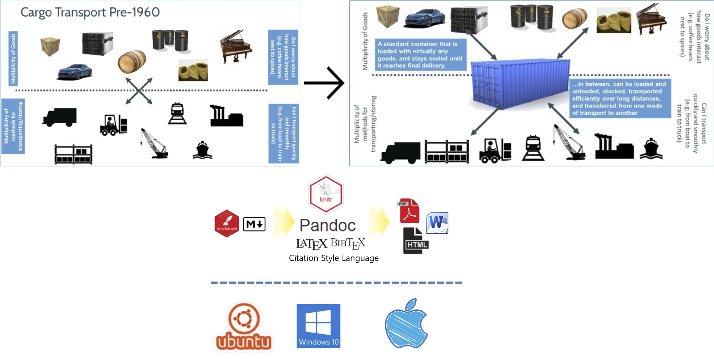
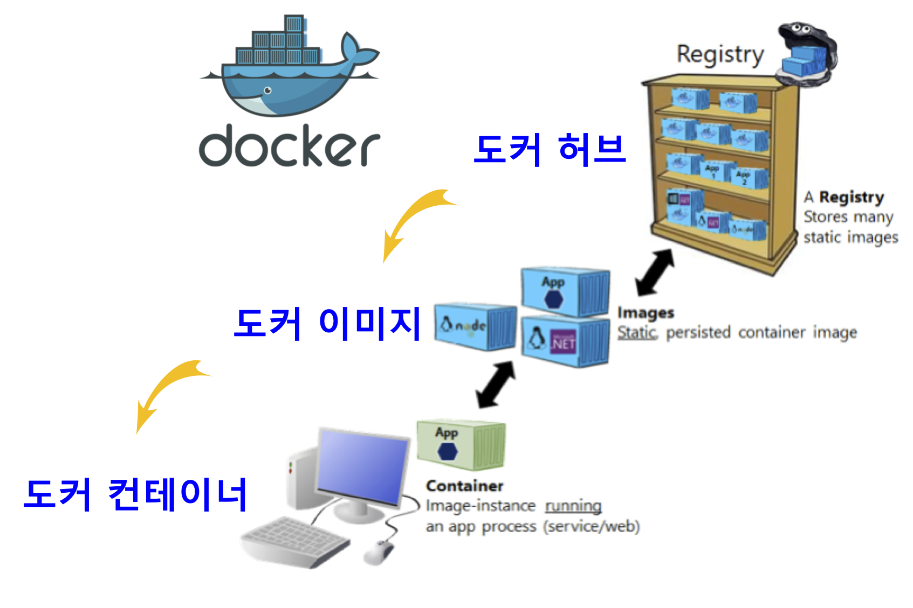
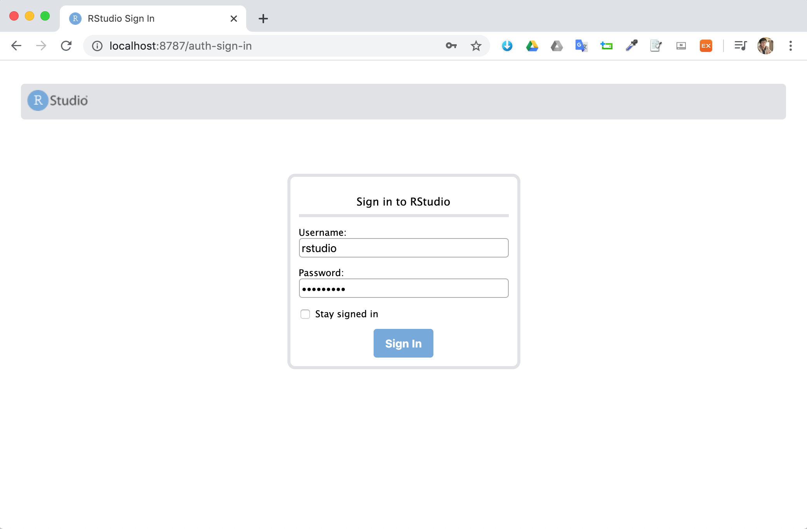
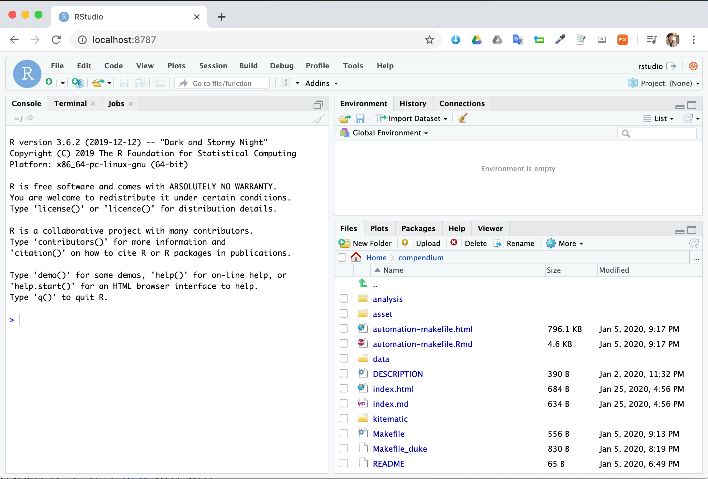
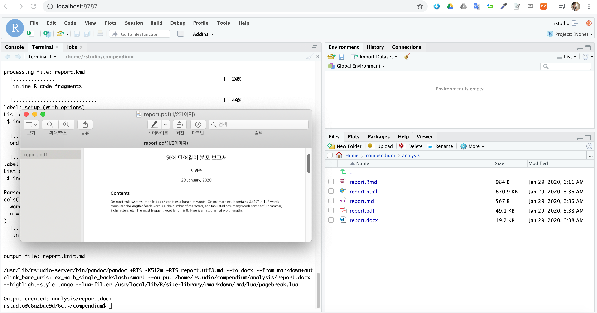

```{r setup2, include=FALSE}
knitr::opts_chunk$set(echo = TRUE, message=FALSE, warning=FALSE,
                      comment="", digits = 3, tidy = FALSE, prompt = FALSE, fig.align = 'center')

library(reticulate)
use_condaenv("anaconda3")
# reticulate::repl_python()
```

# 도커 교재 {#prerequisite-docker}

- [R 도커 - "재현가능한 과학연구를 위한 도커 학습교재"](http://statkclee.github.io/r-docker/)
    - [도커 설치](http://statkclee.github.io/r-docker/00-install.html)
    - [도커는 무엇이고 왜 사용하나](http://statkclee.github.io/r-docker/01-what-and-why.html)
    - [도커 실행](http://statkclee.github.io/r-docker/02-Launching-Docker.html)
    - [도커 이미지 생성 - 팩키지 설치 포함](http://statkclee.github.io/r-docker/03-install-packages.html)
    - [도커허브(Dockerhub)](http://statkclee.github.io/r-docker/04-Dockerhub.html)
    - [도커파일(Dockerfiles)](http://statkclee.github.io/r-docker/05-dockerfiles.html)
    - [분석결과 공유](http://statkclee.github.io/r-docker/06-Sharing-all-your-analysis.html)

도커 컨테이너 기술이 필요한 이유는 재현가능한 데이터 과학 제품 개발을 위해서 반듯이 필요하다. 
현재의 상황을 살펴보면 다양한 운영체제가 존재하고 이에 맞춰 정말 다양한 오픈소스를 동원해서 최종 데이터 과학 제품을 제작해야 하는데 매번 이를 source 코드를 가지고 컴파일해서 환경을 구축해서 작업하는 것은 완전히 시간낭비다.



# 도커 기본 [^docker-basics] {#docker-basics}

[^docker-basics]: [03. Publishing your Windows Container images into a Docker Registry](https://github.com/dotnet-architecture/eShopModernizing/wiki/03.-Publishing-your-Windows-Container-images-into-a-Docker-Registry)

[도커 컨테이너](https://www.docker.com/resources/what-container)를 하나의 컴퓨터로 생각하고 재현가능한 과학연구 혹은 제품개발을 위한 환경을 그대로 가져오는 것을 생각할 수 있다. 이를 위해서 몇가지 기본지식이 필요하다.

먼저 도커는 쉽게 생각해서 하나의 컴퓨터를 새로 장만하는 것으로 볼 수 있는데 주문한 컴퓨터는 특정 목적을 달성하기 위해서 필요로하는 모든 소프트웨어 환경이 완벽하게 구축되어 있다. [도커 허브(docker hub)](https://hub.docker.com/)에는 없는 것이 없다. 따라서 도커 허브에 회원가입하게 되면 필요로 하는 컴퓨터 이미지를 바로 얻을 수 있다.

다음 단계로 필요로 하는 컴퓨팅 환경이 구축된 도커 이미지를 로컬 컴퓨터로 가져오게 되면 다음 단계로 도커 이미지를 컨테이너로 실행시켜 본격적인 작업을 수행하는 것이 필요하다. 도커 컨테이너가 돌아가게 되면 이제 본격적인 데이터 과학 작업을 수행할 수 있게 된다.



## 도커 설치 {#docker-install}

[Docker Hub](https://hub.docker.com/)은 GitHub과 마찬가지로 도커로 제작한 다양한 이미지를 공유할 수 있게 해준다. 도커 프로그램도 운영체제에 맞춰 아래와 같이 골라 저장하면 된다.

- [Docker Desktop for Windows](https://hub.docker.com/editions/community/docker-ce-desktop-windows)
- [Docker Desktop for Mac](https://hub.docker.com/editions/community/docker-ce-desktop-mac)
- [Docker for Ubuntu](https://docs.docker.com/install/linux/docker-ce/ubuntu/)

도커를 설치하고 나면, 다음 단계로 제대로 설치되었는지를 `docker --version`, `docker-compose --version` 명령어를 통해서 확인한다.

```{bash check-docker-version}
docker --version
```

```{bash check-docker-compose}
docker-compose --version
```

```{bash check-docker-machine, eval=FALSE}
docker-machine --version
```

<style>
div.blue { background-color:#e6f0ff; border-radius: 5px; padding: 10px;}
</style>
<div class = "blue">

`docker system prune -f` 명령어를 사용해서 정지된 컨테이너, 사용되지 않는 네트워크, 이미지를 제거할 수 있다.

```{bash docker-container-cleanup, eval=FALSE}
docker system prune -f
```

물론 `docker system prune -f --volumes`을 사용해서 볼륨도 제거할 수 있다.

```{bash docker-container-cleanup-volumes, eval=FALSE}
docker system prune -f --volumes
```

</div>


## 도커 헬로 월드 [^docker-cleanup] {#docker-helloworld}

[^docker-cleanup]: [How To Remove Docker Containers, Images, Volumes, and Networks](https://linuxize.com/post/how-to-remove-docker-images-containers-volumes-and-networks/)

도커를 설치한 후 가장 먼저 헬로 월드를 뿌려보자.
[Hello World! (an example of minimal Dockerization)](https://hub.docker.com/_/hello-world)를 통해서 처음으로 도커 이미지를 가져온다.

```{bash docker-helloworld}
docker pull hello-world
```

다음으로 `docker images` 명령어로 이미지가 제대로 로컬 컴퓨터에 가져왔는지 확인한다.
`docker images -a` 명령어는 이용가능한 모든 도커 이미지가 된다.

```{bash docker-check-helloworld}
docker images hello-world
```

다음 단계로 이미지를 컨테이너로 실행시켜 보자. `--name` 옵션을 사용해서 `hello-docker`로 이름을 준비한다. 
즉, `hello-world` 이미지를 `hello-docker` 컨테이너를 띄우게 된다.

```{bash docker-check-hellodocker}
docker rm $(docker ps -a -q)
docker run --name hello-docker hello-world
```

도커 컨테이너는 `docker ps -l`로 도커 컨테이너를 확인할 수 있다.

```{bash docker-run-helloworld}
docker ps -l
```

# 도커 RStudio {#docker-rstudio}

도커 RStudio를 [The Rocker Project](https://www.rocker-project.org/) 웹사이트에서 가져온다. 
과저 도커 허브에 모든 것이 있었지만, RStudio 에서 많은 기여를 함에 따라 별도 웹사이트에서 준비되어 R과 관련된 데이터 과학 도커 내용만 추려 본다.

`docker pull` 명령어로 도커 허브에서 RStudio IDE 정보를 가져온다. 
이를 위해서 `rocker` 도커 저장소에서 `rstudio`를 `docker pull` 명령어로 가져온다.

```{bash docker-rstudio, eval=TRUE}
docker pull rocker/rstudio
```

도커 이미지 `rstudio`를 가져왔으면 개발환경을 별도로 설치하지 않고도 활용이 가능한데 이를 위해서 `docker run` 명령어로 RStudio IDE 컨테이너를 올리면 된다. 포트번호는 8787로 리눅스 운영체제에 설치된 RStudio IDE를 8787 포트를 통해서 `rstudio` 사용자명에 `tidyverse` 비번을 넣어 데이터 과학 개발환경에 접속한다.

```{bash docker-rstudio-run}
docker run -d -e PASSWORD=tidyverse --rm -p 8787:8787 rocker/rstudio
```

웹브라이져를 열고 `lcoalhost:8787`을 클릭하면 RStudio IDE에 접근할 수 있다. `rstudio` 사용자명에 `rstudio` 비번이 기본으로 설정되어 있는데 비번을 `tidyverse`로 수정한 경우 수정된 비번으로 로그인하면 된다.



`docker ps -a` 명령어를 사용하면 도커 컨테이너가 떠있는 것을 함께 확인할 수 있다.

```{bash docker-rstudio-run-again}
docker ps -a
```

이제 RStudio IDE 컨테이너를 통해 데이터 과학 개발환경 구축이 완료된 것을 확인했으니, 다음 단계로 컨테이너를 제거한다.
이를 위해서 다음 명령어를 사용하면 된다.

- `docker rm $(docker ps -a -q)`
- `docker stop $(docker ps -a -q)`

```{bash docker-rstudio-remove}
docker stop $(docker ps -a -q)
```


# 컨테이너 폴더 연결 {#docker-rstudio-volume}

도커 이미지에서 컨테이너를 뽑아내게 되면 컨테이너에 담긴 데이터 및 정보는 언제라도 없어질 수 있기 때문에 도커 컨테이너를 호스팅하고 있는 로컬 컴퓨터 폴더와 동기화 시키는 것이 필요하다.
이를 위해서 필요한 것이 `-v`, `--volume` 옵션이다. 로컬 컴퓨터 디렉토리와 컨테이너 내부 디렉토리와 동기화시키게 되면 이런 문제를 간단히 해결할 수 있다.

```{bash docker-rstudio-volume}
docker run -d -e PASSWORD=tidyverse --rm --name rstudio -p 8787:8787 -v   /Users/statkclee/swc/compendium_301:/home/rstudio/compendium rocker/rstudio
```

로컬 컴퓨터에서 동기화시킬 디렉토리는 윈도우 탐색기나 맥 `Finder`를 통해 간단히 확인할 수 있으나 도커 컨테이너는 상황이 다르다. 먼저 도커 컨테이러를 띄우는 작업을 하고 나서, `docker exec` 명령어를 사용해서 도커 컨테이너 내부로 들어간다.

- `docker run -d -e PASSWORD=tidyverse --rm --name rstudio -p 8787:8787 rocker/rstudio`
- `docker exec -it rstudio /bin/bash`



```{bash docker-rstudio-volume-stop}
docker exec rstudio ls -al /home/rstudio/compendium
```


# $\LaTeX$ 도커 이미지 {#docker-latex}

`rocker/` 도커 이미지 중 $\LaTeX$ 관련된 이미지가 `verse`다. 
다만, 한글 $\LaTeX$이 없다는 것이 문제라... 이를 해결하기 위해서 다음 과정을 거친다.
먼저 도커 컨테이너를 `latex`이름으로 띄운다. `docker network prune`

```{bash latex-docker-rstudio}
docker stop rstudio
```

```{bash latex-docker}
docker run -d -e PASSWORD=tidyverse --rm --name latex -p 8787:8787 -v   /Users/statkclee/swc/compendium_301:/home/rstudio/compendium rocker/verse
```

그리고 나서, `docker exec latex /bin/bash`으로 들어간다. 

```{bash login-bash-latex}
docker exec latex /bin/bash
```

컨테이너 배쉬쉘에서 `fc-list`를 사용하면 나눔 폰트가 설치된 것이 확인되지 않는다.
`sudo apt-get update` 명령어에 이어서 나눔 폰트를 설치해준다.
이를 통해서 나눔폰트가 설치된 것을 확인할 수 있다.

```{bash check-fonts, eval=FALSE}
$ fc-list | grep "Nanum"
$ sudo apt-get update
$ sudo apt-get install fonts-nanum fonts-nanum-extra fonts-nanum-coding fonts-baekmuk fonts-unfonts-core fonts-unfonts-extra
$ fc-list | grep "Nanum"

/usr/share/fonts/truetype/nanum/NanumSquareRoundB.ttf: NanumSquareRound,나눔스퀘어라운드,NanumSquareRound Bold,나눔스퀘어라운드 Bold:style=Bold,Regular
/usr/share/fonts/truetype/nanum/NanumSquareRoundR.ttf: NanumSquareRound,나눔스퀘어라운드,NanumSquareRound Regular,나눔스퀘어라운드 Regular:style=Regular
/usr/share/fonts/truetype/nanum/NanumSquareB.ttf: NanumSquare,나눔스퀘어,NanumSquare Bold,나눔스퀘어 Bold:style=Bold
/usr/share/fonts/truetype/nanum/NanumGothicLight.ttf: NanumGothic,나눔고딕,NanumGothic Light,나눔고딕 Light:style=Light,Regular
/usr/share/fonts/truetype/nanum/NanumBrush.ttf: Nanum Brush Script,나눔손글씨 붓:style=Regular
/usr/share/fonts/truetype/nanum/NanumBarunGothic.ttf: NanumBarunGothic,나눔바른고딕:style=Regular
/usr/share/fonts/truetype/nanum/NanumBarunGothicUltraLight.ttf: NanumBarunGothic,나눔바른고딕,NanumBarunGothic UltraLight,나눔바른고딕 UltraLight:style=UltraLight
/usr/share/fonts/truetype/nanum/NanumGothic.ttf: NanumGothic,나눔고딕:style=Regular
/usr/share/fonts/truetype/nanum/NanumBarunpenB.ttf: NanumBarunpen,나눔바른펜,NanumBarunpen Bold:style=Bold
/usr/share/fonts/truetype/nanum/NanumGothicCoding.ttf: NanumGothicCoding,나눔고딕코딩:style=Regular
/usr/share/fonts/truetype/nanum/NanumBarunGothicBold.ttf: NanumBarunGothic,나눔바른고딕:style=Bold
/usr/share/fonts/truetype/nanum/NanumPen.ttf: Nanum Pen Script,나눔손글씨 펜:style=Regular
/usr/share/fonts/truetype/nanum/NanumBarunGothicLight.ttf: NanumBarunGothic,나눔바른고딕,NanumBarunGothic Light,나눔바른고딕 Light:style=Light
/usr/share/fonts/truetype/nanum/NanumSquareRoundL.ttf: NanumSquareRound,나눔스퀘어라운드,NanumSquareRound Light,나눔스퀘어라운드 Light:style=Light,Regular
/usr/share/fonts/truetype/nanum/NanumGothicBold.ttf: NanumGothic,나눔고딕:style=Bold
/usr/share/fonts/truetype/nanum/NanumGothicCoding-Bold.ttf: NanumGothicCoding,나눔고딕코딩:style=Bold
/usr/share/fonts/truetype/nanum/NanumSquareEB.ttf: NanumSquare,나눔스퀘어,NanumSquare ExtraBold,나눔스퀘어 ExtraBold:style=ExtraBold
/usr/share/fonts/truetype/nanum/NanumBarunpenR.ttf: NanumBarunpen,나눔바른펜:style=Regular
/usr/share/fonts/truetype/nanum/NanumSquareR.ttf: NanumSquare,나눔스퀘어:style=Regular
/usr/share/fonts/truetype/nanum/NanumMyeongjo.ttf: NanumMyeongjo,나눔명조:style=Regular
/usr/share/fonts/truetype/nanum/NanumSquareL.ttf: NanumSquare,나눔스퀘어,NanumSquare Light,나눔스퀘어 Light:style=Light
/usr/share/fonts/truetype/nanum/NanumMyeongjoBold.ttf: NanumMyeongjo,나눔명조:style=Bold
/usr/share/fonts/truetype/nanum/NanumMyeongjoExtraBold.ttf: NanumMyeongjo,나눔명조,NanumMyeongjoExtraBold,나눔명조 ExtraBold:style=ExtraBold
/usr/share/fonts/truetype/nanum/NanumSquareRoundEB.ttf: NanumSquareRound,나눔스퀘어라운드,NanumSquareRound ExtraBold,나눔스퀘어라운드 ExtraBold:style=ExtraBold,Regular
/usr/share/fonts/truetype/nanum/NanumGothicExtraBold.ttf: NanumGothic,나눔고딕,NanumGothicExtraBold,나눔고딕 ExtraBold:style=ExtraBold
```

마지막 단계로 `localhohst:8787`로 접근한 후에 RStudio 콘솔에서 `make all` 명령어를 실행시키게 되면 `.pdf` 파일도 한글이 정상적으로 출력되는 것을 확인할 수 있다.




