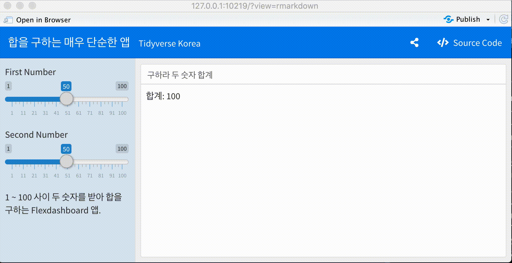

```{r setup, include=FALSE}
knitr::opts_chunk$set(echo = TRUE, message=FALSE, warning=FALSE,
                      comment="", digits = 3, tidy = FALSE, prompt = FALSE, fig.align = 'center')

library(pdftools)
library(tidyverse)
library(magick)

```


# 작업흐름 {#mac-gif-workflow}

맥에서 GIF를 제작하는 방식은 먼저 QuickTime Player로 화면을 `.mov`파일로 저장한 후에 
`ffmpeg`으로 동영상 파일을 처리하고 `gifsicle`을 활용하여 GIF 파일로 떨군다.

# 의존성 설치 [^install-tools] {#mac-gif-setup}

[^install-tools]: [Brayton (November 22, 2018), "CREATING A GIF FROM QUICKTIME SCREEN RECORDING IN MACOS - Creating a GIF from QuickTime Screen Recording in macOS"](https://www.braytonstafford.com/creating-a-gif-from-quicktime-screen-recording/ = )

`ffmpeg`, `xquartz`, `gifsicle`을 순차적으로 설치한다.

```{bash install-tools, eval = FALSE}
brew install ffmpeg 
brew cask install xquartz #dependency for gifsicle, only required for mountain-lion and above
brew install gifsicle
```

# 화면 녹화 {#mac-gif-record}

**QuickTime Player**를 실행하고 "파일" &rarr; "새로운 화면 기록" 을 클릭하여 녹화할 화면을 기록한다. 
화면 기록이 끝나면 `new-file.mov`와 같이 확장자가 `.mov`를 갖는 동영상 파일로 저장시킨다.
동영상으로 파일을 떨구는 방법은 File &rarr; Export &rarr; As Movie 으로 적당한 파일명으로 떨군다.


# 동영상 파일 &rarr; GIF 파일 {#convert-mov-into-gif}

`ffmpeg` 명령어를 사용해서 `.mov`파일을 `.gif`파일로 변환시킨다.

```{bash move-to-gif, eval = FALSE}
ffmpeg -i new-file.mov -s 600x400 -pix_fmt rgb24 
ffmpeg -i new-file.mov new-file.gif
```





