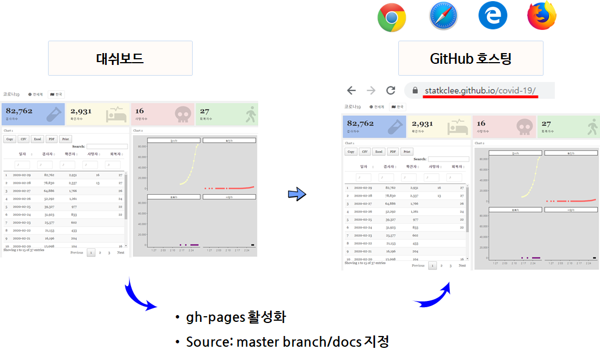

```{r setup2, include=FALSE}
knitr::opts_chunk$set(echo = TRUE, message=FALSE, warning=FALSE,
                      comment="", digits = 3, tidy = FALSE, prompt = FALSE, fig.align = 'center')

library(reticulate)
```

# 대쉬보드 [^dashboard] [^blog-dashboard] {#dashboard}

[^dashboard]: [Marlorie Hughes (2019. 12. 3), "Dashboarding Like a Boss", DC R Conference](https://www.youtube.com/watch?v=yott4quKN6s)

[^blog-dashboard]: [Sagar Kulkarni (Sep 20, 2019), "Building an HR Dashboard in R using Flexdashboard", towrds data science](https://towardsdatascience.com/building-an-hr-dashboard-in-r-using-flexdashboard-76d14ed3f32)

**A 12 Step Program to Quick Emailing Plots & Csvs**

1. Basic Layout
    - [`flexdashboard`](https://rmarkdown.rstudio.com/flexdashboard/)
1. Printing Tables, Descriptive Statistics, Model Summaries
    - `printr`, `summarytools::dfSummary`, `stargazer::stargazer`
    - [list of statistic codes](https://rdrr.io/cran/stargazer/man/stargazer_stat_code_list.html)
1. Interactive Datasets
    - `DT`
1. Interactive Plots
    - `highcharter`
    -  지도(`leaflet`), 시계열(`dygraphs`), `ggplots`(`plotly`)
1. Exporting
    - Datasets with `DT`
    - Highcharter Plots
1. CSS basics
1. Branding: Logos, Fonts, Colors
1. Header/Footer
1. **Hosting**
1. Automate-ish (Render + System())
1. Replicate (Render with arguments)
1. Automate or App it (cron, shiny runtime)

# 대쉬보드 호스팅 {#dashboard-hosting}

GitHub 저장소에 개발된 대쉬보드를 웹호스팅도 가능하다. 
이를 위해서 크게 두가지 작업이 별도로 필요하다.

먼저 `rmarkdown::render_site()` 명령어로 개발된 `flexdashboard` 대쉬보드를 `docs/` 폴더로 배포시킨다.

두번째로 `docs/` 폴더에 담긴 대쉬보드 결과물을 GitHub gh-pages에서 호스팅을 위한 환경 설정을 아래와 같이 수행한다.

1. 기존 Github 저장소에 `gh-pages` 브랜치를 추가시켜 활성화 시킨다.
1. **Source**를 `master branch/docs` 폴더를 지정한다.

마지막으로 두번째와 순서가 바뀌어도 상관이 없다. 즉, `_site.yml`을 작성하여 추가시킨다.

```{r _site.yml, eval=FALSE}
name: "my-website"
output_dir: docs
```




# 대쉬보드 제작 {#finish-dashboard}

`flexdashboard` 팩키지를 사용해서 대쉬보드 사용법에 맞추어 코드를 작성하고 R 시각화 산출물을 배치시킨다. `.Rmd` 소스코드를 RStudio IDE를 사용할 경우 `Ctrl + Shift + B` 단축키를 사용하여 컴파일 시키거나 다음 명령어를 R 콘솔창에 타이핑하여 완성한다. 한글이 들어간 경우 필히 `encoding = 'UTF-8'`을 인자로 넣어준다.

```{r rmarkdown-render_site, eval = FALSE}
rmarkdown::render_site(encoding = 'UTF-8')
```

제작된 대쉬보드를 로컬 웹서버를 띄워서 웹브라우저로 확인하고자 하는 경우 다음 명령어로 대쉬보드 웹서버를 띄운다.
그리고 나서 웹브라우저에서 `localhost:8201` 포트를 사용해서 접근하면 대쉬보드 결과물을 확인할 수 있다.

```{r dashboard-execute, eval=FALSE}
rmarkdown::run("index.rmd", shiny_args = list(host="0.0.0.0",port=8201))
```


# `GitHub` 배포 {#deploy-dashboard}

## `gh-pages` 생성 {#deploy-dashboard-gh-pages}

`gh-pages`를 활용하여 정정 웹사이트인 경우 별다른 고민없이 배포할 수 있다. 
이를 위해서 GitHub 설정을 해줘야만 한다.

{#id .class width="100%"}

## GitHub Pages **Source** {#deploy-dashboard-gh-pages-sources}

대쉬보드 [GitHub 저장소](https://github.com/statkclee/covid-19/) 상단에 보면 **Settings**을 클릭하고 나서, 쭉 아래로 내려가면 `GitHub Pages` 메뉴가 보이고 **Source**를 선택해서 `master branch /docs folder`를 지정한다.
즉, 대쉬보드 호스팅을 위해서 대쉬보드 제작 소스코드 `.Rmd`와 `rmarkdown::render_site(encoding = 'UTF-8')`으로 생성된 `docs/` 폴더 산출물을 이용하여 `gh-pages`에 올려서 서비스하겠다는 얘기가 되겠다.


## 코로나19 대쉬보드 {#deploy-dashboard-hosting}

[코로나19 대쉬보드](https://statkclee.github.io/covid-19/) 웹사이트에 `gh-pages` 규칙에 맞춰 생성된 URL로 접근하면 호스팅 작업이 마무리 된다.

```{r gh-pages-hosting}
library(webshot)

webshot("https://statkclee.github.io/covid-19/")
```


