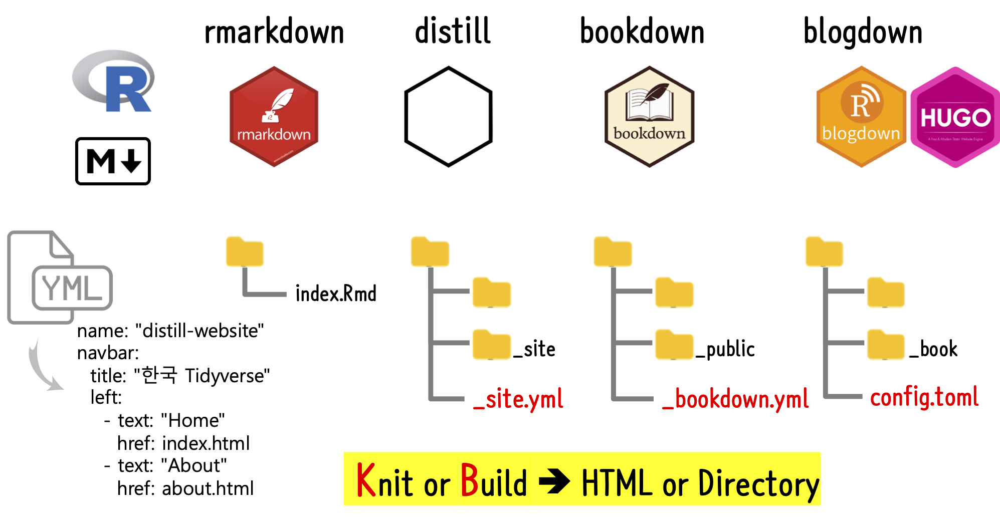

```{r setup2, include=FALSE}
knitr::opts_chunk$set(echo = TRUE, message=FALSE, warning=FALSE,
                      comment="", digits = 3, tidy = FALSE, prompt = FALSE, fig.align = 'center')

library(reticulate)
```

# 데이터 과학 커뮤니케이션 [^meghan] {#data-science-communication}

[^meghan] : [Meghan Hall (June 15, 2021), "Extending R Markdown", RStudio: R in Sports Analytics, ](https://meghan.rbind.io/slides/rstudio/hall_rstudio_2021)

데이터를 기반으로 뭔가 유용한 것을 창출한 후에 이를 알리기 위해 커뮤니케이션 단계를 거치게 된다. 가장 흔히 사용하는 방식은 엑셀, 워드, 파워포인트와 같은 MS 오피스 제품을 활용하는 방식이다. 과거 SAS, SPSS, 미니탭 등 외산 통계 팩키지로 데이터를 분석하고 유용한 모형 등을 찾아낸 후에 이를 커뮤니케이션하기 위해 MS 오피스 제품을 통해 커뮤니케이션을 하기도 했다. 하지만, 각각은 별개의 시스템으로 분리되어 있어 일일이 사람손이 가는 번거러움이 많았다. 이를 해결하기 하는 방법은 하나의 도구 혹은 언어로 모든 작업을 처리하는 것이다.

우선 엑셀은 Tidyverse 로 대체가 되고, 워드는 R 마크다운, 파워포인트도 R 마크다운(`xaringan` 등)으로 대체된다.


# 커뮤니케이션 방법 {#data-science-communication-how}

데이터 과학을 커뮤니케이션하는 방식은 다양한 방식이 존재하지만 아마도 다음과 같은 이해가 많은 분들이 동의하는 방식이 아닐까 싶다.

- 동료 개발자나 협업하시는 분: `.Rmd` 파일
- 직장상사
    - PDF 파일: `knitr`
    - 파워포인트 슬라이스덱: `xaringan`
    - 대쉬보드: `flexdashboard`
- 일반 공개
    - 웹사이트: `distill`
    - 블로그: `blogdown`
    - 책: `bookdown`


# Birds Eye View {#birds-eye-view}

디지털 전환(Digital Transformation) 세상에 보장된 직업은 없으며 각자 일자리를 본인이 창출하는 세상으로 접어든지 시간이 좀 지난듯 하다. [네이버 블로그](https://section.blog.naver.com/), [카카오 브런치](https://brunch.co.kr/), [티스토리](https://www.tistory.com/) 등 국내도 블로그 플랫폼이 있지만 데이터 과학과 과학기술을 지원하는데는 한계가 있다. 또한, 블로그를 넘어서 정적 웹사이트(Static Website) 기능도 장착하는 것도 필요하고 [`postcards`](https://github.com/seankross/postcards)와 같이 이력서 및 포트폴리오 홍보를 위한 기능도 필요하다. 이를 R마크다운과 `distill`을 주된 인프라로 구축하는 방식이 제법 실무적으로 사용가능하도록 다가왔다.

-   [`postcards` 포트폴리오](https://github.com/seankross/postcards)
-   [`distill` 웹사이트](https://rstudio.github.io/distill/website.html)
-   [`distill` 블로그](https://rstudio.github.io/distill/blog.html)


# 공유와 배포 [^1] {#netlify-share}

[^1]: [Alison Hill · Desirée De Leon (2020-04-01), "Sharing on Short Notice HOW TO GET YOUR TEACHING MATERIALS ONLINE WITH R MARKDOWN", RStudio Webinar](https://rstudio-education.github.io/sharing-short-notice/#1)

데이터 과학 콘텐츠를 제작하는 것도 중요하지만, 다양한 형태로 공유하는 방법을 숙지하는 것도 데이터 과학자의 기본 소양으로 자리잡고 있으며, 그 근본에는 웹을 통한 공유가 필수적이다.

R 데이터 과학 콘텐츠는 R 마크다운 저작을 기본으로 하고 다양한 형태로 예를 들어 책, 논문, 블로그 등으로 제작하여 웹으로 배포하는 사례를 꼽을 수 있다.

-   [rmarkdown](https://rmarkdown.rstudio.com/index.html)
-   [distill](https://github.com/rstudio/distill)
-   [bookdown](https://bookdown.org/)
-   [blogdown](https://cran.r-project.org/web/packages/blogdown/index.html)

다양한 저작이 끝나고 나면 이를 로컬 컴퓨터의 웹서비스로 올리는 것은 쉬운데 외부 서버에 자유로이 (무료 포함) 배포하는 방법에는 여러사례가 있지만 아무래도 [netlify](https://www.netlify.com/)를 활용하는 것이 현재 시점(2020년) 최선의 방법으로 생각된다. 특히 [`Netlify Drop`](https://app.netlify.com/drop)을 사용할 경우 이는 그 편리함에서 타의 추종을 불허한다. 꼭 써보시기를 강추합니다.

-   [`Netlify Drop`](https://app.netlify.com/drop)



# `R마크다운` {#netlify-rmarkdown}

[`Netlify Drop`](https://app.netlify.com/drop) 을 배포 웹사이트로 지정했다면 다음 단계로 두가지 선택옵션이 존재한다. 먼저 R마크다운(`.Rmd`) 문서를 뜨게질(knitr)을 하여 HTML 파일로 변환시킨 후에 이를 Drag and Drop방식으로 [`Netlify Drop`](https://app.netlify.com/drop)에서 배포할 것인지 아니면 `Build`하여 `_site`, `_book`, `_book`으로 디렉토리를 마찬가지 방식으로 Drag and Drop방식으로 [`Netlify Drop`](https://app.netlify.com/drop)에서 배포할 것인지 정하면 된다.

```{r netlify-rmarkdown-webshot, eval = FALSE}
webshot2::webshot("https://app.netlify.com/drop", "fig/netlify-drop.png")
```


# 웹사이트와 블로그: `distill` {#netlify-distill}

-   [Sharing Rmarkdown distill paper](https://github.com/statkclee/sharing-distill)

# 블로그: `blogdown` {#netlify-blog}

-   [데이터 과학을 위한 저작도구: Computational Documents, 블로그 - `blogdown`](ds-blogdown.html)

# 책: `bookdown` {#netlify-bookdown}

-   [데이터 과학을 위한 저작도구: 북다운(`bookdown`)](bookdown-intro.html)
