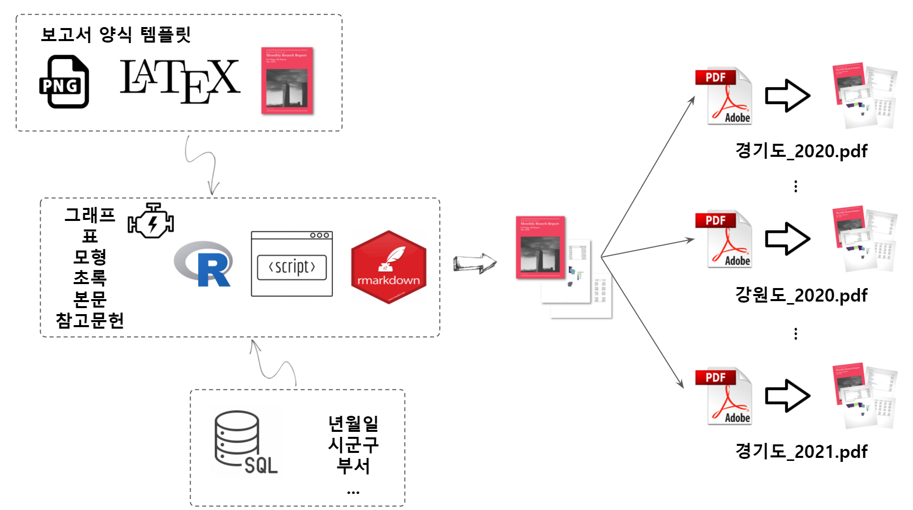

```{r setup2, include=FALSE}
knitr::opts_chunk$set(echo = TRUE, message=FALSE, warning=FALSE,
                      comment="", digits = 3, tidy = FALSE, prompt = FALSE, fig.align = 'center')

library(reticulate)
```




# 전반적인 작업흐름 {#professional-document}

전문 문서를 제작하기 위해서는 다양한 요소가 기술적으로 결합되어야만 된다.

1. 정형 데이터: 관계형 데이터베이스 &rarr; 데이터 과학을 위한 기반 데이터
1. 데이터 과학 문서: R + 마크다운 &rarr; 그래프, 표, 모형, $\cdots$
1. 문서 책 저작: $\LaTeX$ &rarr; PDF 문서

상기 세가지 요소가 유기적으로 연결이 되어야만 전문적인 보고서 문서를 제작할 수 있다.

# 가짜 데이터 만들기 [^faker] {#faker-dataset}

[]: [Dale Seo (Mar 14, 2020), "파이썬으로 가짜 데이터 생성하기 - Faker", Engineering Blog](https://www.daleseo.com/python-faker/)

데이터 과학을 하다보면 처음 데이터가 필요한 경우가 많다. 이런 경우 가짜 데이터를 만들어서 원하는 결과를 얻은 후에 나중에 이를 실데이터로 치환하는 경우 생산성을 많이 높일 수 있고 사전에 관련 문제를 해결하는데 도움을 주기도 한다.
`profile()` 메쏘드를 사용해서 기본 데이터를 얻을 수 있지만 특정 필요한 필드만 정의해서 개인 신상에 대한 가짜 데이터도 얻을 수 있다.

```{python generate-fake-data}
from faker import Faker
import pandas as pd

fake = Faker("ko_KR")

# def create_rows_faker(num=1):
#     output = [{"name"       : fake.name(),
#                "email"      : fake.email(),
#                # "company"    : fake.company(),
#                # "job"        : fake.job(),
#                # "credit card": fake.credit_card_provider(),
#                # "city"       : fake.city(),
#                # "ip_address" : fake.ipv4_private(),
#                # "profile"    : fake.profile(),
#                # "date_time"  : fake.date_time(),
#                "address"    : fake.address()} for x in range(num)]               
#     return output
# 
# df_faker = pd.DataFrame(create_rows_faker(100))

profiles = [fake.profile() for i in range(10)]
df_faker = pd.DataFrame(profiles)

df_faker.head()

df_faker.to_csv("data/faker.csv", sep = "|", na_rep = "NaN")
```

파이썬 `Faker`로 생성한 가짜 데이터를 가지고 기본적인 통계 분석 작업을 수행하기에 앞서 생성한 가짜 고객데이터를 살펴본다.

```{r call-dataframe, eval = TRUE}
library(tidyverse)
library(reticulate)

faker_tbl <- read_delim("data/faker.csv", delim = "|")

faker_tbl %>% 
  reactable::reactable()
```

[`FinanceDataReader`](https://github.com/FinanceData/FinanceDataReader) 파이썬 팩키지를 활용하여 주식 데이터를 얻어온다.

- `pip install beautifulsoup4`
- `pip install finance-datareader`

```{python get-finance-data}
import FinanceDataReader as fdr

# 삼성전자(005930) : (2017-01-0 ~ 2019-12-31)
samsung_df = fdr.DataReader('005930', '2017-01-01', '2019-12-31')

# Apple(AAPL) : (2017-01-0 ~ 2019-12-31)
apple_df = fdr.DataReader('AAPL', '2017-01-01', '2019-12-31')

# AMAZON(AMZN) : (2017-01-0 ~ 2019-12-31)
aws_df = fdr.DataReader('AMZN', '2017-01-01', '2019-12-31')

samsung_df.to_csv("data/stock_samsung.csv", sep = "|", na_rep = "NaN")
apple_df.to_csv("data/stock_apple.csv", sep = "|", na_rep = "NaN")
aws_df.to_csv("data/stock_aws.csv", sep = "|", na_rep = "NaN")

```


# 데이터베이스 구축 {#faker-database}

데이터베이스를 구축하고자 하는 경우 데이터베이스 시스템을 갖추고 데이터를 테이블로 저장한다.

```{r tables-for-writing}
# 고객 정보
faker_tbl <- read_delim("data/faker.csv", delim = "|") %>% 
  select(name, job, ssn, sex, address, mail, company)

samsung_tbl <- read_delim("data/stock_samsung.csv", delim = "|")
apple_tbl   <- read_delim("data/stock_apple.csv", delim = "|")
aws_tbl     <- read_delim("data/stock_aws.csv", delim = "|")

# 주가정보
stock_tbl <- samsung_tbl %>% 
  select(date = Date, samsung = Open) %>% 
  left_join(
    apple_tbl %>% 
    select(date = Date, apple = Open)
  ) %>% 
  left_join(
    aws_tbl %>% 
    select(date = Date, aws = Open)
  )

stock_tbl <- stock_tbl %>% 
  pivot_longer(cols = -date, names_to = "stock", values_to = "price")

# 주식 보유현황
set.seed(777)
investment_tbl <- tibble(name    = faker_tbl %>% select(name) %>% pull,
                         samsung = runif(nrow(faker_tbl), 0, 100) %>% round(., digits =0),
                         apple   = runif(nrow(faker_tbl), 0, 100) %>% round(., digits =0),
                         aws     = runif(nrow(faker_tbl), 0, 100) %>% round(., digits =0)) %>% 
  mutate(samsung = ifelse(samsung < 70, 0, samsung),
         apple   = ifelse(apple   < 70, 0, apple),
         aws     = ifelse(aws     < 70, 0, aws))

investment_tbl <- investment_tbl %>% 
  pivot_longer(cols = -name, names_to = "stock", values_to = "shares")

```

고객정보, 주식보유현황, 주가 정보가 있다고 가정하면 보유주식에 대한 시점별 주식변동에 따른 자산변동현황을 살펴볼 수 있다.


```{r database-creation}
library(DBI)
library(RSQLite)
library(tidyverse)

# Create db ---------------------------------------------------------------

conn <- dbConnect(SQLite(), dbname="data/stock.sqlite")

# 테이블 넣기 ---------------------------------------------------------------

DBI::dbWriteTable(conn = conn, name = "customers",  value = faker_tbl, overwrite = TRUE)
DBI::dbWriteTable(conn = conn, name = "stocks",     value = stock_tbl, overwrite = TRUE)
DBI::dbWriteTable(conn = conn, name = "investment", value = investment_tbl, overwrite = TRUE)

dbDisconnect(conn)
```


```{r database-modelr}
library(datamodelr)
library(DiagrammeR)

conn <- dbConnect(SQLite(), dbname="data/stock.sqlite")

customers  <- tbl(conn, "customers") %>% collect()
stocks     <- tbl(conn, "stocks") %>% collect()
investment <- tbl(conn, "investment") %>% collect()

stock_investment_model <- dm_from_data_frames(customers, investment, stocks)

stock_investment_model <- dm_add_references(
  stock_investment_model,
  customers$name   == investment$name,
  investment$stock == stocks$stock
)

stock_investment_graph <- dm_create_graph(stock_investment_model, rankdir = "LR", col_attr = c("column", "type"))
dm_render_graph(stock_investment_graph)

dbDisconnect(conn)
```

# DB 쿼리 {#faker-database-query}

앞서 작성한 데이터베이스에 접속하여 SQL Query 문을 보내 필요한 정보를 데이터베이스에서 추출한다.

```{r database-connect}
stock_db <- DBI::dbConnect(RSQLite::SQLite(), dbname="data/stock.sqlite")
```

SQL 쿼리문을 작성하여 `customers` 테이블에서 필요한 정보를 추출한다.

```{sql database-query, connection = stock_db}
SELECT name, sex, ssn, company FROM customers LIMIT 10;
```

