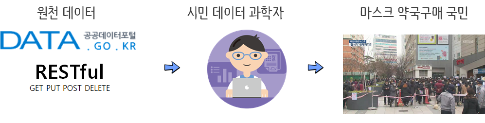
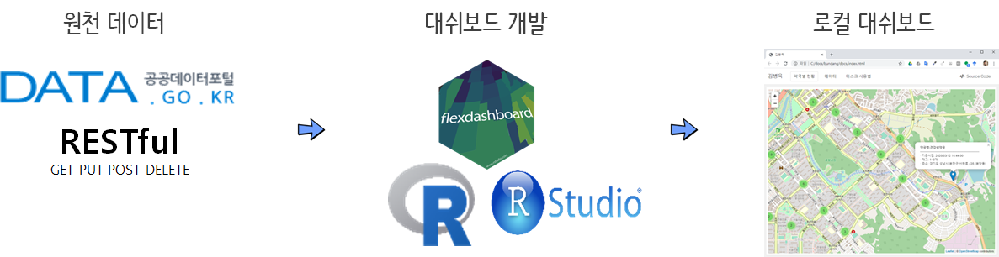

```{r setup2, include=FALSE}
knitr::opts_chunk$set(echo = TRUE, message=FALSE, warning=FALSE,
                      comment="", digits = 3, tidy = FALSE, prompt = FALSE, fig.align = 'center')

library(reticulate)
```

# 대쉬보드 [^dashboard] [^blog-dashboard] {#dashboard}

[^dashboard]: [Marlorie Hughes (2019. 12. 3), "Dashboarding Like a Boss", DC R Conference](https://www.youtube.com/watch?v=yott4quKN6s)

[^blog-dashboard]: [Sagar Kulkarni (Sep 20, 2019), "Building an HR Dashboard in R using Flexdashboard", towrds data science](https://towardsdatascience.com/building-an-hr-dashboard-in-r-using-flexdashboard-76d14ed3f32)

**A 12 Step Program to Quick Emailing Plots & Csvs**

1. Basic Layout
    - [`flexdashboard`](https://rmarkdown.rstudio.com/flexdashboard/)
1. Printing Tables, Descriptive Statistics, Model Summaries
    - `printr`, `summarytools::dfSummary`, `stargazer::stargazer`
    - [list of statistic codes](https://rdrr.io/cran/stargazer/man/stargazer_stat_code_list.html)
1. Interactive Datasets
    - `DT`
1. Interactive Plots
    - `highcharter`
    -  지도(`leaflet`), 시계열(`dygraphs`), `ggplots`(`plotly`)
1. Exporting
    - Datasets with `DT`
    - Highcharter Plots
1. CSS basics
1. Branding: Logos, Fonts, Colors
1. Header/Footer
1. **Hosting**
1. **Automate-ish (Render + System())**
1. **Replicate (Render with arguments)**
1. **Automate or App it (cron, shiny runtime)**


# 실시간 대쉬보드 {#real-time-dashboard-hosting}

약국 마스크 판매에 대해 실시간 정보 제공이 필요한 이유는 늦은 밤시간에도 줄서기를 한다는 점에서 기인한다. [^newdaily]
이러한 사회적 낭비를 막기 위해서 정부에서는 실시간으로 약국에 배정된 마스크 데이터를 제공하고 있지만, 이를 일반인들이 사용하기 위해서는 RESTful API, R 언어 뿐만 아니라 네트워크, DNS, 시각화, 대쉬보드, 데이터프레임, JSON등 다양한 개념을 파악하고 있어야 한다. 이러한 간극을 매워주는 역할을 하는 것이 아마도 **시민 데이터과학자(Citizen Data Scientist)**가 아닐까 싶다.

[^newdaily]: [김새미 (2020-03-10), "마스크 5부제 첫날, 저녁에도 '줄서기' 여전… 판매시간 제각각", 뉴데일리 경제](http://biz.newdaily.co.kr/site/data/html/2020/03/09/2020030900262.html)

## 역할분담 {#real-time-dashboard-hosting-rnr}

전국민이 매주 1인당 마스크 2개를 나눠주는 문제는 그렇게 쉬운 문제가 아니며 정부, 시민 데이터 과학자, 국민 모두가 소임을 충실히 할 때만 원할히 이와 같은 사회적 문제를 해결할 수 있다. 

먼저, 정부는 모든 것을 다 할 수 있다는 사고의 전환이 필요하다. 데이터 과학의 세계에서 모든 일을 정부가 한다는 것은 있을 수도 없지만 한다고 해서 좋은 성과가 나는 것이 아니다. 즉, 정부가 가장 잘 할 수 있는 역할인 데이터를 제공하는 것에 집중하는 것이 필요하다. 

시민 데이터 과학자는 높은 연봉을 추구하는 상업적 성격이 강한 데이터 과학자와 달리 사회적 문제를 그동안 학습한 기본 소양을 바탕으로 사회에 기여할 수 있는 데이터 과학 제품과 서비스를 만들 수 있는 역량을 갖춘 국민일원을 말한다. 아직 그 숫자는 미미하지만 매년 적은 수이지만 [Tidyverse Korea](https://www.facebook.com/groups/tidyverse/)와 같은 커뮤니티를 통해서 꾸준히 늘어나고 있는 것도 사실이다.

마지막으로 정부에서도 정보격차 해소를 위해서 좋은 데이터 과학 제품을 만들어 내고 제공하고 있고 영리를 목적으로 하는 기업체도 늘어나고 있고, 이번 사례와 같이 시민 데이터 과학자도 사회적 문제 해결에 동참하고자 이러한 제품을 많이 만들어 내고 있다. 결국 선택을 하는 것은 국민 본인인만큼 다양한 데이터 과학 제품과 서비스를 사용해보고 어떤 것이 좋은 것인지 파악할 수 있는 안목을 갖추는 것이 이 시대를 사는 국민의 기본소양이 아닐까 싶다.



## 개발 작업흐름 {#real-time-dashboard-hosting-architecture}

### 데이터 확인 {#real-time-dashboard-hosting-data}

이와 같은 대쉬보드는 데이터가 가장 중요한 것이라 먼저 데이터를 공공데이터 포털에서 확인한 후 데이터를 가져오는 것부터 차근히 시작한다. 이를 위해서 데이터가 제공되는 끝점(endpoint, `https://8oi9s0nnth.apigw.ntruss.com/corona19-masks/v1/storesByAddr/json`)을 파악하고 전달해야 되는 인자(`address`)를 넘겨주고 `GET` 방식으로 데이터를 받아온 후에 JSON을 데이터프레임으로 변환시켜 필요하면 데이터 전처리 작업 후 시각화, 요약통계량 등 후속작업을 거친다.

- [공공데이터포털, "건강보험심사평가원_공적 마스크 판매 정보"](https://www.data.go.kr/dataset/15043025/openapi.do)

```{r data-portal-mask}
library(tidyverse)
library(httr)
library(jsonlite)

## 경기도 성남시 분당구
url <- "https://8oi9s0nnth.apigw.ntruss.com/corona19-masks/v1/storesByAddr/json?address=%EA%B2%BD%EA%B8%B0%EB%8F%84%20%EC%84%B1%EB%82%A8%EC%8B%9C%20%EB%B6%84%EB%8B%B9%EA%B5%AC"

request <- GET(url)

resp <- content(request, as = "text", encoding = "UTF-8")

parsed <- jsonlite::fromJSON(resp, flatten = TRUE) %>%
  data.frame() %>% as_tibble()

mask_df <- parsed %>% 
  mutate(stock = case_when(stores.remain_stat == "empty" ~ "1~0개",
                           stores.remain_stat == "few" ~ "2~29개",
                           stores.remain_stat == "some" ~ "30~99개",
                           stores.remain_stat == "plenty" ~ "100개 이상")) %>% 
  mutate(stock = factor(stock, levels=c("100개 이상", "30~99개", "2~29개", "1~0개"))) %>% 
  select(date_time = stores.stock_at, name = stores.name, address = stores.addr, lat=stores.lat, lng = stores.lng, stock)

mask_df %>% 
  DT::datatable()
```

### 로컬 개발 {#real-time-dashboard-hosting-local}

데이터가 확인되면 [데이터 과학을 위한 저작도구: Computational Documents - "대쉬보드(Dashboard)"](https://statkclee.github.io/comp_document/cd-dashboard.html)을 참고하여 스토리를 만들고 대쉬보드 디자인 작업을 wireframe으로 mockup으로 수행하고 `flexdashboard`등을 활용하여 로컬 컴퓨터에 개발작업을 수행한다.



### CI 작업 {#real-time-dashboard-hosting-ci}

로컬 개발이 끝나게 되면 이를 서버에 올리기 위해서 기본적으로 개발 자동화 작업을 수행한다.
이과정에서 가장 중요한 것이 개발 버전 관리로 새로운 기능이 개발되면 이를 하나씩 자동으로 서비스에 반영되도록 파이프라인을 구축한다. `Git`, `GitHub`을 일반적인 입문자 작업과정으로 많이 사용한다.

- [코로나19 분당 약국 마스크 재고 현황](https://github.com/statkclee/bundang)

이와 같은 작업을 완료하게 되면 로컬 컴퓨터와 GitHub 저장소(`bundang`)가 `git push` 명령어로 연결되고 `gh-pages`를 통해 정적 웹사이트 서비스가 가능하게 된다. 
GitHub 저장소를 정적 웹사이트(`gh-pages`)를 통해 일반에 서비스하는 방식은 [데이터 과학을 위한 저작도구: Computational Documents - `GitHub 호스팅`](https://statkclee.github.io/comp_document/cd-github-hosting.html)을 참고한다.


```{r webshot-bundang-github}
library(webshot2)

webshot('https://statkclee.github.io/bundang/')
```

### CD 작업 {#real-time-dashboard-hosting-cd}

새로운 기능을 구현하여 통합하여 올리는 것 까지는 문제가 없으나 코로나19 마스크의 경우 데이터가 10분마다 새롭게 갱신되어 올라오고 있다. 이를 위해서 10분마다 [공공데이터포털, "건강보험심사평가원_공적 마스크 판매 정보"](https://www.data.go.kr/dataset/15043025/openapi.do)으로부터 데이터를 가져와서 새로 대쉬보드를 갱신시키는 자동화 과정이 필요하다. 이를 위해서 두가지 작업을 크게 진행한다.

1. [로컬 개발](#real-time-dashboard-hosting-local)을 AWS EC2에서 수행할 수 있도록 환경을 구축한다.
    - AWS EC2 생성
    - S3 버킷 생성
    - `aws sync` 연결
1. `crontab -e` 명령어로 새로운 cronjob 생성

### 도메인 {#real-time-dashboard-hosting-dns}

`Route53`를 통해서 도메인 생성 후 S3 정적 웹사이트(static website) 연결 작업


