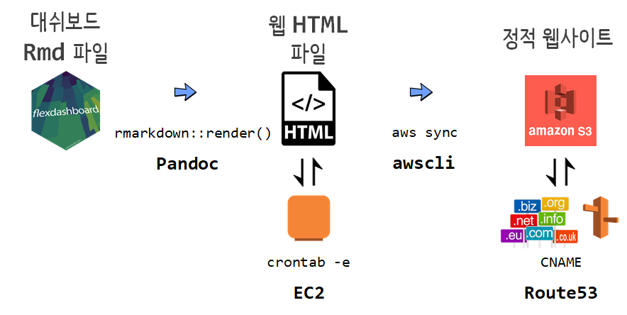

```{r setup2, include=FALSE}
knitr::opts_chunk$set(echo = TRUE, message=FALSE, warning=FALSE,
                      comment="", digits = 3, tidy = FALSE, prompt = FALSE, fig.align = 'center')

library(reticulate)
```

# 대쉬보드 [^dashboard] [^blog-dashboard] {#dashboard}

[^dashboard]: [Marlorie Hughes (2019. 12. 3), "Dashboarding Like a Boss", DC R Conference](https://www.youtube.com/watch?v=yott4quKN6s)

[^blog-dashboard]: [Sagar Kulkarni (Sep 20, 2019), "Building an HR Dashboard in R using Flexdashboard", towrds data science](https://towardsdatascience.com/building-an-hr-dashboard-in-r-using-flexdashboard-76d14ed3f32)

**A 12 Step Program to Quick Emailing Plots & Csvs**

1. Basic Layout
    - [`flexdashboard`](https://rmarkdown.rstudio.com/flexdashboard/)
1. Printing Tables, Descriptive Statistics, Model Summaries
    - `printr`, `summarytools::dfSummary`, `stargazer::stargazer`
    - [list of statistic codes](https://rdrr.io/cran/stargazer/man/stargazer_stat_code_list.html)
1. Interactive Datasets
    - `DT`
1. Interactive Plots
    - `highcharter`
    -  지도(`leaflet`), 시계열(`dygraphs`), `ggplots`(`plotly`)
1. Exporting
    - Datasets with `DT`
    - Highcharter Plots
1. CSS basics
1. Branding: Logos, Fonts, Colors
1. Header/Footer
1. **Hosting**
1. **Automate-ish (Render + System())**
1. **Replicate (Render with arguments)**
1. **Automate or App it (cron, shiny runtime)**


# 실시간 대쉬보드 {#real-time-dashboard-hosting}

약국 마스크 판매에 대해 실시간 정보 제공이 필요한 이유는 늦은 밤시간에도 줄서기를 한다는 점에서 기인한다. [^newdaily]
이러한 사회적 낭비를 막기 위해서 정부에서는 실시간으로 약국에 배정된 마스크 데이터를 제공하고 있지만, 이를 일반인들이 사용하기 위해서는 RESTful API, R 언어 뿐만 아니라 네트워크, DNS, 시각화, 대쉬보드, 데이터프레임, JSON등 다양한 개념을 파악하고 있어야 한다. 이러한 간극을 매워주는 역할을 하는 것이 아마도 **시민 데이터과학자(Citizen Data Scientist)**가 아닐까 싶다.

[^newdaily]: [김새미 (2020-03-10), "마스크 5부제 첫날, 저녁에도 '줄서기' 여전… 판매시간 제각각", 뉴데일리 경제](http://biz.newdaily.co.kr/site/data/html/2020/03/09/2020030900262.html)

## 역할분담 {#real-time-dashboard-hosting-rnr}

전국민이 매주 1인당 마스크 2개를 나눠주는 문제는 그렇게 쉬운 문제가 아니며 정부, 시민 데이터 과학자, 국민 모두가 소임을 충실히 할 때만 원할히 이와 같은 사회적 문제를 해결할 수 있다. 

먼저, 정부는 모든 것을 다 할 수 있다는 사고의 전환이 필요하다. 데이터 과학의 세계에서 모든 일을 정부가 한다는 것은 있을 수도 없지만 한다고 해서 좋은 성과가 나는 것이 아니다. 즉, 정부가 가장 잘 할 수 있는 역할인 데이터를 제공하는 것에 집중하는 것이 필요하다. 

시민 데이터 과학자는 높은 연봉을 추구하는 상업적 성격이 강한 데이터 과학자와 달리 사회적 문제를 그동안 학습한 기본 소양을 바탕으로 사회에 기여할 수 있는 데이터 과학 제품과 서비스를 만들 수 있는 역량을 갖춘 국민일원을 말한다. 아직 그 숫자는 미미하지만 매년 적은 수이지만 [Tidyverse Korea](https://www.facebook.com/groups/tidyverse/)와 같은 커뮤니티를 통해서 꾸준히 늘어나고 있는 것도 사실이다.

마지막으로 정부에서도 정보격차 해소를 위해서 좋은 데이터 과학 제품을 만들어 내고 제공하고 있고 영리를 목적으로 하는 기업체도 늘어나고 있고, 이번 사례와 같이 시민 데이터 과학자도 사회적 문제 해결에 동참하고자 이러한 제품을 많이 만들어 내고 있다. 결국 선택을 하는 것은 국민 본인인만큼 다양한 데이터 과학 제품과 서비스를 사용해보고 어떤 것이 좋은 것인지 파악할 수 있는 안목을 갖추는 것이 이 시대를 사는 국민의 기본소양이 아닐까 싶다.


## 개발 작업흐름 {#real-time-dashboard-hosting-architecture}

### 데이터 확인 {#real-time-dashboard-hosting-data}

이와 같은 대쉬보드는 데이터가 가장 중요한 것이라 먼저 데이터를 공공데이터 포털에서 확인한 후 데이터를 가져오는 것부터 차근히 시작한다. 이를 위해서 데이터가 제공되는 끝점(endpoint, `https://8oi9s0nnth.apigw.ntruss.com/corona19-masks/v1/storesByAddr/json`)을 파악하고 전달해야 되는 인자(`address`)를 넘겨주고 `GET` 방식으로 데이터를 받아온 후에 JSON을 데이터프레임으로 변환시켜 필요하면 데이터 전처리 작업 후 시각화, 요약통계량 등 후속작업을 거친다.

- [공공데이터포털, "건강보험심사평가원_공적 마스크 판매 정보"](https://www.data.go.kr/dataset/15043025/openapi.do)

```{r data-portal-mask}
library(tidyverse)
library(httr)
library(jsonlite)

## 경기도 성남시 분당구
url <- "https://8oi9s0nnth.apigw.ntruss.com/corona19-masks/v1/storesByAddr/json?address=%EA%B2%BD%EA%B8%B0%EB%8F%84%20%EC%84%B1%EB%82%A8%EC%8B%9C%20%EB%B6%84%EB%8B%B9%EA%B5%AC"

request <- GET(url)

resp <- content(request, as = "text", encoding = "UTF-8")

parsed <- jsonlite::fromJSON(resp, flatten = TRUE) %>%
  data.frame() %>% as_tibble()

mask_df <- parsed %>% 
  mutate(stock = case_when(stores.remain_stat == "empty" ~ "1~0개",
                           stores.remain_stat == "few" ~ "2~29개",
                           stores.remain_stat == "some" ~ "30~99개",
                           stores.remain_stat == "plenty" ~ "100개 이상")) %>% 
  mutate(stock = factor(stock, levels=c("100개 이상", "30~99개", "2~29개", "1~0개"))) %>% 
  select(date_time = stores.stock_at, name = stores.name, address = stores.addr, lat=stores.lat, lng = stores.lng, stock)

mask_df %>% 
  DT::datatable()
```

### 로컬 개발 {#real-time-dashboard-hosting-local}

데이터가 확인되면 [데이터 과학을 위한 저작도구: Computational Documents - "대쉬보드(Dashboard)"](https://statkclee.github.io/comp_document/cd-dashboard.html)을 참고하여 스토리를 만들고 대쉬보드 디자인 작업을 wireframe으로 mockup으로 수행하고 `flexdashboard`등을 활용하여 로컬 컴퓨터에 개발작업을 수행한다.


### CI 작업 {#real-time-dashboard-hosting-ci}

로컬 개발이 끝나게 되면 이를 서버에 올리기 위해서 기본적으로 개발 자동화 작업을 수행한다.
이과정에서 가장 중요한 것이 개발 버전 관리로 새로운 기능이 개발되면 이를 하나씩 자동으로 서비스에 반영되도록 파이프라인을 구축한다. `Git`, `GitHub`을 일반적인 입문자 작업과정으로 많이 사용한다.

- [코로나19 분당 약국 마스크 재고 현황](https://github.com/statkclee/bundang)

이와 같은 작업을 완료하게 되면 로컬 컴퓨터와 GitHub 저장소(`bundang`)가 `git push` 명령어로 연결되고 `gh-pages`를 통해 정적 웹사이트 서비스가 가능하게 된다. 
GitHub 저장소를 정적 웹사이트(`gh-pages`)를 통해 일반에 서비스하는 방식은 [데이터 과학을 위한 저작도구: Computational Documents - `GitHub 호스팅`](https://statkclee.github.io/comp_document/cd-github-hosting.html)을 참고한다.


```{r webshot-bundang-github}
library(webshot2)

webshot('https://statkclee.github.io/bundang/', 'fig/bundang-mask.png')
```

### CD 작업 {#real-time-dashboard-hosting-cd}

새로운 기능을 구현하여 통합하여 올리는 것 까지는 문제가 없으나 코로나19 마스크의 경우 데이터가 10분마다 새롭게 갱신되어 올라오고 있다. 이를 위해서 10분마다 [공공데이터포털, "건강보험심사평가원_공적 마스크 판매 정보"](https://www.data.go.kr/dataset/15043025/openapi.do)으로부터 데이터를 가져와서 새로 대쉬보드를 갱신시키는 자동화 과정이 필요하다. 이를 위해서 두가지 작업을 크게 진행한다.

1. [로컬 개발](#real-time-dashboard-hosting-local)을 AWS EC2에서 수행할 수 있도록 환경을 구축한다.
    - AWS EC2 생성: [Rstudio](https://statkclee.github.io/bigdata/ds-aws-rstudio-server.html)
    - S3 버킷 생성
    - `aws sync` 연결
1. `crontab -e` 명령어로 새로운 cronjob 생성: [자동화 헬로월드 - `wsl` + `crontab`](https://statkclee.github.io/sw4ds/)
1. 도메인 구입 후 S3 버킷 연결

RStudio IDE에서 `.Rmd` 파일을 컴파일 해서 `.html` 대쉬보드를 만들어내는 것이 아니라 CLI 쉘 환경에서 `rmarkdown::render()` 함수를 사용해서 `.html` 대쉬보드를 만들어 내고 이를 `awscli`를 사용해서 EC2에서 `.html` 대쉬보드를 S3 버킷으로 복사하여 동기화시킨다. 
이와는 별도로 Route53 이나 기타 도메인 판매업체를 통해서 구입한 도메인을 S3 버킷 정적 웹사이트(static website)에 연결시킨다.




### 도메인 [^route53-domain] {#real-time-dashboard-hosting-dns}

[^route53-domain]: [minholee_93 (2019년 12월 11일), "[AWS] Route 53 DNS 서비스 사용하기"](https://velog.io/@minholee_93/AWS-Route-53-DNS-%EC%84%9C%EB%B9%84%EC%8A%A4-%EC%82%AC%EC%9A%A9%ED%95%98%EA%B8%B0-8lk40vfqt4)

`Route53`와 같은 DNS 서비스는 도메인(domain)을 IP주소로 전환시켜주는 역할을 수행하여 IP 주소 숫자를 기억하지 않고 편리하게 인터넷을 사용할 수 있도록 도와준다.
`Route53`를 통해서 도메인 생성 후, 즉 도메인 구입 후,  S3 정적 웹사이트(static website) 연결 작업을 수행하여 웹서비스를 제공할 수 있도록 한다.


## 대쉬보드 자동화 {#real-time-dashboard-automation}

### `pandoc` 설치 {#real-time-dashboard-automation-pandoc}

`flexdashboard`로 제작한 R 대쉬보드를 쉘 스크립트로 자동화할 경우 `Rscript -e` 명령어를 쉘에서 사용한다. `rmarkdown::render()` 명령어로 `output_dir=`를 지정하여 특정 디렉토리(`docs/`)에 대쉬보드를 배포한다. 

```{r rscript-bash, eval = FALSE}
$ Rscript -e "rmarkdown::render('/home/rstudio/bundang/index.Rmd', output_dir = 'docs/')"
```

다만, 사전 전제조건을 충족시켜야 한다. RStudio IDE 내부에는 `pandoc`이 설치되어 있지만, `ubuntu`에는 기본 설치가 되어 있지 않아 `rmarkdown::render()` 명령어가 제대로 실행되려면 `pandoc`을 우분투에 설치해줘야 한다. [^install-pandoc]

[^install-pandoc]: [ask ubuntu, "Install Pandoc (required for docverter)"](https://askubuntu.com/questions/341295/install-pandoc-required-for-docverter)

```{r install-pandoc, eval = FALSE}
sudo apt-get install pandoc
```

### `awscli` 설치 {#real-time-dashboard-automation-awscli}

`flexdashboard`를 컴파일한 정적 웹사이트 HTML 파일을 EC2에서 S3로 옮기는 것이 필요하다. 이를 위해서 필요한 것이 `awscli` 툴이다. [^awscli-install]

[^awscli-install]: [AWS CLI 설치 및 구성](https://docs.aws.amazon.com/ko_kr/streams/latest/dev/kinesis-tutorial-cli-installation.html)

```{r install-awscli, eval = FALSE}
sudo pip install awscli
```

`awscli`를 설치하면 AWS EC2에서 S3로 파일을 보내려면 인증작업을 거쳐야 한다. 이를 위해서 `aws configure` 명령어를 입력한 후에 AWS `IAM`에서 생성한 Access Key와 Secret Access Key로 인증작업을 대신한다.

```{r aws-configure-output, eval = FALSE}
$ aws configure
AWS Access Key ID [****************77777]:
AWS Secret Access Key [****************1111111]:
Default region name [ap-northeast-2]:
Default output format [json]:
```

이를 통해서 앞서 `flexdashboard`로 제작된 `/home/rstudio/bundang/docs/` HTML 웹사이트가 담겨진 파일들을 `s3://byungwook.kim/` S3 버킷으로 복사를 할 수 있게 된다.


```{r aws-configure-output-run, eval = FALSE}
aws s3 sync /home/rstudio/bundang/docs/ s3://byungwook.kim/
```


# 자동화 {#real-time-dashboard-automation-run}

자동화는 어쩌면 코로나19 마스크의 경우 정해진 것이 명확하다. 약국 마스크 재고는 10분정도 지연이 있지만 재고상황이 거의 실시간으로 공공데이터 포털을 통해서 제공되고 있다. 따라서 매 10~15분마다 데이터를 받아 `flexdashboard`를 새로 제작하여 웹사이트에 제공하면 된다. 

## 배포 쉘스크립트 제작  {#real-time-dashboard-automation-shell}

이를 위해서 `run_covid.sh`이름으로 배쉬 쉘 스크립트를 제작한다.

1. `aws` 명령어를 쉘에서 찾을 수 있도록 경로명을 추가한다.
    - `export PATH=/home/rstudio/.local/bin:$PATH`
1. GitHub 저장소 최신 `flexdashboard` `.Rmd` 파일 가져온다.
    - `git clone https://github.com/statkclee/bundang.git`
    - `index.Rmd` 파일에 공공데이터 포털에서 데이터를 가져오는 로직도 포함됨
1. 데이터를 가져와서 새로 대쉬보드 생성
    - `Rscript -e "rmarkdown::render('/home/rstudio/bundang/index.Rmd', output_dir = 'docs/')"`
1. 생성된 대쉬보드 HTML 웹사이트를 S3 버킷으로 배포
    - `aws s3 sync /home/rstudio/bundang/docs/ s3://byungwook.kim/`

```{r run-bash-script, eval = FALSE}
#!/bin/bash

export PATH=/home/rstudio/.local/bin:$PATH

cd ~

rm -rf /home/rstudio/bundang

git clone https://github.com/statkclee/bundang.git

cd bundang

rm docs/data/*.csv

Rscript -e "rmarkdown::render('/home/rstudio/bundang/index.Rmd', output_dir = 'docs/')"

aws s3 sync /home/rstudio/bundang/docs/ s3://byungwook.kim/
```

## 크론잡(cronjob) 생성  {#real-time-dashboard-automation-cron}

`crontab -e` 명령어를 통해 크론잡을 추가한다. 앞서 제작한 쉘스크립트를 매15분마다 돌려 대쉬보드를 최신화시킨다.

```{r run-bash-script-cron, eval = FALSE}
*/15 * * * * bash /home/rstudio/run_covid.sh
```

# `byungwook.kim` 분당구  {#real-time-dashboard-automation-kbw}

`Route53`에서 구입한 `byungwook.kim` 도메인으로 앞선 과정을 자동화한 결과를 웹사이트에서 확인해보자.

```{r webshot-bundang-github-byungwook-kim}
webshot('http://byungwook.kim', 'fig/byungwook.png')
```


