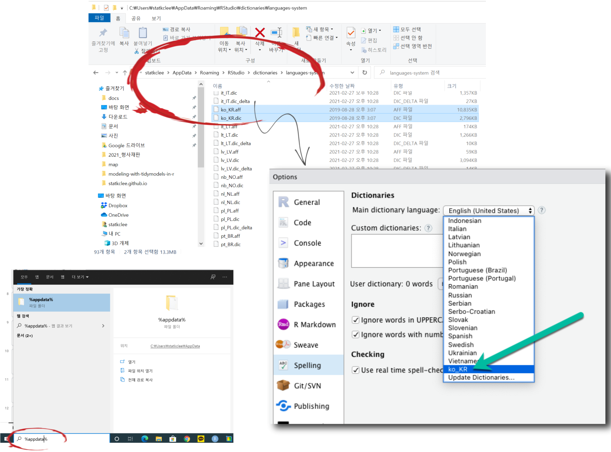
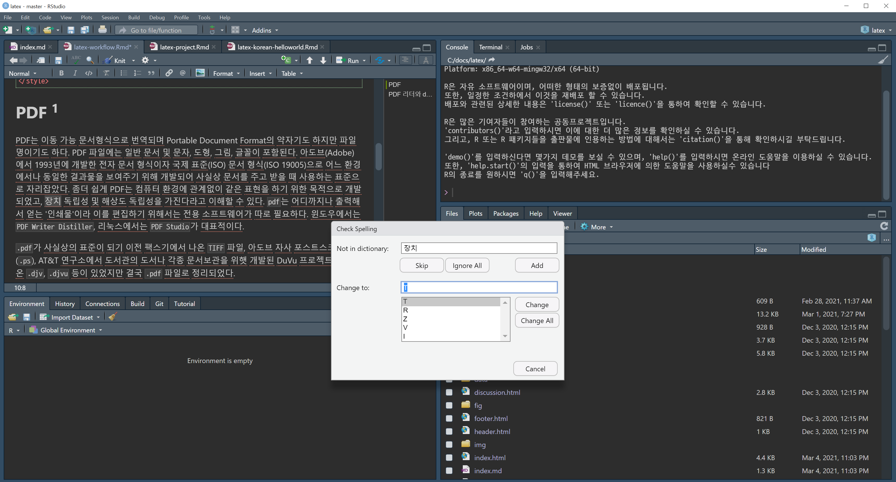
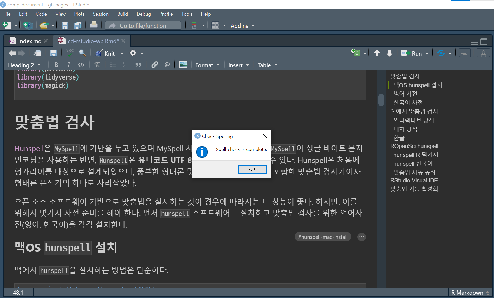

```{r setup, include=FALSE}
knitr::opts_chunk$set(echo = TRUE, message=FALSE, warning=FALSE,
                      comment="", digits = 3, tidy = FALSE, prompt = FALSE, fig.align = 'center')

library(pdftools)
library(tidyverse)
library(magick)

```

# 맞춤법 검사 {#check-spelling}

[Hunspell](hunspell.github.io)은 `MySpell`에 기반을 두고 있으며 MySpell 사전과 하위 호환되는데, `MySpell`이 싱글 바이트 문자 인코딩을 사용하는 반면, `Hunspell`은 **유니코드 UTF-8 인코딩 사전**을 사용할 수 있다. Hunspell은 처음에 헝가리어를 대상으로 설계되었으나, 풍부한 형태론 및 합성어, 문자 인코딩을 포함한 맞춤법 검사기이자 형태론 분석기의 하나로 자리잡았다.

오픈 소스 소프트웨어 기반으로 맞춤법을 실시하는 것이 경우에 따라서는 더 성능이 좋다. 하지만, 이를 위해서 몇가지 사전 준비를 해야 한다. 먼저 `hunspell` 소프트웨어를 설치하고 맞춤법 검사를 위한 언어사전(영어, 한국어)을 각각 설치한다.

## 맥OS `hunspell` 설치 {#hunspell-mac-install}

맥에서 `hunspell`을 설치하는 방법은 단순하다.

```{r macos-install-hunspell, eval = FALSE}
brew install hunspell
```

## 영어 사전 {#dictionary-english}

[libreoffice/dictionaries](https://cgit.freedesktop.org/libreoffice/dictionaries/tree/) 웹사이트에서 필요한 언어 사전(영어, `en_US`)을 다운로드 받아 `~/Library/Spelling/` 디렉토리에 복사하여 넣어둔다. 필요한 파일은 확장자가 `.aff`, `.dic`를 갖는 언어사전 파일이다.

```{r download-dictionary, eval = FALSE}
download.file(url = "https://cgit.freedesktop.org/libreoffice/dictionaries/plain/en/en_US.aff", destfile = "~/Library/Spelling/en_US.aff")
download.file(url = "https://cgit.freedesktop.org/libreoffice/dictionaries/plain/en/en_US.dic", destfile = "~/Library/Spelling/en_US.dic")
```

## 한국어 사전 {#hunspell-dictionary}

[`hunspell` 한국어 맞춤법 사전](https://github.com/spellcheck-ko/hunspell-dict-ko)은 오픈소스 데스크톱에 널리 사용되는 **hunspell 맞춤법 검사 프로그램**에서 동작하는 (현재 유일한) 한국어 맞춤법 사전으로 [`hunspell-dict-ko`: `hunspell` 한국어 사전](https://github.com/spellcheck-ko/hunspell-dict-ko/releases)을 다운로드 받아, 압축을 풀게 되면 `ko.aff`, `ko.dic` 파일이 두개 나오게 된다. 영어 사전과 마찬가지로 웹사이트에서 필요한 언어 사전(영어, `en_US`)을 다운로드 받아 `~/Library/Spelling/` 디렉토리에 복사하여 넣어둔다.

`hunspell -D` 명령어를 통해 맞춤법을 확인을 위한 설치된 언어 사전을 확인할 수 있다.

```{bash check-dictionary, eval = FALSE}
$ hunspell -D

SEARCH PATH:
.::/usr/share/hunspell:/usr/share/myspell:/usr/share/myspell/dicts:/Library/Spelling:/Users/kwangchunlee/.openoffice.org/3/user/wordbook:/Users/kwangchunlee/.openoffice.org2/user/wordbook:/Users/kwangchunlee/.openoffice.org2.0/user/wordbook:/Users/kwangchunlee/Library/Spelling:/opt/openoffice.org/basis3.0/share/dict/ooo:/usr/lib/openoffice.org/basis3.0/share/dict/ooo:/opt/openoffice.org2.4/share/dict/ooo:/usr/lib/openoffice.org2.4/share/dict/ooo:/opt/openoffice.org2.3/share/dict/ooo:/usr/lib/openoffice.org2.3/share/dict/ooo:/opt/openoffice.org2.2/share/dict/ooo:/usr/lib/openoffice.org2.2/share/dict/ooo:/opt/openoffice.org2.1/share/dict/ooo:/usr/lib/openoffice.org2.1/share/dict/ooo:/opt/openoffice.org2.0/share/dict/ooo:/usr/lib/openoffice.org2.0/share/dict/ooo
AVAILABLE DICTIONARIES (path is not mandatory for -d option):
/Users/kwangchunlee/Library/Spelling/ko
/Users/kwangchunlee/Library/Spelling/en_US
```

# 쉘에서 맞춤법 검사 [^1] {#spellcheck-bash}

[^1]: [Xah Lee (2010-06-16), "Hunspell Tutorial"](http://xahlee.info/comp/hunspell_spell_checking.html)

## 인터랙티브 방식 {#hunspell-interactive}

인터랙티브 방식으로 사전을 정의하고 나서 맞춤법 검사를 진행할 파일을 지정하면 해당 파일에 대한 맞춤법 검사를 진행할 수 있게 된다.

```{bash hello-world-hunspell, eval = FALSE}
echo "Hello World! \n Thiss is Great." > data/hunspell_test.txt

hunspell -d en_US data/hunspell_test.txt

        Thiss           File: data/hunspell_test.txt

Hello World! \n Thiss is Great.

 0: Hiss
 1: T hiss
 2: This
 3: Thins
 4: This s

[SPACE] R)epl A)ccept I)nsert U)ncap S)tem Q)uit e(X)it or ? for help
```

## 배치 방식 {#hunspell-batch}

배치방식으로 `-l` 플래그를 사용하게 되면 철자법 검사에서 검출된 사례만 뽑을 수 있다.

```{bash hunspell-batch, eval = FALSE}
$ hunspell -l -d en_US -i utf-8 data/hunspell_test.txt 

Thiss
```

## 한글 {#check-spelling-korean}

[자주 틀리는 한글 맞춤법 사례](http://blog.daum.net/woalsdlvjxld/5808471) 블로그에 올라온 사례를 가지고 한글 맞춤법을 확인해보자.

-   기둥에 머리를 {받치다/**받히다**}
-   아이가 밥을 {**넙죽**/넓죽} 잘도 받아먹는다.
-   신문 {**스포츠난**/스포츠란}에 기사가 났다

```{bash spell-check-korean, eval = FALSE}
$ echo "기둥에 머리를 받치다. \n 아이가 밥을 넓죽 잘도 받아먹는다.\n 신문 스포츠란에 기사가 났다" > data/hunspell_korean.txt
$ hunspell -l -d ko -i utf-8 data/hunspell_korean.txt 

넓죽
스포츠란에
```

`C:\Users\statkclee\AppData\Local\RStudio-Desktop\dictionaries\languages-user` 디렉토리에 <https://github.com/spellcheck-ko/hunspell-dict-ko/releases>에서 다운로드 받은 `.dic`, `.aff` 파일을 압축을 풀어 넣는다. `ko.dic`, `ko.aff` 파일인데 이렇게 하면 RStudio에서 인식을 못하기 때문에 `ko.dic` → `ko_KR.dic`, `ko.aff` → `ko_KR.aff`로 각각 파일명을 변경한다. 그리고, `Sys.setenv(DICPATH = "C:/Users/statkclee/AppData/Local/RStudio-Desktop/dictionaries/languages-user/")`와 같이 한국어 사전이 저장된 위치를 지정해줘야 한국어 맞춤법 검사가 가능하다.

# ROpenSci `hunspell` [^2] {#hunspell-package}

[^2]: [Josh Paulson (2020-07-28), "Spelling Dictionaries" RStudio Blog](https://support.rstudio.com/hc/en-us/articles/200551916)

## `hunspell` R 팩키지 [^3] {#rstudio-package}

[^3]: [Jeroen Ooms (March 14, 2016), "Hunspell: Spell Checker and Text Parser for R"](https://www.opencpu.org/posts/hunspell-release/)

`hunspell` R 팩키지를 통해서 맞춤법 검정도 가능하다.

```{r hunspell-r-package}
library(hunspell)

words <- c("beer", "wiskey", "wine")

hunspell_check(words)
```

맞춤법에 대한 심층조사가 필요한 부분에 대해서 `hunspell_suggest()`를 통해 제안을 받을 수도 있다.

```{r hunspell-suggest}
bad_words <- hunspell("spell checkers are not neccessairy for langauge ninja's")
print(bad_words)

hunspell_suggest(bad_words[[1]])
```

## `hunspell` 한국어 {#hunspell-korean}

한국어 맞춤법 검사를 진행하기 위해서는 먼저 한국어 사전을 설치해야 된다. 설치된 한국어 사전을 `list_dictionaries()`함수로 확인할 수 있다.

```{r hunspell-korean-dic}
list_dictionaries()
```

[The hunspell package: High-Performance Stemmer, Tokenizer, and Spell Checker for R](https://cran.r-project.org/web/packages/hunspell/vignettes/intro.html)을 참조하면 설치된 사전에 대한 자세한 내용도 확인할 수 있다.

```{r hunspell-korean-dic-vignette}
Sys.setenv(DICPATH = "C:/Users/statkclee/AppData/Local/RStudio-Desktop/dictionaries/languages-user/")
hunspell::dictionary("ko_KR")
```

한국어 사전이 탐지되면 이를 이용하여 맞춤법 검사를 예전과 마찬가지로 진행하면 된다.

```{r hunspell-korean}
news <- hunspell("한켜레 신문사는 죠선 일보와 다른 논도를 갖는다.", dict = dictionary("ko_KR"))
news

hunspell_suggest(news[[1]], dict = dictionary("ko_KR"))
```

## 맞춤법 자동 동작 {#automatic-spelling-correction}

[How to use hunspell package to suggest correct words in a column in R?](https://stackoverflow.com/questions/56026550/how-to-use-hunspell-package-to-suggest-correct-words-in-a-column-in-r)에 나와 있듯이 맞춤법이 맞지 않는 것도 자동으로 수정이 가능하다.

```{r automatic-correction}
sample_df <- data.frame("index" = 1:7, "text" = c("A complec sentence joins an independet",
                                            "Mary and Samantha arived at the bus staton before noon",
                                            "I did not see thm at the station in the mrning",
                                            "The participnts read 60 sentences in radom order",
                                            "how to fix mispelled words in R languge",
                                            "today is Tuesday",
                                            "bing sports quiz"))

correct_text <- function(x){
  sapply(1:length(x), function(y){
    bad  <- hunspell(x[y])[[1]]
    good <-unlist(lapply(hunspell_suggest(bad), `[[`, 1))

    if (length(bad)){
      for (i in 1:length(bad)){
        x[y] <<- gsub(bad[i], good[i],x[y])
      }}})
  return(x)
}

correct_text(sample_df$text)
```

# RStudio Visual IDE [^4] {#hunspell-package-ko}

[^4]: [Josh Paulson (February 02, 2021 01:56), "Spelling Dictionaries", RStudio Support](https://support.rstudio.com/hc/en-us/articles/200551916)

`C:\Users\statkclee\AppData\Local\RStudio-Desktop\dictionaries\languages-user` 디렉토리에 <https://github.com/spellcheck-ko/hunspell-dict-ko/releases>에서 다운로드 받은 `.dic`, `.aff` 파일을 압축을 풀어 넣는다. `ko.dic`, `ko.aff` 파일인데 이렇게 하면 RStudio에서 인식을 못하기 때문에 `ko.dic` → `ko_KR.dic`, `ko.aff` → `ko_KR.aff`로 각각 파일명을 변경한다. 그렇게 되면 RStudio IDE에서 `Tools` → `Global Options ...` → `Spelling` 을 통해 한국어를 지정할 수 있다. 하지만, 버그가 있어 한국어 맞춤법 검사를 제대로 실시할 수 없다.

RStudio Support 프로그램을 통해서 RStudio Desktop 버전에 버그가 있는 것을 확인했으며 RStudio Desktop 1.5 버전에는 이런 문제를 해결할 예정이고 한국어 사전이 디폴트로 장착되어 배포될 예정이라고 합니다. (Mar 15, 2021)

당분간 맞춤법 한글 검사를 하는 방식은 다음과 같습니다.

1.  윈도우 10의 경우 검색창을 열어 `%appdata%` 디렉토리를 확인합니다.
2.  윈도우 탐색기를 사용해서 `%appdata%\\rstudio\\dictionaries\\languages-system\` 디렉토리로 이동합니다.
3.  `ko_KR.dic`, `ko_KR.aff` 파일을 복사합니다.
4.  RStudio를 재시작하고 `Visual R Markdown` 편집기를 열어 `F7` 키를 눌러 맞춤법 검사를 실행합니다.



# 맞춤법 기능 활성화 {#spelling-check}

한글 맞춤법 검사가 활성화 되지 않은 경우 한글 단어 아래 빨간색 줄이 쫙\~\~ 간 것이 보일 것이다. 하지만 앞서 한글 맞춤법 사전을 설치하고 RStudio Desktop에 기능을 붙일 경우 단어 아래 빨간색 줄이 대폭 없어진 것을 알 수 있고 필요한 경우 `F7` 키를 누르게 되면 맞춤법 검사를 원활히 수행할 수 있다.

+-----------------------------+-----------------------------------+
| 한글 맞춤법 검사 이슈       | 한글 맞춤법 검사 기능 활성화      |
+=============================+===================================+
|  |  |
+-----------------------------+-----------------------------------+
