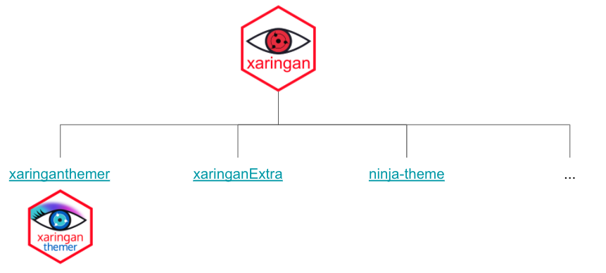
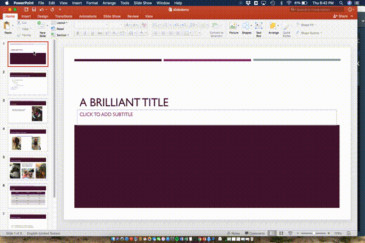

```{r setup, include=FALSE}
knitr::opts_chunk$set(echo = TRUE, message=FALSE, warning=FALSE,
                      comment="", digits = 3, tidy = FALSE, prompt = FALSE, fig.align = 'center')

library(tidyverse)
```


```{r xaringan-ecosystem, fig.align='center'}

```


[`xaringan`](https://github.com/yihui/xaringan)은 처음 세상에 나온 이후 나름대로 생태계를 굳건하게 꾸려 나가고 있다. 관련 주요 팩키지는 다음과 같다. 

- [`xaringan`](https://github.com/yihui/xaringan)
    - [`xaringanExtra`](https://github.com/gadenbuie/xaringanExtra)
    - [`xaringanthemer`](https://github.com/gadenbuie/xaringanthemer)
    - [`ninja-theme`](https://github.com/emitanaka/ninja-theme)
    - [`slidex`](https://github.com/datalorax/slidex)

# 슬라이드쇼 기본기능 [^slideshow-tutorial] {#slideshows-basics}

[^slideshow-tutorial]: [Zhi Yang, "How to make xaringan slides in R", Orange County R Users Group](https://zhiyang.netlify.app/talk/xaringan/)

## 2 칼럼 {#slideshow-basics-two-columns}

기본적으로 `.pull-left`가 내장되어 있는데 5:5로 화면을 분할하는데 기본 문법은 다음과 같다.

<pre><code>```{r whatever}

.pull-left[
```{r refname, echo=TRUE, eval=FALSE}
R code
```
]
.pull-right[


]

```</code></pre>


한걸음 더 나아가 칼럼 비율을 조정하고자 할 경우 다음과 같이 코드를 다시 작성할 수 있다.
즉, `.css` 파일에 다음과 같이 `.left-column`, `.right-column`에 관련 비율을 조정하게 되면 원하는 비율대로 2칼럼 슬라이드 제작이 가능하게 된다. 

```{r css-two-columns, eval = FALSE}

/* Two-column layout */
.left-column {
  width: 20%;
  height: 92%;
  float: left;
}
.left-column h2, .left-column h3 {
  color: #1381B099;
}
.left-column h2:last-of-type, .left-column h3:last-child {
  color: #1381B0;
}
.right-column {
  width: 75%;
  float: right;
  padding-top: 1em;
}
```

## 한줄씩 보여주기 {#incremental-reveal}

`--`을 사용함으로써 한줄씩 순차적으로 보여주는 것이 가능하다. 영어로 increnetal reveal 기능이라고도 한다.

```{r incremental-reval, eval = FALSE}
# Tidyverse Korea

--
KRUG Fork?

--
### Facebook 페북 그룹

--
## Seoul R 미트업

```

## 코드 강조 기능 {#code-highlight-function}

R 코드 강조를 위해서 `#<<`을 코드 뒷쪽에 붙이면 강조된다.

```{r code-highlight-output, eval = TRUE, fig.height=4}
random_var <- rnorm(1000)
# mean(random_var)

random_df <- tibble(var = random_var)

random_df %>% 
  ggplot(aes(x=var)) + #<<
    geom_histogram()
```


## 출력 결과 강조 {#code-highlight-function-output}

출력 결과 강조를 위해서 출력결과에 chunk 선택옵션으로 `highlight.output`으로 특정 행을 강조하면 된다.

```{r code-highlight-output-result, highlight.output=c(1, 5, 7)}
random_df
```

## 외부 이미지 삽입 {#insert-images}

R마크다운에서 많이 사용되는 이미지 삽입 구문, 예를 들어, `{width=17px}`은 사용될 수 없어 다음과 같이 HTML `img` 태그를 사용하거나, `knitr::include_graphics()` 태그를 사용한다. 


```{r insert-images, eval = FALSE}

```


````markdown
`r ''````{r image-resize}
knitr::include_graphics("fig/xaringan-hex.png")
```
````


## 로고 삽입

`---` 다음에 `background-image`에 `url()` 함수로 다음과 같이 작성하여 로컬 이미지를 가져와서 로고를 지정할 수 있다.
좌측하단, 우측상단에 다음과 같이 로고를 삽입한다. 

```{r insert-logo, eval = FALSE}
---
background-image: url(fig/xaringan-hex.png), url(fig/xaringan-hex.png) 
background-position: 5% 100%, 100% 5%
background-size: 5%, 10%
  
# 로고 삽입  
```

## 키보드 단축키

`xaringan` 으로 제작된 슬라이드쇼는 `?` 단축키로 발표자료에 대한 다양한 기능을 실시간으로 확인할 수 있다.
숫자 + 엔터키를 치게 되면 해당 슬라이드로 바로 가게 되고 `p` 단축키는 발표자 모드를 볼 수 있는 기능을 제공한다.


# PPT &rarr; `xaringan` [^slidex-behind] {#convert-ppt-xaringan}

[^slidex-behind]: [Daniel Anderson (2018-06-08), Peeking behind the curtain with {slidex}, https://www.datalorax.com/](https://www.datalorax.com/post/peeking-behind-the-curtain-with-slidex/)

[`slidex`](https://github.com/datalorax/slidex) 팩키지는 pptx, docx 파일을 파싱할 경우 `XML`로 구성된 점을 감안하여 이를 다시 `xaringan` 으로 만들어 주는 역할을 수행한다. 하지만, 현재 오류가 있어 다음 헬로 월드 코드도 돌아가지 않고 있어 수정 작업중에 있다. 

```{r ppt2xaringan, eval = FALSE}
library(slidex)
pptx <- system.file("examples", "slidedemo.pptx", package = "slidex")

convert_pptx(path = pptx, author = "Daniel Anderson")
```



# 테마(theme) {#xaringan-thema}

```{r chocolate-minimal, eval = FALSE}
knitr::include_url('https://statkclee.github.io/ds-authoring/KCD2020_Tidyverse.html#1')
```

