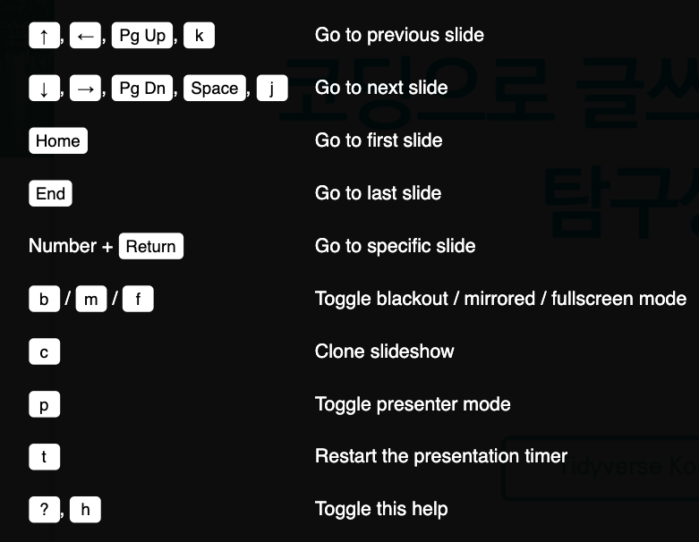

```{r setup, include=FALSE}
knitr::opts_chunk$set(echo = TRUE, message=FALSE, warning=FALSE,
                      comment="", digits = 3, tidy = FALSE, prompt = FALSE, fig.align = 'center')

library(tidyverse)
```


```{r xaringan-ecosystem, fig.align='center'}
knitr::include_graphics("fig/xaringan-overview.png")
```


[`xaringan`](https://github.com/yihui/xaringan)은 처음 세상에 나온 이후 나름대로 생태계를 굳건하게 꾸려 나가고 있다. 관련 주요 팩키지는 다음과 같다. 

- [`xaringan`](https://github.com/yihui/xaringan)
    - [`xaringanExtra`](https://github.com/gadenbuie/xaringanExtra)
    - [`xaringanthemer`](https://github.com/gadenbuie/xaringanthemer)
    - [`ninja-theme`](https://github.com/emitanaka/ninja-theme)
    - [`slidex`](https://github.com/datalorax/slidex)

# 슬라이드쇼 기본기능 [^slideshow-tutorial] [^reduce-complexity] {#slideshows-basics}

[^slideshow-tutorial]: [Zhi Yang, "How to make xaringan slides in R", Orange County R Users Group](https://zhiyang.netlify.app/talk/xaringan/)

[^reduce-complexity]: [Yong Fu (Apr 29, 2019), "Tips to Reduce the Complexity of Slide Making with Xaringan", Yongfu's Blog](https://yongfu.name/2019/04/29/xaringan_tips.html)

## 2 칼럼 {#slideshow-basics-two-columns}

기본적으로 `.pull-left`가 내장되어 있는데 5:5로 화면을 분할하는데 기본 문법은 다음과 같다.

<pre><code>```{r whatever}

.pull-left[
```{r refname, echo=TRUE, eval=FALSE}
R code
```
]
.pull-right[


]

```</code></pre>


한걸음 더 나아가 칼럼 비율을 조정하고자 할 경우 다음과 같이 코드를 다시 작성할 수 있다.
즉, `.css` 파일에 다음과 같이 `.left-column`, `.right-column`에 관련 비율을 조정하게 되면 원하는 비율대로 2칼럼 슬라이드 제작이 가능하게 된다. 

```{r css-two-columns, eval = FALSE}

/* Two-column layout */
.left-column {
  width: 20%;
  height: 92%;
  float: left;
}
.left-column h2, .left-column h3 {
  color: #1381B099;
}
.left-column h2:last-of-type, .left-column h3:last-child {
  color: #1381B0;
}
.right-column {
  width: 75%;
  float: right;
  padding-top: 1em;
}
```

## 한줄씩 보여주기 {#incremental-reveal}

`--`을 사용함으로써 한줄씩 순차적으로 보여주는 것이 가능하다. 영어로 increnetal reveal 기능이라고도 한다.

```{r incremental-reval, eval = FALSE}
# Tidyverse Korea

--
KRUG Fork?

--
### Facebook 페북 그룹

--
## Seoul R 미트업

```

## 코드 강조 기능 {#code-highlight-function}

R 코드 강조를 위해서 `#<<`을 코드 뒷쪽에 붙이면 강조된다.

```{r code-highlight-output, eval = TRUE, fig.height=4}
random_var <- rnorm(1000)
# mean(random_var)

random_df <- tibble(var = random_var)

random_df %>% 
  ggplot(aes(x=var)) + #<<
    geom_histogram()
```


## 출력 결과 강조 {#code-highlight-function-output}

출력 결과 강조를 위해서 출력결과에 chunk 선택옵션으로 `highlight.output`으로 특정 행을 강조하면 된다.

```{r code-highlight-output-result, highlight.output=c(1, 5, 7)}
random_df
```

## 외부 이미지 삽입 {#insert-images}

R마크다운에서 많이 사용되는 이미지 삽입 구문, 예를 들어, `{width=17px}`은 사용될 수 없어 다음과 같이 HTML `img` 태그를 사용하거나, `knitr::include_graphics()` 태그를 사용한다. 


```{r insert-images, eval = FALSE}

```


````markdown
`r ''````{r image-resize}
knitr::include_graphics("fig/xaringan-hex.png")
```
````


## 로고 삽입

`---` 다음에 `background-image`에 `url()` 함수로 다음과 같이 작성하여 로컬 이미지를 가져와서 로고를 지정할 수 있다.
좌측하단, 우측상단에 다음과 같이 로고를 삽입한다. 

```{r insert-logo, eval = FALSE}
---
background-image: url(fig/xaringan-hex.png), url(fig/xaringan-hex.png) 
background-position: 5% 100%, 100% 5%
background-size: 5%, 10%
  
# 로고 삽입  
```

## 키보드 단축키

`xaringan` 으로 제작된 슬라이드쇼는 `?` 단축키로 발표자료에 대한 다양한 기능을 실시간으로 확인할 수 있다.
숫자 + 엔터키를 치게 되면 해당 슬라이드로 바로 가게 되고 `p` 단축키는 발표자 모드를 볼 수 있는 기능을 제공한다.




# PPT &rarr; `xaringan` [^slidex-behind] {#convert-ppt-xaringan}

[^slidex-behind]: [Daniel Anderson (2018-06-08), Peeking behind the curtain with {slidex}, https://www.datalorax.com/](https://www.datalorax.com/post/peeking-behind-the-curtain-with-slidex/)

[`slidex`](https://github.com/datalorax/slidex) 팩키지는 pptx, docx 파일을 파싱할 경우 `XML`로 구성된 점을 감안하여 이를 다시 `xaringan` 으로 만들어 주는 역할을 수행한다. 하지만, 현재 오류가 있어 다음 헬로 월드 코드도 돌아가지 않고 있어 수정 작업중에 있다. 

```{r ppt2xaringan, eval = FALSE}
library(slidex)
pptx <- system.file("examples", "slidedemo.pptx", package = "slidex")

convert_pptx(path = pptx, author = "Daniel Anderson")
```


# `html` 슬라이드 &rarr; `.png` {#slides-to-png}

`xaringan`으로 제작한 `.html` 슬라이드를 예를 들어 `.png`와 같은 이미지로 작업을 할 경우 몇가지 장점이 있다. 발표자료를 만들 경우 맨 앞장 Title 슬라이드와, 목차, 소분류 제목, 본문, 마무리 슬라이드로 구성되는 대략의 얼개를 확인할 수 있다는 장점이 있다. 이를 위해서 `pagedown` 팩키지로 html 파일을 pdf 파일로 변환시킨 후에 `magick`에서 pdf 파일을 불러 읽을 수 있도록 한 후 다양한 이미지 처리 작업을 수행한다.


## 테마(theme) {#xaringan-thema}

`knitr` 팩키지 `include_url()`함수를 사용하면 `xaringan` 슬라이드를 R마크다운 문서에 내장할 수 있다.

```{r chocolate-minimal, eval = TRUE}
knitr::include_url('https://statkclee.github.io/comp_document/tutorial/slideshows/xaringan_theme.html#1')
```

## PDF 변환 {#xaringan-thema-pdf}

`pagedown` 팩키지 `chrome_print()` 함수를 사용하게 되면 `xaringan` `.html`슬라이드를 `.pdf` 파일로 변환시킬 수 있다.

```{r html-to-png, eval = FALSE}
pagedown::chrome_print("xaringan_theme.html", output="xaringan_theme.pdf")
```

## 이미지 작업 {#xaringan-thema-pdf-img}

`.pdf` 파일을 이미지로 작업할 경우 두가지 방법이 있는데 `pdftools`와 `mgaick` 팩키지가 그것이다. `.pdf` 파일에서 텍스트를 추출하는 등의 작업을 하지 않을 것이라 `magick` 팩키지 `image_read_pdf()` 함수를 사용해서 `magick` 이미지 객체로 후속 작업을 수행하는 것이 훨씬 더 수월하다.

```{r pdf-to-png-magickf}
library(magick)

chocolate <- image_read_pdf("tutorial/slideshows/xaringan_theme.pdf")

chocolate %>% 
  image_scale("300") %>% 
  image_append(stack = FALSE)

```

# `.css` 날코딩 {#slides-css}

발표 슬라이드는 크다 다음과 같이 5가지로 나눠진다.

- 제목 타이틀 슬라이드
- 목차(Table of Contents)
- 소제목 타이틀 슬라이드
- 본문 슬라이드
- 마무리 슬라이드

제목 타이틀 슬라이드를 제작하는 것이 아마도 발표자료 제작의 첫걸음으로 생각된다.
`.css` 파일을 하나 제작하는데 기본적인 `.css` 문법에 맞춰 `html` 태그를 매칭하는 방식으로 제작한다.

```{r html-to-png-title, eval = FALSE}
pagedown::chrome_print("xaringan_title_slides.html", output="xaringan_title_slides.pdf")
```

전체 적인 작업흐름은 구글 검색으로 적당한 [외부 이미지 파일](https://pixabay.com/photos/milky-way-starry-sky-night-sky-star-2695569/)을 첫 제목 슬라이드에 넣고 이를 `.css` 에 반영한다. 한글 폰트를 [Google Fonts](https://fonts.google.com/)에서 가져와서 웹브라우져에서 실시간 사용하도록 활성화시키고 `html` 태그 `h1, h2, h3`와 `body`에 대한 내용을 적용시킨다.

```{r html-to-png-title-magick}
title_slides <- image_read_pdf("tutorial/slideshows/xaringan_title_slides.pdf")

title_slides %>% 
  image_scale("300") %>% 
  image_append(stack = FALSE)
```

## 최소 `.css` {#minimal-css}

Google Fonts 웹사이트에서 한글 폰트를 특정하고 `.title-slide`다음과 같이 지정하고 이미지를 넣고 `h1, h2`등을 지정하고 본문 글꼴도 지정한다.

```{r minimal-css, eval = FALSE}
@import url(https://fonts.googleapis.com/css?family=Nanum+Pen+Script);
@import url(https://fonts.googleapis.com/css?family=Noto+Sans+KR);

.title-slide {
  background-image: url(fig/slide_background_milky_way.jpg);
  background-size: cover;
}

h1, h2{
  font-family: 'Nanum Pen Script';
  font-weight: normal;
}

body { font-family: 'Noto Sans KR', 'Nanum Pen Script', serif; }

.remark-code, .remark-inline-code { font-family: 'Source Code Pro', 'Lucida Console', Monaco, monospace; }
```

## 다운로드 {#download-minimal-css}

상기 `.css` 파일을 다운로드 받는다.

```{r slidedhows-title-download}
xfun::embed_file('tutorial/slideshows/xaringan-title.css')
```

`.css` 파일을 R마크다운 `xaringan` 슬라이드쇼에 반영하여 발표 슬라이드 외관을 깔끔하게 정리한다.

```{r slidedhows-title-css-download}
xfun::embed_file('tutorial/slideshows/xaringan_title_slides.Rmd')
```

# `xaringanthemer` {#xaringan-themer}

[`xaringanthemer`](https://github.com/gadenbuie/xaringanthemer)를 활용할 경우 `.css`를 많이 고치지 않고 `xaringan` 슬라이드 작성에 많이 사용되는 기능을 쉽게 넣을 수 있다.

```{r chocolate-minimal-themer, eval = TRUE}
knitr::include_url('https://statkclee.github.io/comp_document/tutorial/slideshows/xaringanthemer.html')
```

상기 슬라이드를 앞서와 같이 PDF 로 변환시킨 후에 PNG 이미지 파일로 일별할 수 있다.

```{r themer-pdf, eval = FALSE}
pagedown::chrome_print("xaringanthemer.html", output="xaringanthemer.pdf")
```

```{r themer-magick}
themer_slides <- image_read_pdf("tutorial/slideshows/xaringanthemer.pdf")

themer_slides %>% 
  image_scale("300") %>% 
  image_append(stack = FALSE)
```

[`xaringanthemer`](https://github.com/gadenbuie/xaringanthemer)은 또한 `ggplot`으로 시각화 그래프를 넣을 경우 `look-and-feel`을 자동으로 맞춰준다는 면에서 큰 장점도 있다. 

<style>
div.blue { background-color:#e6f0ff; border-radius: 5px; padding: 10px;}
</style>
<div class = "blue">

YAML 헤더에 `seal: false`을 지정할 경우 `background-image: url("fig/slide_background_milky_way.jpg");`와 같이 원하는 이미지를 지정할 수 있다.

```{r set-background-image, eval = FALSE}
.title-slide {
  background-image: url("fig/slide_background_milky_way.jpg");
  background-size: cover;
}
```

</div>

## 다운로드 {#download-minimal-css-xaringan}

상기 `.css` 파일을 다운로드 받는다.

```{r slidedhows-title-download-themer}
xfun::embed_file('tutorial/slideshows/my-xaringan-themer.css')
```

`.css` 파일을 R마크다운 `xaringan` 슬라이드쇼에 반영하여 발표 슬라이드 외관을 깔끔하게 정리한다.

```{r slidedhows-title-css-download-themer}
xfun::embed_file('tutorial/slideshows/xaringanthemer.Rmd')
```

# 여자 닌자 [^female-ninja]  {#female-ninja}

[^female-ninja]: [Earo Wang, "Presenting like a kunoichi kunoichi with Xaringa", R Ladies 2020](https://github.com/earowang/rladiesakl20)

[Earo Wang, "Presenting like a kunoichi kunoichi with Xaringa", R Ladies 2020](https://github.com/earowang/rladiesakl20) 발표자료를 참조하여 가장 많이 사용되는 발표자료 형태를 찾아 나중에 `xaringan` 발표자료를 제작할 때 활용하도록 한다.

```{r chocolate-minimal-ninja, eval = TRUE}
knitr::include_url('https://statkclee.github.io/comp_document/tutorial/slideshows/female-ninja.html')
```

## 다운로드 {#download-minimal-css-ninja}

필요한 `.css`, `.js` 파일은 별도 준비하여 나중에 사용하도록 한다.


```{r slidedhows-title-css-download-ninja}
xfun::embed_file('tutorial/slideshows/female-ninja.Rmd')
```


