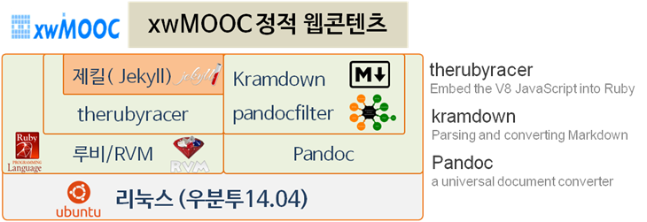

 
``` {r, include=FALSE}
knitr::opts_chunk$set(echo = TRUE, message=FALSE, warning=FALSE,
                      comment="", digits = 3, tidy = FALSE, prompt = FALSE, fig.align = 'center')

```


윈도우 정적 웹콘텐츠 개발 툴체인(Tool Chain)을 이해하고, 
윈도우 정적 웹콘테츠 개발환경을 구축한다.
특히,소프트웨어 카펜트리 마크다운 콘텐츠를 HTML로 컴파일 한다. 

# 정적 웹콘텐츠 제작환경 - 윈도우즈 {#static-webcontents-windows}

정적 웹콘텐츠를 **`제킬(Jekyll)`** 기반으로 구축하기 위해서 `제킬(Jekyll)`과 관련된 소프트웨어도 함께 
버젼을 맞추어서 설치해야 된다. 특히, [소프트웨어 카펜트리](http://software-carpentry.org/)에서 정적 웹콘텐츠 저작을 위한 좋은 툴을 개발하여 활발히 사용되고 있다. [소프트웨어 카펜트리](http://software-carpentry.org/) 저작 도구는 `pandoc`, `jekyll`에 기반하고 있고 근본에는 루비언어 기반으로 글로벌 협업도구 **GitHub** 인프라가 깔려있다.


``` {r web-contents-for-software-carpentry, eval=FALSE}
Package Manager         Language               Webpage Reuse           Plugins (SWCarepntry)
+-----------+           +----------+           +-----------+           +---------------+ 
|           |           |          |           |           |           |               |
|Chocolatey |---------->| Ruby     |---------->| Jekyll    |<--------->| pandocfilters |
|           |           |          |           |           |           |               | 
+-----------+           +----------+           +-----------+           +---------------+ 
                                                    ^
 문서 변환기                                        |
+-----------+                                       |
|           |                                       |
| Pandoc    |----------------------------------------
|           |          
+-----------+          
```

<style>
div.blue { background-color:#e6f0ff; border-radius: 5px; padding: 10px;}
</style>
<div class = "blue">

- **설치가 필요한 소프트웨어**
* RVM(Ruby Version Manager) : 루비 버젼 관리자 
* 팬독(Pandoc) : 마크다운 문서 변환 소프트웨어
* 루비(Ruby) : 마츠모토 유키히로가 개발한 동적 객체 지향 스크립트 프로그래밍 언어.
* 제킬(Jekyll) : GitHub 공동 창업자 Tom Preston-Werner이 루비로 작성한 단순하며, 블로그-인식, 정적사이트 생성 프로그램.
* therubyracer : 루비 언어내에서 V8 자바스크립트 인터프리터를 내장. NodeJS 대신 경량화된 자바스크립트 인터프리터로 사용.
* pandocfilters : pandoc 필터를 작성하는 파이썬 모듈. pandoc 필터는 파이프로 JSON을 받아 변환하여 출력한다.
* kramdown : 루비로 작성된 마크다운 변환기

</div>





# 윈도우 툴체인 구축 절차 {#swcarpentry-windows-toolcahin}

[팬독(pandoc)](http://pandoc.org/)과 [루비](https://www.ruby-lang.org/) 중 어떤 것을 먼지 설치할 것은 중요하지 않다. 
[제킬(Jekyll)](https://jekyllrb.com/)이 루비에 의존성을 갖고, HTML, PDF 등 문서 생성에 [팬독(pandoc)](http://pandoc.org/)이 필요하기 
때문에 독립적으로 각각 설치한다. 

특히, 윈도우에서 제킬을 바로 설치하기 까다롭기 때문에 [Chocolatey](https://chocolatey.org/)를 통해 제킬을 설치한다.

소프트웨어 카펜트리 교재 작성 템플릿을 사용하기 위해서 `Make`를 사용해야 하는데, 리눅스 계열은 자체 내장되어 있어 별도 설치가 필요없지만,
윈도우에서는 Git Bash를 사용해야 하는데, `Make` 가 포함되지 않아서 make를 다운로드 받아 Git Bash가 설치된 `bin` 폴더에 복사해 넣는 방법과
이전 msysGit [net installer](https://github.com/msysgit/msysgit/releases) 버전 전체를 설치하는 방법이 있다.

* [팬독(pandoc) 설치](http://pandoc.org/installing.html)
* [제킬(Jekyll) 설치](https://jekyllrb.com/docs/windows/)
    * [Chocolatey](https://chocolatey.org/install) 설치
    * Chocolatey 경유 [루비](http://rubyinstaller.org/downloads/) 설치 : `choco install ruby -y`
    * [제킬(Jekyll)](https://jekyllrb.com/) 설치 : `gem install jekyll`
* [Git Bash](https://git-for-windows.github.io/) Make
    * 첫번째 방법 
        * make 다운로드 : [https://github.com/msysgit/msysgit/blob/master/bin/make.exe?raw=true](https://github.com/msysgit/msysgit/blob/master/bin/make.exe?raw=true)
        * Git bash 설치된 `bin` 디렉토리 복사해서 저장
    * 두번째 방법
        * Git Bash Windows 대신 `msysGit 전체 버젼` 1.9X 버젼을 사용한다.    
        * msysGit 전체 버젼을 설치 : [net installer](https://github.com/msysgit/msysgit/releases)
* `pandocfilter` 설치 [^windows-pip]
    * [파이썬 2.7](https://www.python.org/downloads/)을 설치한다. **경로명 추가**
    * [setuptools](https://pypi.python.org/pypi/setuptools#windows-simplified) 다운로드 받아 설치한다.
        * 윈도우 cmd 에서 `python ez_setup.py` 타이핑한다.
        * 윈도우 탐색기를 열고 파이썬 홈, `C:\Python27\Scripts` 이 생성되면 성공한 것이다.
        * 윈도우 환경변수, 경로에 `C:\Python27\Scripts`을 추가해서 어디서나 `easy_install-2.7` 명령어가 먹도록 조치한다.
    * `easy_install-2.7 pip` 명령어로 `pip`를 설치한다.
    * `python -m pip install --upgrade pip` 명령어로 `pip` 최신 버젼으로 올린다.
    * `pip install pandocfilters` 명령어로 `pandocfilters`를 마지막으로 설치한다.

# 소프트웨어 카펜트리 예제 {#swcarpentry-example}

소프트웨어 카펜트리를 교재 템플릿을 사용하는 Git 웹페이지를 하나 골라 복제한다.
그리고 나서 `make preview` 명령어를 실행할 경우, 모든 설정이 잘 된 경우 `index.html` 파일이 자동으로 생성되게 된다.

```{r ds-authoring-compile, eval=FALSE}
$ git clone -b gh-pages https://github.com/statkclee/ds-authoring.git
$ cd ds-authoring
$ touch index.md
$ make preview
pandoc -s -t html \
    --smart \
    --mathjax \
    --template=_layouts/page \
    --filter=tools/filters/blockquote2div.py \
    --filter=tools/filters/id4glossary.py \
    -Vheader="$(cat _includes/header.html)" -Vbanner="$(cat _includes/banner.htm
l)" -Vfooter="$(cat _includes/footer.html)" -Vjavascript="$(cat _includes/javasc
ript.html)" \
    -o index.html index.md
```

