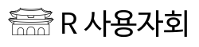
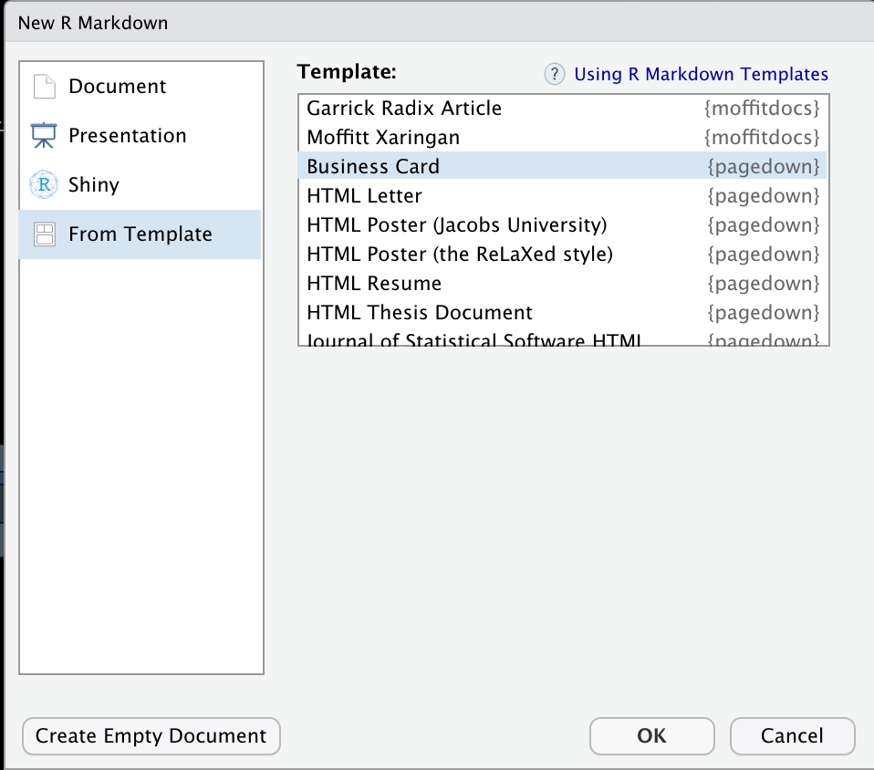

```{r setup, include=FALSE}
knitr::opts_chunk$set(echo = TRUE, message=FALSE, warning=FALSE,
                      comment="", digits = 3, tidy = FALSE, prompt = FALSE, fig.align = 'center')

library(pdftools)
library(tidyverse)
library(magick)

```


# 명함 [^1] {#business-cards}

[^1]: [Yihui Xie and Romain Lesur (2021-06-23), "`pagedown`: Create Paged HTML Documents for Printing from R Markdown - A Less Traveled Road to PDF and Printing](https://rstudio.github.io/pagedown/#business-card)

명함은 `pagedown` 기능을 이용하여 구현할 수 있다. 크게 3가지 기능이 명함제작에 필요한데 로고, 키-값으로 구성된 명함 정보, 그리고 명함 외양(css)으로 나눌 수 있다.

## 로고 {#business-card-logo}

로고는 [`R 사용자회` 로고 제작](https://statkclee.github.io/art/art-r-user-group.html)을 참고한다.



## 명함 템플릿 [^bc-basics] {#key-value-info}

[^bc-basics]: [Arbor Analytics, "How to created paged HTML documents with pagedown", October 19, 2019](https://arbor-analytics.com/post/how-to-created-paged-html-documents-with-pagedown/)

명함 기본 템프릿은 R 마크다운 `pagedown` 템플릿에서 `business card`를 선택하여 컴파일한다.



## 결과 확인 {#check-result}

기본템플릿에 기본 정보를 넣어 작성한 내용을 명함으로 제작한 결과는 다음과 같다.

{height=350 width=25%}

```{r embed-business-card, eval = FALSE}
htmltools::includeHTML("business_card/R_user_group.html")
```

# 조금더 예쁘게 {#business-cards-beautify}

이모지 HTML 참조표 : [Emoji Unicode Reference](https://www.w3schools.com/charsets/ref_emoji.asp)

CSS를 사용해서 좀더 예쁘게 명함을 제작할 수 있다.

{height=350 width=25%}


```{r yaml-header, eval = FALSE}
---
phone: "&#9742; : +82 010-xxxx-xxxx"
email: "&#128231; : victor@r2bit.com"
url: "&#127760; : www.r2bit.com"
address: |
  경기도 성남시 분당구 판교
logo: "https://raw.githubusercontent.com/statkclee/art/gh-pages/fig/R_user_group.png"
person: 
  - name: 이광춘
    title: R 사용자회, 대표
    repeat: 12
googlefonts: "sunflower" # feel free to try other fonts at https://fonts.google.com
paperwidth: 8.5in
paperheight: 11in
cols: 4
rows: 3
size: 8
output: pagedown::business_card
---

# CSS ----------------------------  
  
.wrapper {
  color: black;
  font-size: 11pt;
  background-color: white;
  border: 4px solid darkgray;
}
.name {
  color: black;
  font-size: 15pt;
  width: 100%;
  line-height: 270%;
}
.title {
  color: darkgray;
  font-size: 12pt;
}
.coordinates {
  color: #100;
}
```


