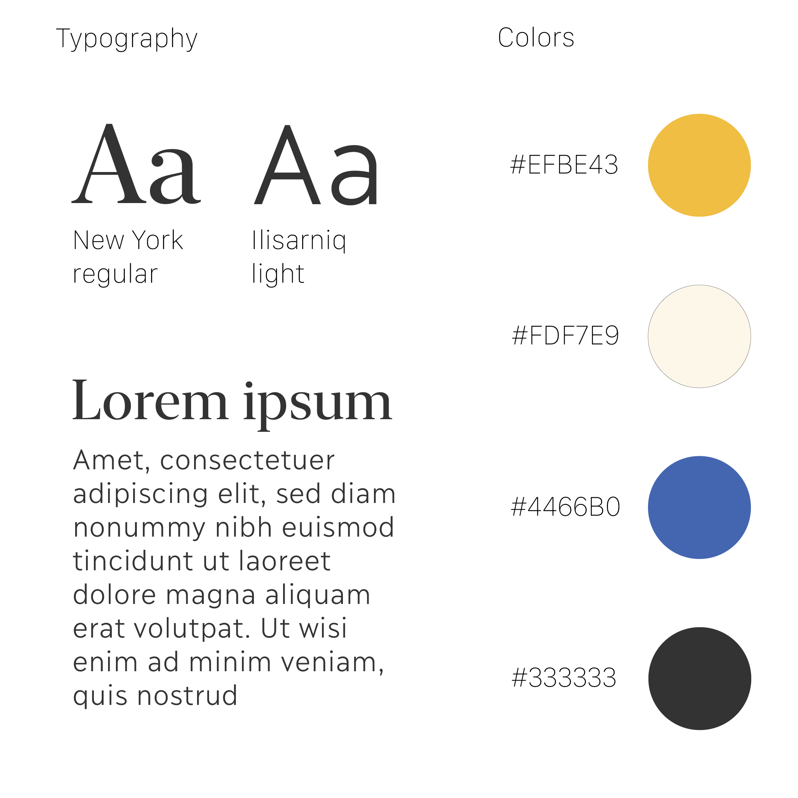

```{r setup, include=FALSE}
knitr::opts_chunk$set(echo = TRUE, message=FALSE, warning=FALSE,
                      comment="", digits = 3, tidy = FALSE, prompt = FALSE, fig.align = 'center')

library(pdftools)
library(tidyverse)
library(magick)

```

{width="357"}

# PPT 스타일 [^xaringan-tutorial] [^circle-image] {#xaringan-style}

[^circle-image]: https://stackoverflow.com/questions/64597525/r-magick-square-crop-and-circular-mask

[^xaringan-tutorial]: https://www.katiejolly.io/blog/2021-03-16/designing-slides

```{r ppt-style}
library(tidyverse)
library(magick)
library(sysfonts)
# font_add_google("Noto Sans KR")
# library(extrafont)
# loadfonts()

## 텍스트 Lorem Ipsum ------------
lorem_raw <- lorem::ipsum(paragraphs = 3)

lorem_text <- lorem_raw %>% 
  str_split("\\.") %>% 
  unlist() %>% 
  str_trim() %>% 
  str_extract(pattern = "(?:\\w+\\s+){5}") 

lorem_text <- lorem_text[!is.na(lorem_text)]

## 빈 이미지 --------------------
template_img <- image_blank(width = 650, height = 350, color = "gray", pseudo_image = "", defines = NULL)


## 조합 -------------------------
left_img <- template_img %>% 
  ## 폰트 -----------------------
  image_annotate("Typography", location = "+30+30", size = 20, font = "NanumGothic", color = "black") %>% 
  # image_annotate("Aa가", location = "+30+50", size = 30, font = "Noto Sans KR", color = "black") %>% 
  # image_annotate("Aa가", location = "+90+50", size = 30, font = "Noto Serif KR", color = "black")
  image_annotate("Aa가", location = "+30+60", size = 30, font = "Nanum Gothic", color = "black") %>% 
  image_annotate("Aa가", location = "+90+60", size = 30, font = "Nanum Myeongjo", color = "black") %>% 
  ## 텍스트 -----------------------
  image_annotate("Lorem Ipsum", location = "+30+150", size = 30, font = "Nanum Myeongjo", color = "black") %>% 
  image_annotate(lorem_text[1], location = "+30+200", size = 20, font = "Nanum Myeongjo", color = "black") %>% 
  image_annotate(lorem_text[2], location = "+30+220", size = 20, font = "Nanum Myeongjo", color = "black") %>% 
  image_annotate(lorem_text[3], location = "+30+240", size = 20, font = "Nanum Myeongjo", color = "black") %>% 
  image_annotate(lorem_text[4], location = "+30+260", size = 20, font = "Nanum Myeongjo", color = "black") %>% 
  image_annotate(lorem_text[5], location = "+30+280", size = 20, font = "Nanum Myeongjo", color = "black") %>% 
  ## 색상 -----------------------
  image_annotate("Colors",  location = "+430+30", size = 20, font = "Nanum Myeongjo", color = "black") %>% 
  image_annotate("#EFBE43", location = "+470+90", size = 17, font = "Nanum Myeongjo", color = "darkgray") %>%    
  image_annotate("#FDF7E9", location = "+470+140", size = 17, font = "Nanum Myeongjo", color = "darkgray") %>%    
  image_annotate("#4466B0", location = "+470+190", size = 17, font = "Nanum Myeongjo", color = "darkgray") %>% 
  image_annotate("#333333", location = "+470+240", size = 17, font = "Nanum Myeongjo", color = "darkgray")  
  
full_img <- image_draw(left_img)
symbols(600, 100, circles=20, fg = '#EFBE43', bg='#EFBE43', inches=FALSE, add=TRUE)
symbols(600, 150, circles=20, fg = '#FDF7E9', bg='#FDF7E9', inches=FALSE, add=TRUE)
symbols(600, 200, circles=20, fg = '#4466B0', bg='#4466B0', inches=FALSE, add=TRUE)
symbols(600, 250, circles=20, fg = '#333333', bg='#333333', inches=FALSE, add=TRUE)

dev.off()

print(full_img)

```


