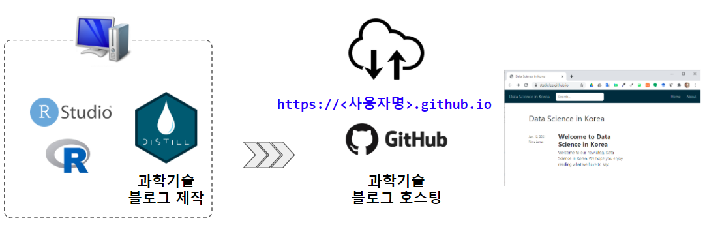
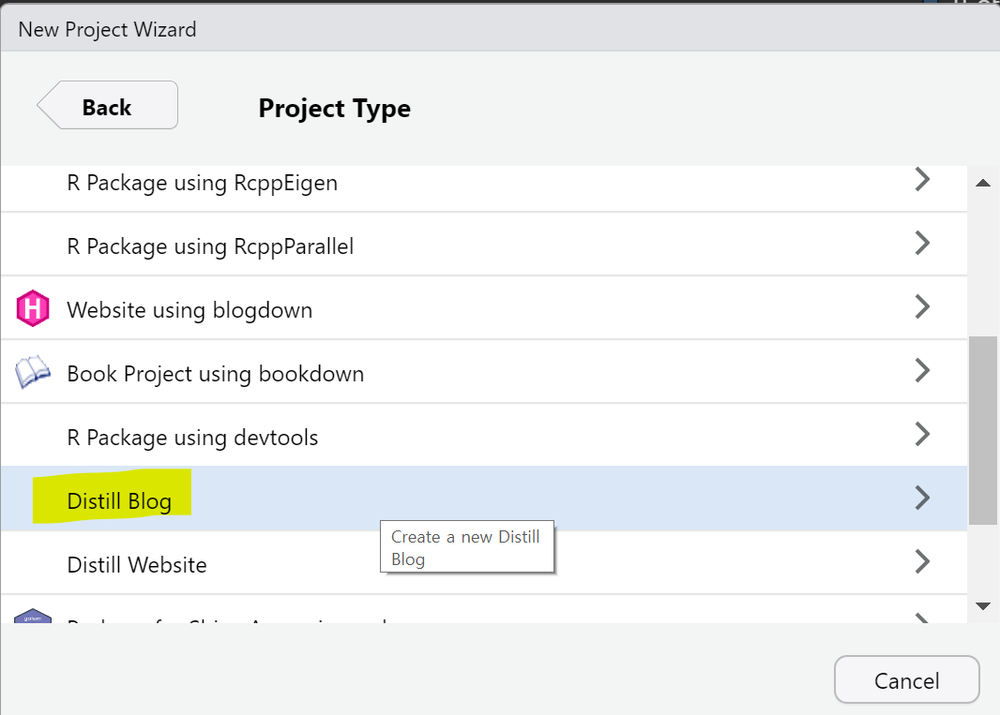
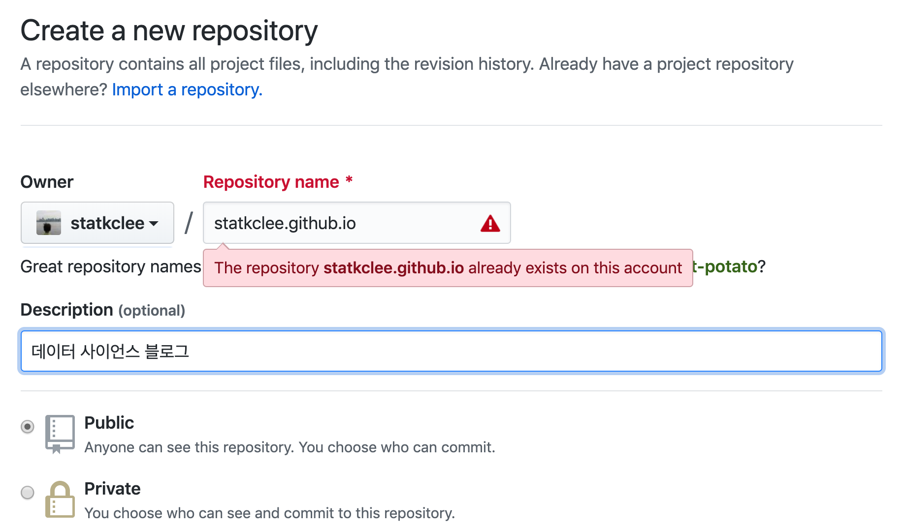
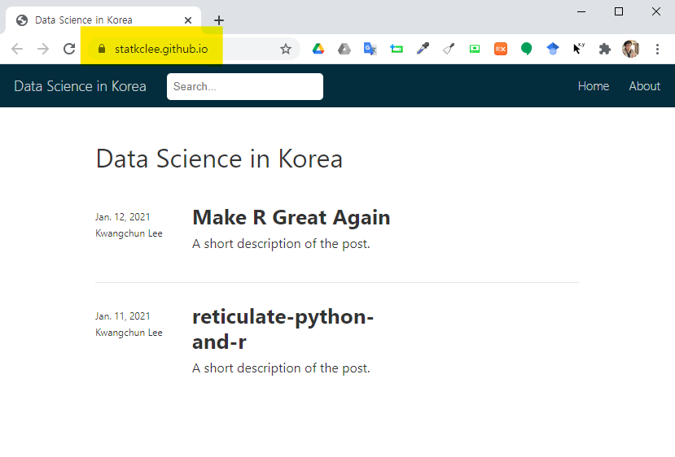
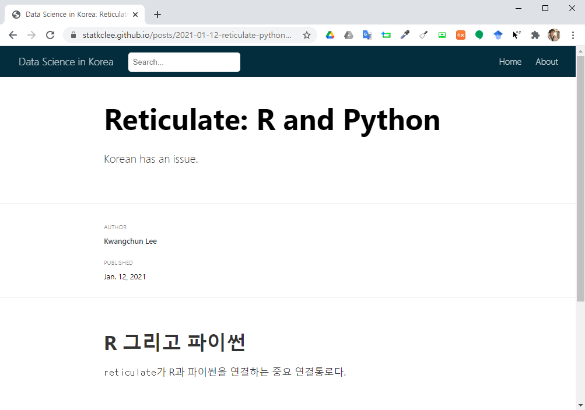

```{r setup2, include=FALSE}
knitr::opts_chunk$set(echo = TRUE, message=FALSE, warning=FALSE,
                      comment="", digits = 3, tidy = FALSE, prompt = FALSE, fig.align = 'center')
```

<center>



</center>

# 과학기술 블로그 제작 {#scitech-static-website}

과학기술을 공유할 블로그를 작성하는 것은 코로나19로 촉발된 디지털 전환(Digital Transformation) 시대에 과학기술 종사자 뿐만 아니라 현대를 사는 누구나 갖춰야 하는 보편적인 기술로 자리잡아 가고 있다. 통상 <http://netlify.com/> 혹은 <https://github.com/> 두 웹사이트에서 제공하는 정적 웹사이트(Static Website) 기능을 활용하여 제작된 블로그를 공유하는 것이 **데이터 과학자** 사이에 일반화되어 있다. 

하지만, 과학기술을 정적 웹사이트에 호스팅하여 공유한다는 것은 지금까지와는 다른 기술적 배경을 가지기 때문에 이러한 문제를 해결한 것이 [`distill`](https://rstudio.github.io/distill/) 팩키지다. [`distill`](https://rstudio.github.io/distill/) 팩키지를 블로그 혹은 웹사이트 과학기술 콘텐츠 공유를 위해서 두가지 방식으로 활용이 가능한데 여기서는 **블로그(Blog)**에 초점을 잡아 전반적인 방향을 진행하고자 한다.

따라서, 과학기술 블로그를 R + RStudio + [`distill`](https://rstudio.github.io/distill/) 팩키지를 조합하여 로컬에서 제작하고 공유와 배포를 위해서 <https://github.com/> 정적 웹사이트 기능을 활용한다. `https://<사용자명>.github.io/`가 최종 배포 웹사이트 URL이 된다. 본 작업흐름으로 제작된 결과물은 https://statkclee.github.io/ 에서 확인이 가능하다. 

# 로컬 컴퓨터 블로그 제작 [@mock2020building] {#build-static-website}

## 환경 설정 {#setup-environment}

가장 먼저, R + RStudio로 블로그 제작환경을 준비한다.
[`distill`](https://github.com/rstudio/distill) 팩키지를 설치하여 과학기술 블로그 저작을 위한 준비를 마무리한다.

```{r install-distill, eval=FALSE}
install.packages("distill")
```


## 프로젝트 생성 {#project-setup}

[`distill`](https://github.com/rstudio/distill) 팩키지를 설치하게 되면 블로그 제작을 위한 프로젝트를 준비한다. 
RStudio 메뉴에서 `File` &rarr; `New Project ...` &rarr; `Project Type` 에서 **Distill Blog**를 선택한다.



GUI 없이 R 콘솔에서 `distill` 블로그를 시작한다면 다음 명령어를 사용한다.

```{r distill-blog-start, eval = FALSE}
distill::create_blog(dir = "my-blog", title = "My Blog No Korean, Only English")
```

상기 작업을 통해서 결국 다음 파일과 디렉토리가 생성된다.

- `_site.yml`
- `about.rmd`
- `index.rmd`
- `_posts\`
- `_site\`

`_site.yml` 파일에 블로그 관련 설정을 한다.
`about.rmd`, `index.rmd`, 추가로 `**.rmd` 파일을 제작하여 변하지 않는 일반적인 사항 혹은 가끔 수정하는 내용을 작성한다.
`_posts\`는 `distill::distill_article()` 명령어로 매일 매주 작성하는 블로그 게시글이 작성되는 곳이다.
마지막으로 `_site\` 디렉토리는 블로그 정적 웹사이트가 배포되는 디렉토리다. 
기본적으로 <http://netlify.com/>를 상정하고 있어 `_site\`를 사용하지만,
`docs\`로 바꿔주게 되면 GitHub을 웹호스팅으로 사용하여 배포할 수 있게 된다.

## 배포 설정 - `GitHub` {#deployment-setup}

`https://<사용자명>.github.io/` 저장소는 매우 특별한 GitHub 저장소다. 
따라서, GitHub 저장소 명칭을 `<사용자명>.github.io` 으로 생성해야 한다.
예를 들어, `statkclee.github.io` 와 같이 사용자계정을 `github.io`와 붙여 먼저 판다.
그리고 나서, 상단 `Settings`로 들어간 다음 **GitHub Pages** 설정을 한다.
이때 GitHub 저장소의 특정 디렉토리 `docs/` 디렉토리에 담긴 내용 전부가 정적 웹사이트에 게시되는 내용이 된다.
즉, `docs/index.html` &rarr; `https://<사용자명>.github.io/index.html`로 바뀌어 블로그 웹사이트로 게시된다.


`_site.yml` 파일을 열어 `output_dir:` 값을 `_site` &rarr; `docs`으로 변경시킨다. 그리고 나서 블로그 사이트를 빌드시키면 블로그 웹사이트 전체가 `docs/` 디렉토리에 저장된다. 이것을 GitHub에 `push` 해서 올리게 되면 블로그 웹사이트가 `https://<사용자명>.github.io/index.html`을 통해 배포된다.


```{r site-yaml, eval = FALSE}
name: "my-blog"
title: "My Blog No Korean, Only English"
description: |
  My Korean Blog
output_dir: "docs"
navbar:
  right:
    - text: "Home"
      href: index.html
    - text: "About"
      href: about.html
output: distill::distill_article
```


## 블로그글 작성 {#writing-blog}

`distill::create_post()` 명령어를 사용해서 블로그를 작성한다. 
예를 들어 `distill::create_post("reticulate-python-and-r")` 명령어를 실행하게 되면,
작성 날짜 `2020-01-12`가 붙은 폴더가 `_posts/2021-01-12-reticulate-python-and-r`와 같이 생성되고 폴더 
내부에 `reticulate-python-and-r.Rmd` 파일이 위치한다.

이제 파일을 R마크다운 문서 작성하듯이 작성하고 나서 뜨게질(Knit) 하게 되면 컴파일 되어 HTML 문서가 생성된다.

<style>
div.blue { background-color:#e6f0ff; border-radius: 5px; padding: 10px;}
</style>
<div class = "blue">

### `README.html' does not exist.` {-#error}

[error with pandoc and title #52](https://github.com/rstudio/distill/issues/52)을 참조하여 `README.html` 파일 관련 이슈를 해결한다.


```{r fix-readm-error, eval = FALSE}
rmarkdown::render("README.Rmd", output_format = "github_document")
```

</div>


## 블로그 웹사이트 생성 {#create-blog}

블로그 글 작성이 완료되면 이를 블로그 웹사이트에 반영시키기 위해서 `CTRL + SHIFT + B` 키를 입력하여 작성한 블로그글이 웹사이트에 올라오도록 준비한다.


## `GitHub` 저장소 연결 {#connect-github-repo}

`GitHub` 저장소를 연결시켜야 하는데 `<사용자명>.github.io` 와 같이 지정하여 `Repository`를 GitHub 상단 `+` 버튼을 클릭하여 생성시킨다. 



다음으로 Git 작업흐름에 맞춰 순차적으로 작업하는데 로컬 컴퓨터에서 작업한 `distill` 블로그 웹저장소와 `<사용자명>.github.io`을 연결시킨다.


```{r connect-github-repo, eval = FALSE}
$ git add -A
$ git commit -m"첫번째 블로그 게시글 배포"
$ git remote add origin git@github.com:statkclee/statkclee.github.io.git
$ git pull origin master --allow-unrelated-histories
```


## 격려와 축하 {#congratulation-github-repo}

`https://<사용자명>.github.io/index.html` 혹은 `https://<사용자명>.github.io/` 웹사이트에 접속하게 되면 그동안 노력했던 결과물을 확인할 수 있다.




# 외양 - 폰트, 색상 등 [@alison2020blog] {#theme-distill}

지금까지 전반적인 블로그 게시글 작성과 관련된 전반적인 작업흐름에 집중했다면 글꼴, 색상 등 외양을 꾸며 좀더 과학기술 게시글이 더욱 친근하게 다가설 수 있도록 하자.

`distill::create_theme("tidyverse")` 명령어를 사용하면 `tidyverse.css` 파일이 자동생성되고 폰트와 색상을 원하는 방식대로 변경시키면 된다. 다음 웹사이트를 참고하여 적절한 CSS 파일 변경을 통해 본인이 원하는 웹사이트를 구축한다. 

- https://rstudio.github.io/distill/blog.html?panelset=tidymodels
- https://rstudio.github.io/distill/blog.html?panelset=before-i-sleep
- https://rstudio.github.io/distill/blog.html?panelset=piping-hot-data

```{r create-theme, eval = FALSE}
> distill::create_theme("tidyverse")
v Created CSS file at theme.css
o TODO: Customize it to suit your needs
o TODO: Add 'theme' entry to your`site/article YAML

See docs at https://rstudio.github.io/distill/website.html#theming
```

폰트만 한글로 바꿔 `tidyverse.css`를 저장한다. 기본 아이디어는 구글 폰트 웹사이트 <https://fonts.google.com/> 에서 한글 폰트를 가져와서 이를 블로그 주요 텍스트의 글꼴을 저작자의 선택에 맞춰 반영시키는 것이다. 수정한 `tidyverse.css` 파일의 일부는 다음과 같다.

```{r css-fonts, eval = FALSE}
/* Optional: embed custom fonts here with `@import`          */
/* This must remain at the top of this file.                 */

@import url('https://fonts.googleapis.com/css2?family=Sunflower:wght@500&display=swap');
@import url('https://fonts.googleapis.com/css2?family=Noto+Sans+KR:wght@100;300&family=Sunflower:wght@500&display=swap');
@import url('https://fonts.googleapis.com/css2?family=Gaegu:wght@700&family=Noto+Sans+KR:wght@100;300&family=Sunflower:wght@500&display=swap');

html {
  /*-- Main font sizes --*/
  --title-size:      50px;
  --body-size:       1.06rem;
  --code-size:       14px;
  --aside-size:      12px;
  --fig-cap-size:    13px;
  /*-- Main font colors --*/
  --title-color:     #000000;
  --header-color:    rgba(0, 0, 0, 0.8);
  --body-color:      rgba(0, 0, 0, 0.8);
  --aside-color:     rgba(0, 0, 0, 0.6);
  --fig-cap-color:   rgba(0, 0, 0, 0.6);
  /*-- Specify custom fonts ~~~ must be imported above   --*/
  --heading-font:    'Sunflower', sans-serif;
  --mono-font:       "DM Mono", monospace;
  --body-font:       'Noto Sans KR', sans-serif;
  --navbar-font:     'Gaegu', cursive;
}

```





