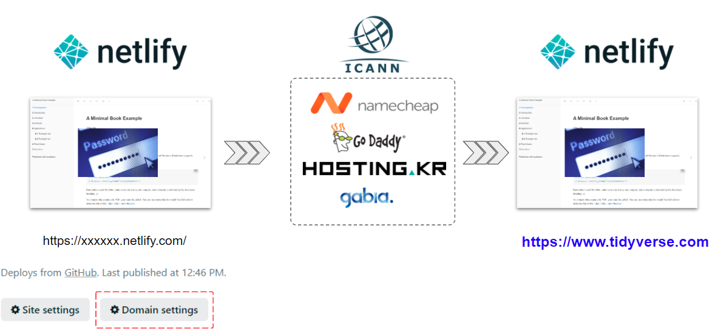
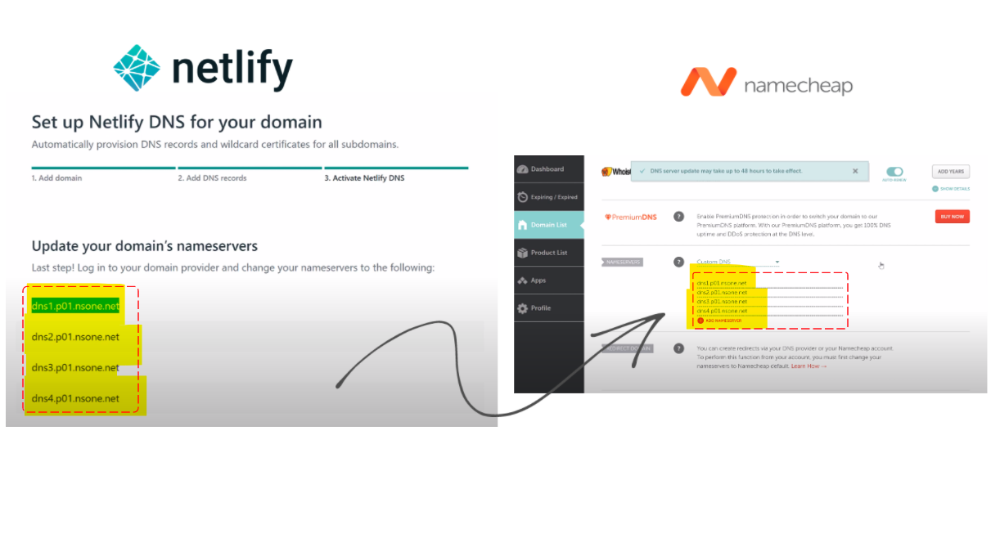

```{r setup2, include=FALSE}
knitr::opts_chunk$set(echo = TRUE, message=FALSE, warning=FALSE,
                      comment="", digits = 3, tidy = FALSE, prompt = FALSE, fig.align = 'center')
```

# 구한 도메인 적용방법 {-#custom-domain}


<center>



</center>

# 도메인 구입 {#purchase-domain}

[Name Cheap](http://namecheap.com/), [GoDaddy](https://www.godaddy.com/), 혹은 한국 도메인 판매 회사를 통해 원하는 도메인을 구입한다.
`.ai`, `.io` 등 AI 갬성이 물씬 풍기는 도메인은 가격이 비싸고 `.tv` 등 도메인도 가격이 업종에 따라 상당하다. 경제적인 상황과 각자 맞는 상황에 맞춰 적절한 도메인을 구매하여 1년 동안 유의미하게 사용할 수 있도록 한다.

# 도메인 `netlify` 연결 {#connect-domain}

`namecheap` 혹은 `GoDaddy`에서 구입한 도메인을 `netlify`에 연결시킨다.
자세한 내용은 다음 동영상을 참고한다.

| `namecheap` | `GoDaddy` |
|:------------------------------:|:------------------------------:|
| <iframe width="560" height="315" src="https://www.youtube.com/embed/T9L8aWTPTLA" frameborder="0" allow="accelerometer; autoplay; clipboard-write; encrypted-media; gyroscope; picture-in-picture" allowfullscreen></iframe> | <iframe width="560" height="315" src="https://www.youtube.com/embed/qlrCptpwtgs" frameborder="0" allow="accelerometer; autoplay; clipboard-write; encrypted-media; gyroscope; picture-in-picture" allowfullscreen></iframe> |

중요한 것은 `Netlify` Name Server를 구매한 도메인 제공업체 예를 들어 `namecheap` **Custom DNS**에 NAMESEVERS를 등록시키면 된다.




