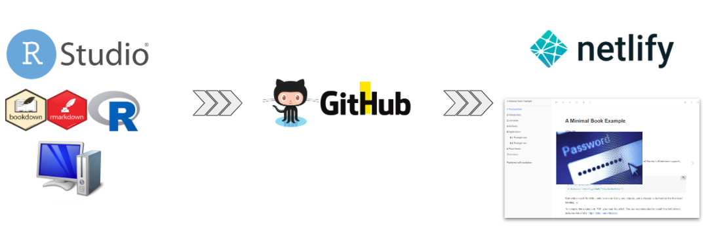
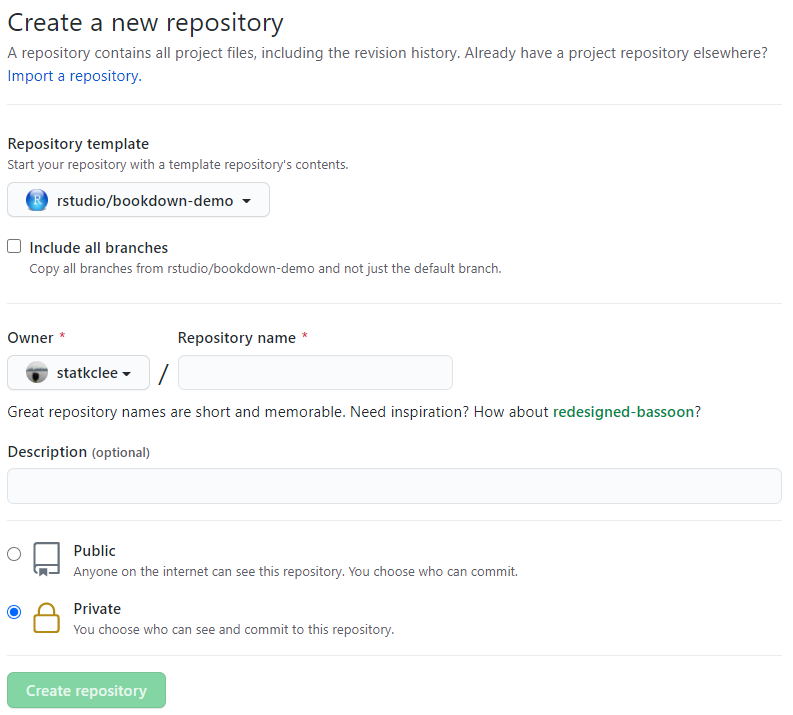
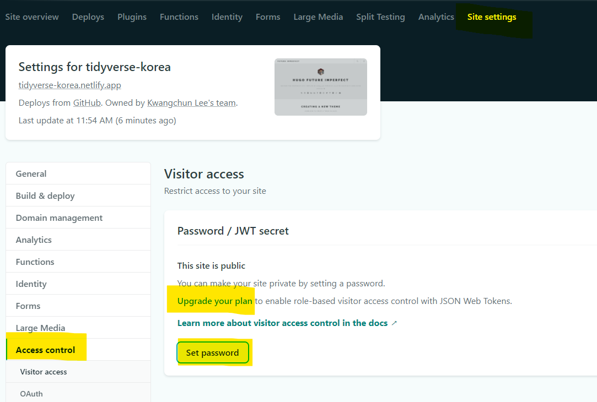
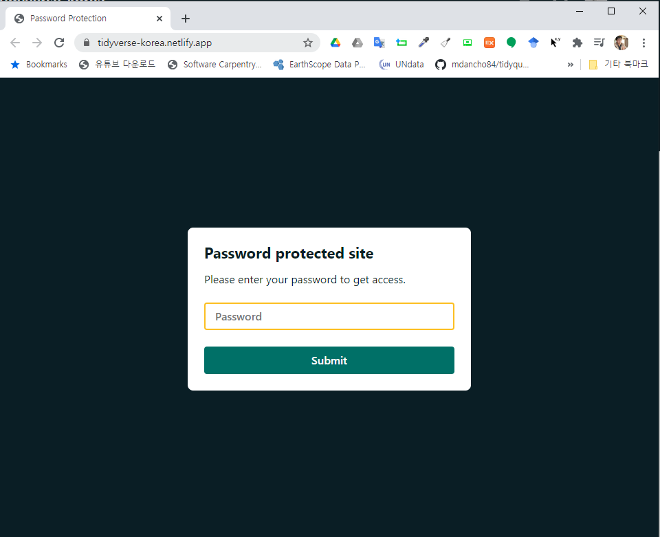

```{r setup2, include=FALSE}
knitr::opts_chunk$set(echo = TRUE, message=FALSE, warning=FALSE,
                      comment="", digits = 3, tidy = FALSE, prompt = FALSE, fig.align = 'center')
```

# DevOps 파이프라인 {-#R마크다운-pipeline}


보안이 강화된 웹페이지를 제작하기 위해서 패스워드로 보안이 되게 만들고, 
당연히 R마크다운 코드 저장소도 Private GitHub Repository 를 제작하여 로컬 PC에서 개발되는 사항이 버전관리도 DevOps 기능도 되면서 보안도 패스워드 보안을 통해 작업이 되도록 준비한다.

<center>



</center>

# GitHub 개인 저장소 {#github-private-repo}

GitHub에 개인 저장소를 제작한다. 제작된 클라우드 GitHub 저장소를 로컬 컴퓨터로 클론해서 R마크다운 작업을 수행한다.



# GitHub 작업흐름 {#github-private-workflow}

GitHub의 일반적인 작업 흐름에 맞춰 작업을 수행한다.

1. `git clone`
1. `git add`
1. `git commit -m`
1. `git push`

# Netlify 저장소 등록 {#netlify-registration}

[http://netlify.com/](http://netlify.com/) 웹사이트에 Github Private 저장소를 등록시킨다.
필요한 경우 GitHub 저장소에도 NETLIFY APP ID와 NETLIFY_AUTH_TOKEN 을 등록시켜 상호간의 작업을 일원화 시킨다.

# Netlify 비밀번호 등록 {#netlify-registration-protection}

[http://netlify.com/](http://netlify.com/) 웹사이트에 배포한 앱에 대한 방문자 접근을 위해서 비밀번호 접근 권한 설정을 해야 된다. 
매월 $19 달러 비용이 소요되니 주의하도록 한다.



# 배포 웹사이트 비밀번호 적용 {#netlify-registration-protection-application}

방문자 접근을 위해 비밀번호 설정이 완료된 경우 다음과 같이 비밀번호 보안기능이 활성화된 것을 확인할 수 있다.




