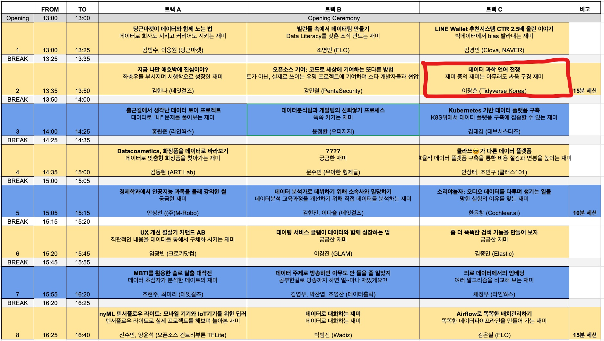
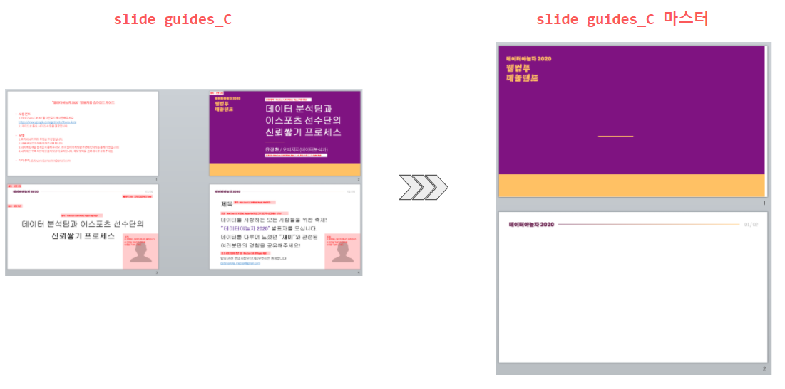
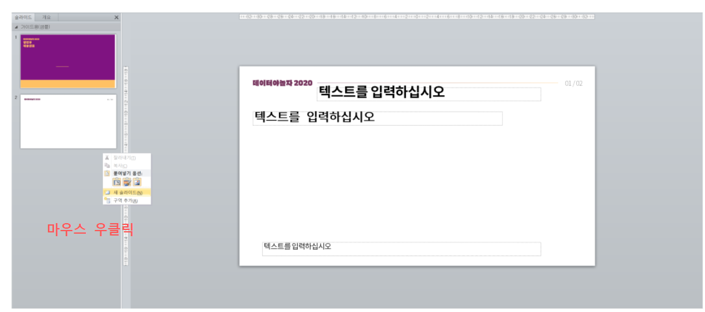

```{r setup, include=FALSE}
knitr::opts_chunk$set(echo = TRUE, message=FALSE, warning=FALSE,
                      comment="", digits = 3, tidy = FALSE, prompt = FALSE, fig.align = 'center')

library(pdftools)
library(tidyverse)
library(magick)

```


# 파워포인트 발표자료 {#pptx-slide-deck}

각종 행사에서 발표를 하는데 발표의 `look and feel`을 맞추기 위해서 최소한 지켜야하는 지침이 주어지는 경우가 있다. 
사실 다수 발표자가 발표를 할때 서로 다른 색상, 폰트, 크기를 사용하게 되면 산만하고 뭔가 정리가 안된 느낌을 줄 수 있다. 이를 방지하기 위해서 배포되는 파워포인트 양식에 맞춰 발표내용을 정리하는 것이 많이 사용되는 흐름이다. 

[데이터야놀자, 2020년에도 데이터야놀자 :)](https://datayanolja.github.io/) 행사는 언제부터인가 다른 모습을 띄게 되었고 좋은 모양으로 진화에 진화를 거듭하고 있다. [데이터야놀자 발표 준비 가이드](https://www.notion.so/bf501454a3f845ccb9421c6fe07044c1)에 따르면 3가지 서로 다른 형태의 트랙이 존재하여 트랙 A,B,C에 맞춰  slide guides_A , slide guides_B, slide guides_C 양식과 폰트(Noto Sans CJK KR)가 제공되었다.

[데이터 과학 언어 전쟁](https://statkclee.github.io/ds-authoring/ds-data-science-war.html#/) 발표를 하게 되어 기존 작성된 발표자료를 데이터야 놀자에서 배포한 파워포인트에 맞춰 작성하는 방법을 정리해보자.




# 파워포인트 마스터 {#pptx-slide-master}

[데이터야놀자 발표 준비 가이드](https://www.notion.so/bf501454a3f845ccb9421c6fe07044c1)에서 배포된 파워포인트 슬라이드는 **슬라이드 마스터** 작업은 되어 있지 않다. 따라서 슬라이드 마스터를 Noto Sans CJK KR 폰트도 설치하고 마스터를 따로 제작해야 한다.

파워포인트에서 슬라이드 마스터를 제작하는 방법은 파워포인트 상단 메뉴 **보기** &rarr; **슬라이드 마스터**를 들어가서 편집하면 된다.




마스터가 준비되면 슬라이드 제목 및 본문 마스터를 활용하여 폰트종류 크기 신경쓰지 않고 발표내용 저작에 집중할 수 있는 토대가 마련된다.



# R마크다운 + PPT 템플릿 [^rendering-pptx-rmarkdown] {#pptx-slide-master-rmarkdown}

[^rendering-pptx-rmarkdown]: [RStudio Support (September 15, 2020), "Rendering PowerPoint Presentations with RStudio"](https://support.rstudio.com/hc/en-us/articles/360004672913-Rendering-PowerPoint-Presentations-with-RStudio)

`reference_doc: template.pptx` 와 같이 `reference_doc`에 파워포인트 템플릿을 지정하여 R 마크다운으로 PPT 발표자료를 제작한다.

- New File > R Markdown > Presentation > PowerPoint

다음과 같이 `reference_doc`에 파워포인트 슬라이드 템플릿을 넣어 R 마크다운 코드를 작성하고 이를 PPT 파일로 뽑아내는 방법도 있다.


<pre><code>
---
title: My presentation
output: 
  powerpoint_presentation:
    reference_doc: data/slide guides_C_template.pptx
    slide_level: 3
---

# Section Header

Hi

## Section header

Second

</code></pre>


# R마크다운 CSS {#pptx-slide-master-rmarkdown-css}


