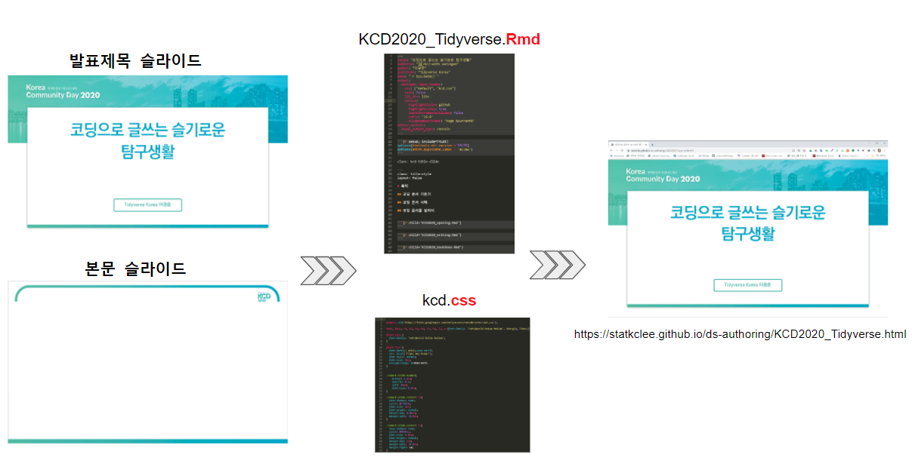

```{r setup, include=FALSE}
knitr::opts_chunk$set(echo = TRUE, message=FALSE, warning=FALSE,
                      comment="", digits = 3, tidy = FALSE, prompt = FALSE, fig.align = 'center')
```


# 컴파일 없이 바로 미리보기 [^instant-preview] {#ds-instant-preview}

[^instant-preview]: [Yihui Xie (2019-02-20), "The Ultimate Infinite Moon Reader for xaringan Slides - Instant preview without fully rebuilding HTML, and the linked navigation"](https://yihui.name/en/2019/02/ultimate-inf-mr/)

[pagedown](https://github.com/rstudio/pagedown) 팩키지 `crome_print()` 함수를 활용하여 xaringan 팩키지 `xaringan::inf_mr()`을 사용해서 컴파일 없이 바로 미리보기 기능을 구현해냈다.

`remotes::install_github('yihui/xaringan', upgrade = TRUE)` 명령어로 설치작업을 수행하고, 
콘솔창에 `xaringan::inf_mr()` 명령어를 실행시킨다. 다만, 다만 슬라이드쇼 문서 출력형식이 `xaringan::moon_reader`으로 지정되면 된다.

```{r xaringan-instant-preview, eval=FALSE}
remotes::install_github('yihui/xaringan', upgrade = TRUE)
xaringan::inf_mr()
```


# 글꼴(font) 설정 {#ds-xaringan-font}

[구글 글꼴(Google Fonts)](https://fonts.google.com/) 웹사이트에서 인터넷 글꼴을 가져와서 `xaringan`에 반영하는 것이 가능하다.
이를 위해서 먼저 원하는 한글 글꼴을 선택한다. "Languages"를 선택하고 "Korean"을 지정하게 되면 구글 폰트 중 한글 글꼴만 확인이 가능하다.
이중 원하는 글꼴을 선택하게 되면 다음과 같이 @import 할 수 있고 CSS에서 사용할 수 있도록 코드가 제공된다.

```{r xaringan-css, eval=FALSE}
<style>
@import url('https://fonts.googleapis.com/css?family=Nanum+Pen+Script');
</style>

font-family: 'Nanum Pen Script', cursive;
```

상기정보를 활용하여 R마크다운 `xaringan` 슬라이스쇼에 반영시키면 된다.

R마크다운 `YAML` 헤더에 다음과 같이 작성하게 되면 `css` 디렉토리에 `tidyverse.css`, `tidyverse-fonts.css` 앞서 전달받은 내용을 반영시킨다.

```{r xaringan-css-rmarkdown, eval=FALSE}
output:
  xaringan::moon_reader:
    css: ["default", "css/tidyverse.css", "css/tidyverse-fonts.css"]
    lib_dir: libs
    nature:
      highlightStyle: github
      highlightLines: true
      countIncrementalSlides: false
```

"css/tidyverse-fonts.css" 파일에 다음과 같이 구글 웹폰트를 반영하여 슬라이드쇼에 반영시킨다.

```{r css-rmarkdown, eval=FALSE}
@import url(https://fonts.googleapis.com/css?family=Cute+Font|Jua|Dokdo|Nanum+Pen+Script|Nanum+Gothic);

h1 {
  font-family: 'Jua', sans-serif;
}

h2, h3 {
  font-family: 'Cute Font',  cursive;
}

p {
  font-family: 'Nanum Gothic', sans-serif;
  font-size: 17px;
}
```

# 사용자 정의 슬라이드 [^xaringan-custom-slide] {#ds-xaringan-slide}

[^xaringan-custom-slide]: [Steven V. Miller (February 3, 2018), "Make Your Presentations Fun in Xaringan"](http://svmiller.com/blog/2018/02/r-markdown-xaringan-theme/)

사용자 정의 슬라이드를 제작하는 것도 가능한데 원리는 앞서와 마찬가지로 사용자 정의 `.css` 파일을 제작한다.
그리고 `.css` 파일을 `Rmd` 파일에 지정하여 연결시키고 컴파일하는 작업흐름을 취한다.

```{r css-custom-rmarkdown, eval=FALSE}
.title-slide {
	background-color: #fff;
  background-image: url(/home/steve/Dropbox/teaching/clemson-academic.png);
	background-position: center bottom 170px;
	background-size: 30%;
	border-bottom: 0px solid  #522D80;
	box-shadow:  0 55px 0 #fff;
}
```


# 스타일 생성 {#ds-xaringan-slide-style}

`xaringan` 슬라이드에 스타일 입히는 [`xaringanthemer`](https://github.com/gadenbuie/xaringanthemer) 팩키지를 통해서 슬라이드 내용은 그대로 둔 채로 다양한 스타일을 입힐 수 있다.

# PPT &rarr; `xaringan` 슬라이드 {#xaringan-slideshows}

[Korea Community Day 2020](https://kcd2020.festa.io/)에서 [코딩으로 글쓰는 슬기로운 탐구생활](https://statkclee.github.io/ds-authoring/KCD2020_Tidyverse.html) 발표자료를 제작하는 과정은 다음과 같다. 
먼저, 커뮤니티에 발표자로 선정되면 발표일관성과 통일성을 위해서 통상 파워포인트 템플릿을 전달해 준다. 파워포인트 템플릿은 다소 차이가 있지만, 본문 슬라이드와 발표제목 슬라이드로 구성되어 있고, 글꼴, 글꼴크기 위치 등이 사전에 지정되어 있다. 



## PPT 파일 {#ppt-file}

[KCD 발표 템플릿](data/KCD2020_온라인_최종.pptx)을 전자우편으로 전달받게 되면 템플릿에서 권장하는 글꼴폰트도 다운로드 받아 작업 컴퓨터에 설치하고 슬라이드 마스터 기능을 활용하여 Look-and-Feel 을 맞추어 발표 내용을 작성한다.
특히, 한국출판인회의에서 [`KoPubWorld` 서체](http://www.kopus.org/Biz/electronic/Font.aspx)를 별도 승인없이 기본정보만 입력함으로써 사용가능한 폰트이기도 하다.

```{r ppt-slickr}
library(tidyverse)
library(slickR)

kcd_template <- fs::dir_ls(path="data/KCD2020_온라인_최종")

kcd_template_df <- tibble(page = glue::glue("{kcd_template}") )
  
slickR(kcd_template_df$page, height = 600)
```

## PPT 마스터 {#ppt-master-file}

본격적인 발표내용을 채우기 전에 KCD 발표 템플릿이 마스터에 글꼴, 크기, 위치 등이 지정되지 않아 슬라이드 마스터를 열어 슬라이드 마스터를 통해 기본 윤곽을 잡고 발표내용을 채우는 것도 권장되는 방법 중 하다.
[KCD 발표 마스터 템플릿](data/KCD2020_Tidyverse.pptx)에 발표내용을 소그룹으로 나눌 수 있는 기능이 빠져있어 중간제목 슬라이드를 추가한다.


```{r ppt-slickr-master}
kcd_master_template <- fs::dir_ls(path="data/KCD2020_Tidyverse")

kcd_master_template_df <- tibble(page = glue::glue("{kcd_master_template}") )
  
slickR(kcd_master_template_df$page, height = 600)
```

## 작업 구조 {#file-structure}

KCD 발표 마스터 템플릿에 지정된 글꼴과 글자 크기 및 관련된 사항을 `kcd.css`에 담아두고,
`.Rmd` 파일에 발표 콘텐츠를 `xaringan` 문법에 맞춰 발표자료를 작성한다. 
`KCD2020_Tidyverse.Rmd` 파일이 모든 것을 담당하는 `main` 역할을 담당하고 `opening.Rmd`, `writing.Rmd`, `bookdown.Rmd`으로 나눠 모듈화시켜 발표자료를 제작한다. 기본적인 발표자료 작업 디렉토리 구조는 다음과 같다.

```{r xaringan-file-directory-structure, eval = FALSE}
KCD2020_Tidyverse.Rmd
├── css/ kcd.css
├── Rmd/
    ├── KCD2020_opening.Rmd  
    ├── KCD2020_writing.Rmd
    └── KCD2020_bookdown.Rmd
```

- [KCD2020_Tidyverse.Rmd](https://raw.githubusercontent.com/statkclee/ds-authoring/gh-pages/KCD2020_Tidyverse.Rmd)
    - [KCD2020_opening.Rmd](https://raw.githubusercontent.com/statkclee/ds-authoring/gh-pages/KCD2020_opening.Rmd)
    - [KCD2020_writing.Rmd](https://raw.githubusercontent.com/statkclee/ds-authoring/gh-pages/KCD2020_writing.Rmd)
    - [KCD2020_bookdown.Rmd](https://raw.githubusercontent.com/statkclee/ds-authoring/gh-pages/KCD2020_bookdown.Rmd)
- [kcd.css](https://raw.githubusercontent.com/statkclee/ds-authoring/gh-pages/kcd.css)

## KCD 발표자료 {#file-structure-presentation}

상기 작업을 완료한 후에 작업결과는 다음과 같다.

```{r kcd-2020-slideshow}
knitr::include_url('https://statkclee.github.io/ds-authoring/KCD2020_Tidyverse.html#1')
```


