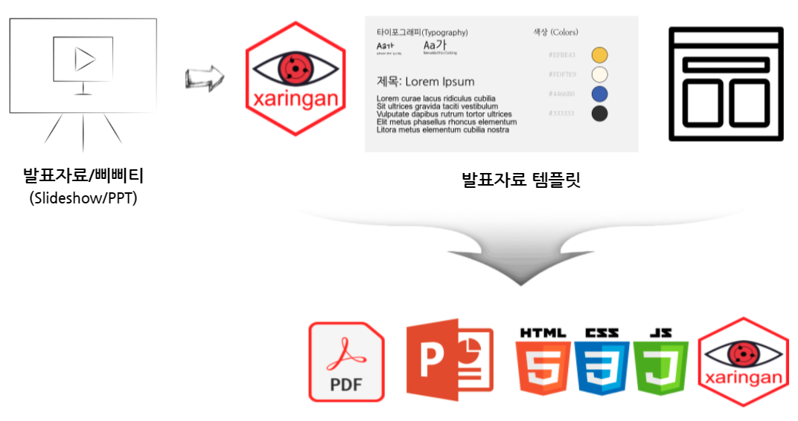
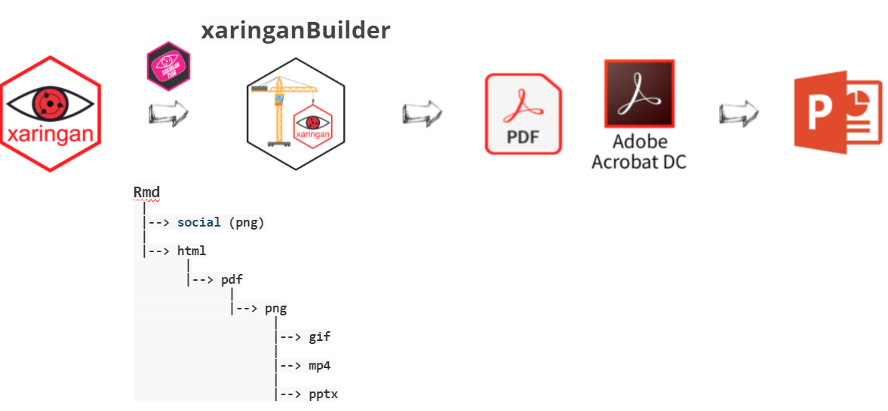
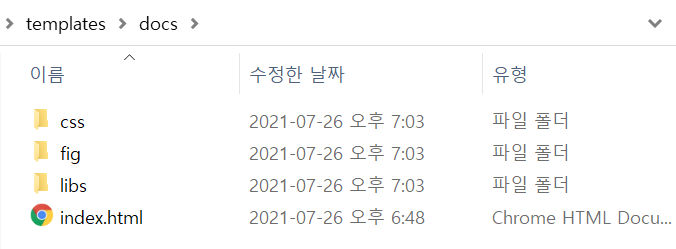

```{r setup, include=FALSE}
knitr::opts_chunk$set(echo = TRUE, message=FALSE, warning=FALSE,
                      comment="", digits = 3, tidy = FALSE, prompt = FALSE, fig.align = 'center')

library(pdftools)
library(tidyverse)
library(magick)

```



# 작업흐름 {#rconf-template-workflow}

발표자료를 다양한 소프트웨어를 사용하여 제작하기 때문에 통일되고 일관된 `look and feel` 을  제공하는 것이 중요하다. 이를 위해서 가장 많이 사용되는 slideshow 제작도구를 지원하는 것은 물론 프로그래밍을 통해 발표자료를 제작하는 환경도 제공하는 것이 필요하다.

`xaringan`을 바탕으로 기본 HTML 템플릿을 제작한 후에 [`xaringanBuilder`](https://github.com/jhelvy/xaringanBuilder)를 활용하면 다양한 형태 slideshow 산출물을 HTML, PDF, GIF, 등 형식으로 만들어낼 수 있다. 하지만 PPTX 파워포인트를 제작하는데는 한계가 있다. 이를 우회하는 방식은 Adobe Acrobat DC와 같은 상용 도구를 사용해서 PPTX 파일로 내보낸 뒤에 일부 편집하는 것이 편하다.





# 한국 R 컨퍼런스 {#rconf-template-github}

한국 R 컨퍼런스 [발표자 템플릿](https://github.com/tidyverse-korea/templates)을 활용하면 발표자 템플릿을 나름 재현가능하게 제작하는 것이 가능하다.


[`rconf.Rmd`](https://raw.githubusercontent.com/tidyverse-korea/templates/main/rconf.Rmd) 파일이 가장 핵심적인 역할을 하고 있으며, `css/rconf.css`, `css/rconf-fonts.css` 두개의 CSS 파일이 폰트 글꼴과 슬라이드 외양을 책임지고 있다. [`xaringanBuilder`](https://github.com/jhelvy/xaringanBuilder)를 `generate-files.R` 스크립트에 두어 다양한 형태 산출물을 뽑아낸다. `.pdf`, `.gif`, `.mp4`, ... 하지만 `.pptx` 파일을 편집가능하게 뽑아내는 것에 다소 어려움이 있어 이를 Acrobat Pro 상용 소프트웨어의 힘을 빌어 `.pptx` 파일도 쉽게 제작한다.


```{r generate-files, eval = FALSE}
library(xaringanBuilder)

build_pdf(input = "rconf.Rmd", output_file = "rconf.pdf")
build_pptx(input = "rconf.Rmd", output_file = "rconf.pptx")
build_gif(input = "rconf.Rmd", output_file = "rconf.gif")

# Xaringan --> PPTX
# library(slidex)

# Use pdf file to pptx with Adobe commercial tool
```


# 웹사이트 연결 {#rconf-template-website}

마지막으로 <https://tidyverse-korea.github.io/templates/> 웹사이트에 올리는 방식은 `gh-pages` 기능을 활용한다. 
`rconf.html` 파일을 `index.html` 파일로 변경하고 의존성을 갖는 폴더를 함께 `docs/` 디렉토리를 만들어 이동시킨다.



GitHub 저장소에서 상단 `Settings`를 클릭하고 좌측 `Pages`를 선택하여 `Source`의 브랜치를 `main` 혹은 `master` 아래 `docs/` 폴더를 지정하면 정적웹사이트에 발표슬라이드를 쉽게 올릴 수 있다.

```{r embed-templates}
knitr::include_url('https://tidyverse-korea.github.io/templates/')
```


