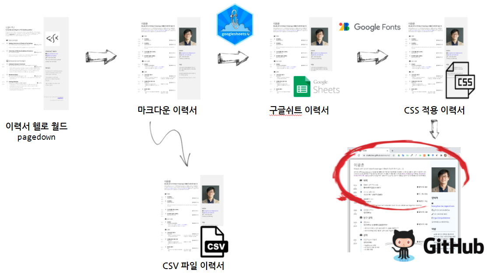
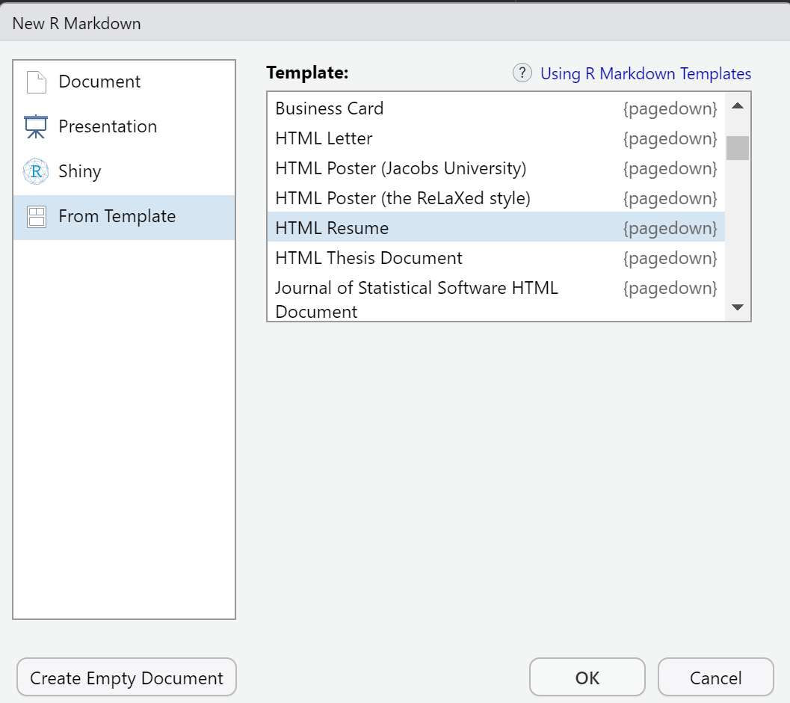
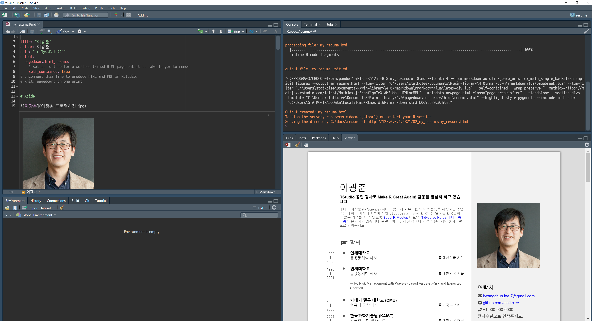

```{r setup, include=FALSE}
knitr::opts_chunk$set(echo = TRUE, message=FALSE, warning=FALSE,
                      comment="", digits = 3, tidy = FALSE, prompt = FALSE, fig.align = 'center')

library(pdftools)
library(tidyverse)
library(magick)

```



# 이력서 작성 작업흐름 {#resume-workflow}

[`pagedown`](https://github.com/rstudio/pagedown) 팩키지의 등장은 이력서 작성에 새로운 전기를 마련했다는 평가를 받고 있다. [`pagedown`](https://github.com/rstudio/pagedown)을 설치하면 내장된 기본 템플릿을 사용해서 이력서를 컴파일하여 헬로월드를 찍은 후에 마크다운 문법에 맞춰 이력서를 작성할 수도 있고 이력서의 주요내용을 데이터프레임으로 변경시킨 후에 이를 이력서에 넣는 방법도 있다. 파일을 로컬 파일에 저장시키는 것이 아니라 `googlesheets4` 팩키지를 활용하여 구글 쉬트(Google Sheets)에 이력서 기본 정보를 넣은 후에 이를 R마크다운과 결합시킬 경우 유지보수도 깔끔하고 생산성도 높일 수 있다. 마지막으로 GitHub Pages 기능을 연결해서 웹사이트에 올리는 것도 자동화시킬 수 있다.

# `pagedown` 이력서 {#pagedown-helloworld}

`pagedown`을 설치한 후 `File` → `New File` → `R Markdown ...`으로 가게 되면 HTML 이력서 작성을 위한 기본 이력서 템플릿에서 시작할 수 있다.

{width="406"}

## 작업방법 {#resume-working}

`pagedown` 이력서를 작성하는 방식은 `xaringan::inf_mr()` 을 켜고 시작하면 실시간으로 변경사항을 확인할 수 있다. 즉, `xaringan` 팩키지를 설치하고 R 콘솔에서 `xaringan::inf_mr()` 명령어를 실행하면 우측하단 이력서 변경사항을 파일을 저장하게 되면 실시간 반영되게 된다.



특히, 버전관리를 위해서 GitHub에 저장소를 파서 경우에 따라서는 private으로 코드를 작성하는 방법도 있다.

- <https://github.com/statkclee/resume>

# 이력서 헬로월드 {#pagedown-helloworld-gogo}

```{r helloworld-embed-pdf, out.height = "460px", out.width='800px', echo=TRUE}
knitr::include_graphics("data/resume/hello_world.pdf")
```


# 마크다운 한글 이력서 {#resume-korean}

`pagedown::html_resume:`는 `# Aside`와 `# Main`으로 크게 나눠져 있고 각 영역에 적절히 작성하면 된다.

```{r korean-embed-pdf, out.height = "460px", out.width='800px', echo=TRUE}
knitr::include_graphics("data/resume/my_resume.pdf")
```


# CSV 한글 이력서 {#pagedown-helloworld-gogo-csv}

```{r csv-embed-pdf, out.height = "460px", out.width='800px', echo=TRUE}
knitr::include_graphics("data/resume/csv_resume.pdf")
```


# 웹배포 이력서 {#pagedown-helloworld-web}

<https://statkclee.github.io/resume/>


