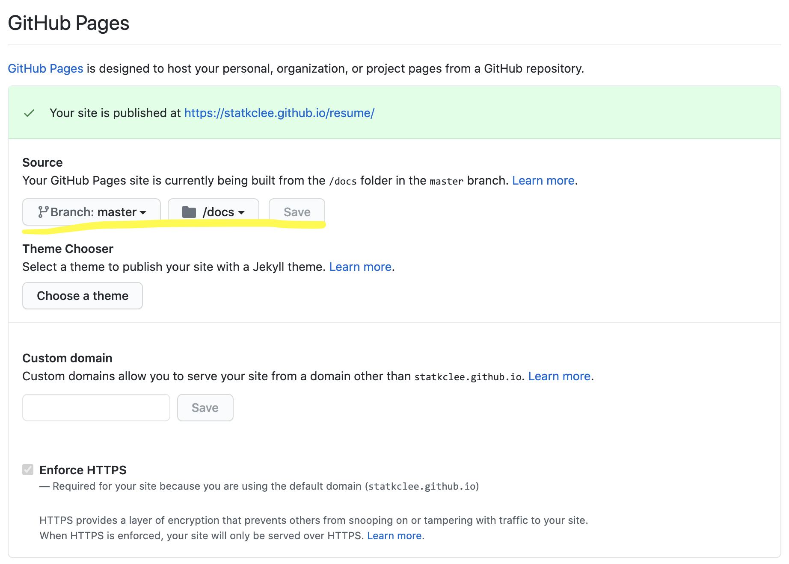
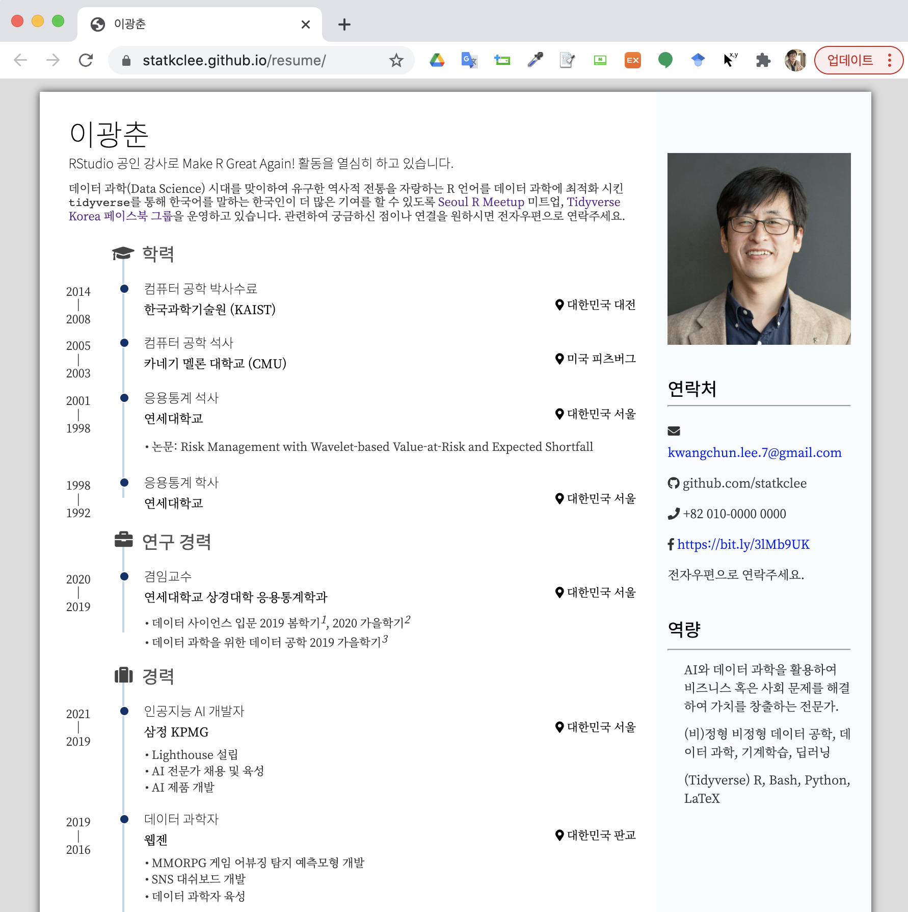

```{r setup, include=FALSE}
knitr::opts_chunk$set(echo = TRUE, message=FALSE, warning=FALSE,
                      comment="", digits = 3, tidy = FALSE, prompt = FALSE, fig.align = 'center')

library(pdftools)
library(tidyverse)
library(magick)

```


# 이력서 작성 작업흐름 [^1] [^2] {#resume-workflow}

[^1]: [Abhinav Malasi (2021-03-09), "Create Your Resume with Pagedown Package in R -Making impressive resume under 1 hour with pagedown package in R", Towards Data Science](https://towardsdatascience.com/create-your-resume-with-pagedown-package-in-r-123ca6310d52)

[^2]: [Nick Strayer (2019-09-04), "Building a data-driven CV with R"](https://livefreeordichotomize.com/2019/09/04/building_a_data_driven_cv_with_r/)

[`pagedown`](https://github.com/rstudio/pagedown) 팩키지의 등장은 이력서 작성에 새로운 전기를 마련했다는 평가를 받고 있다. [`pagedown`](https://github.com/rstudio/pagedown)을 설치하면 내장된 기본 템플릿을 사용해서 이력서를 컴파일하여 헬로월드를 찍은 후에 마크다운 문법에 맞춰 이력서를 작성할 수도 있고 이력서의 주요내용을 데이터프레임으로 변경시킨 후에 이를 이력서에 넣는 방법도 있다. 파일을 로컬 파일에 저장시키는 것이 아니라 `googlesheets4` 팩키지를 활용하여 구글 쉬트(Google Sheets)에 이력서 기본 정보를 넣은 후에 이를 R마크다운과 결합시킬 경우 유지보수도 깔끔하고 생산성도 높일 수 있다. 마지막으로 GitHub Pages 기능을 연결해서 웹사이트에 올리는 것도 자동화시킬 수 있다.

# `pagedown` 이력서 {#pagedown-helloworld}

`pagedown`을 설치한 후 `File` → `New File` → `R Markdown ...`으로 가게 되면 HTML 이력서 작성을 위한 기본 이력서 템플릿에서 시작할 수 있다.

{width="406"}

## 작업방법 {#resume-working}

`pagedown` 이력서를 작성하는 방식은 `xaringan::inf_mr()` 을 켜고 시작하면 실시간으로 변경사항을 확인할 수 있다. 즉, `xaringan` 팩키지를 설치하고 R 콘솔에서 `xaringan::inf_mr()` 명령어를 실행하면 우측하단 이력서 변경사항을 파일을 저장하게 되면 실시간 반영되게 된다.


특히, 버전관리를 위해서 GitHub에 저장소를 파서 경우에 따라서는 private으로 코드를 작성하는 방법도 있다.

- <https://github.com/statkclee/resume>

# 이력서 헬로월드 {#pagedown-helloworld-gogo}

RStudio 를 실행하고 `File` → `New File` → `R Markdown ...`으로 가게 되면 HTML 이력서 작성을 위한 기본 이력서 템플릿 선택하여 파일을 `hello_world.Rmd` 파일로 저장하고 컴파일한다.

```{r helloworld-embed-pdf, out.height = "460px", out.width='800px', echo=TRUE}
knitr::include_graphics("data/resume/hello_world.pdf")
```

```{r helloworld-tree, eval = FALSE}
01_hello_world/
├── hello_world.Rmd
├── hello_world.html
└── hello_world.pdf
```


# 마크다운 한글 이력서 {#resume-korean}

`pagedown::html_resume:`는 `# Aside`와 `# Main`으로 크게 나눠져 있고 각 영역에 적절히 작성하면 된다.

```{r korean-embed-pdf, out.height = "460px", out.width='800px', echo=TRUE}
knitr::include_graphics("data/resume/my_resume.pdf")
```

사진을 반영해야 하기 때문에 다음과 같은 디렉토리 구조를 갖는다.

```{r markdown-tree, eval = FALSE}
02_my_resume
├── my_resume.Rmd
├── my_resume.html
├── my_resume.pdf
└── profile.jpg
```


# CSV 한글 이력서 {#pagedown-helloworld-gogo-csv}

마크다운 파일에 모든 것을 작성하게 되면 파일은 단순하지만 나중에 유지보수할 때 여러 문제가 발생할 수 있으니 학력 등 정보를 `.csv` 데이터프레임으로 담아 작업하게 되면 자동화에 좀더 깔끔하게 이력서를 작성할 수 있다. 

```{r csv-embed-pdf, out.height = "460px", out.width='800px', echo=TRUE}
knitr::include_graphics("data/resume/csv_resume.pdf")
```

디렉토리와 파일구조는 다음과 같다. `.csv` 데이터를 저장시키고 R 함수를 사용해서 `csv_resume.Rmd` 파일에 앞서 마크다운으로 손수 작성한 것을 자동화 시킨다.

```{r csv-resume, eval = FALSE}
03_csv_resume/
├── R
│   ├── import_data.R
│   └── parsing_functions.R
├── csv_resume.Rmd
├── csv_resume.html
├── csv_resume.pdf
├── data
│   ├── contact_info.csv
│   ├── language_skills.csv
│   └── positions.csv
└── profile.jpg
```

[`googlesheets4`](https://googlesheets4.tidyverse.org/) 팩키지를 사용하게 되면 로컬파일로 이력서 관련 중요정보를 저장시킬 필요없이 구글 쉬트에서 바로 불러읽어 들이게 되면 이에 대한 장점도 상당하다. 다만, 구글 쉬트 파일에 대한 권한을 어떻게 관리하느냐에 따라 복잡성이 높아질 수 있다. public으로 공개하고 읽기 권한만 부여하게 되면 외부에 노출되기는 하지만 상대적으로 관리가 단순해지는 장점이 있다. 앞서 정의된 `data`가 `import_data.R` 파일 내부 `googlesheets` 기능에 흡수되어 프로젝트 구조가 훨씬 단순화 된 것을 확인할 수 있다.  

```{r googlesheets-resume, eval = FALSE}
04_googlesheet_resume/
├── R
│   ├── import_data.R
│   └── parsing_functions.R
├── googlesheets_resume.Rmd
├── googlesheets_resume.html
└── profile.jpg
```


# 웹배포 이력서 {#pagedown-helloworld-web}

마지막으로 작성된 이력서가 로컬 파일 형태 (`.html`, `.pdf`) 로 작성되어 이를 다른 사람에게 전달하게 되는 경우 아무래도 웹이 좋은 대안이 된다. 이를 위해서 GitHub 저장소를 만들고 관련 내용을 작성하고 `gh-pages` 기능을 활성화시켜 웹상에서 이력서를 바로 볼 수 있도록 개발한다. `_site.yml` 파일과 함께 `index.Rmd` 파일에 YAML 헤더에 `output_dir: "docs"` 을 지정하여 `CTRL + Shift + K` 가 아니라 `CTRL + Shift + B` 명령어로 이력서를 니트질하는 것이 아니라 웹사이트를 빌드하는 개념으로 작업한다. 

이력서 빌드 결과는 `docs/` 디렉토리에 정적 웹사이트로 저장된다. 이를 GitHub에 Push하게 되면 앞서 GitHub 저장소에서 활성화시킨 `gh-pages` 설정에 따라 웹사이트로 공개된다.




```{r web-tree, eval = FALSE}
resume/
├── LICENSE
├── R
│   ├── import_data.R
│   └── parsing_functions.R
├── README.md
├── _site.yml
├── css
│   ├── custom_resume.css
│   └── typography.css
├── docs
│   ├── LICENSE
│   ├── R
│   │   ├── import_data.R
│   │   └── parsing_functions.R
│   ├── css
│   │   ├── custom_resume.css
│   │   └── typography.css
│   ├── fig
│   │   └── profile.jpg
│   ├── index.html
│   └── site_libs
├── fig
│   └── profile.jpg
├── index.Rmd
└── resume.Rproj
```

# `css` 및 레이아웃 {#css-layout}

`custom_resume.css` 파일에 레이아웃 관련 사항(Main과 Aside의 비율 변경 등)을 정리하고 `typography.css` 파일에 글꼴 등 관련 내용을 설정하면 멋진 외양을 같는 나만의 개성있는 이력서를 작성할 수 있게 된다.

```{r css-layout, eval = FALSE}
---
title: "이광춘"
author: 이광춘
date: "`r Sys.Date()`"
output:
  pagedown::html_resume:
    css: 
      - css/custom_resume.css
      - css/typography.css
      - resume
    # set it to true for a self-contained HTML page but it'll take longer to render
    self_contained: true
# uncomment this line to produce HTML and PDF in RStudio:
# knit: pagedown::chrome_print
editor_options: 
  chunk_output_type: console
output_dir: "docs"  
---
```


- <https://statkclee.github.io/resume/>



