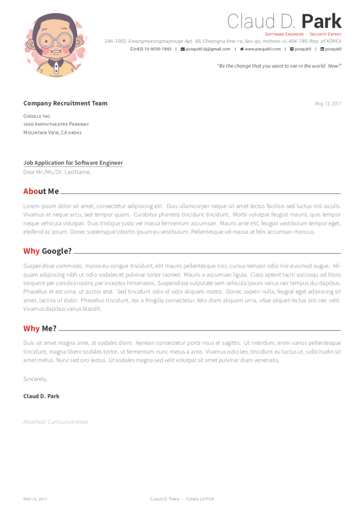
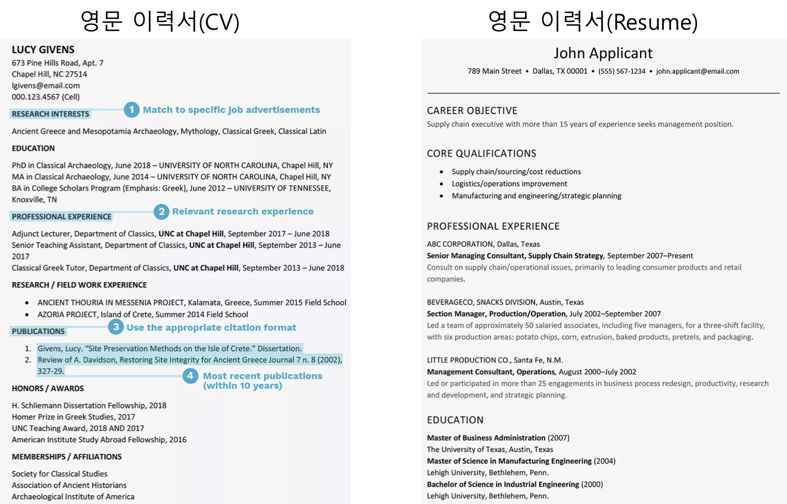
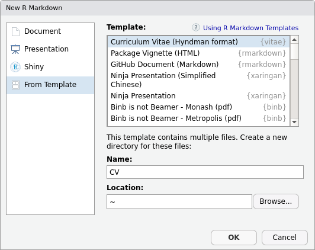
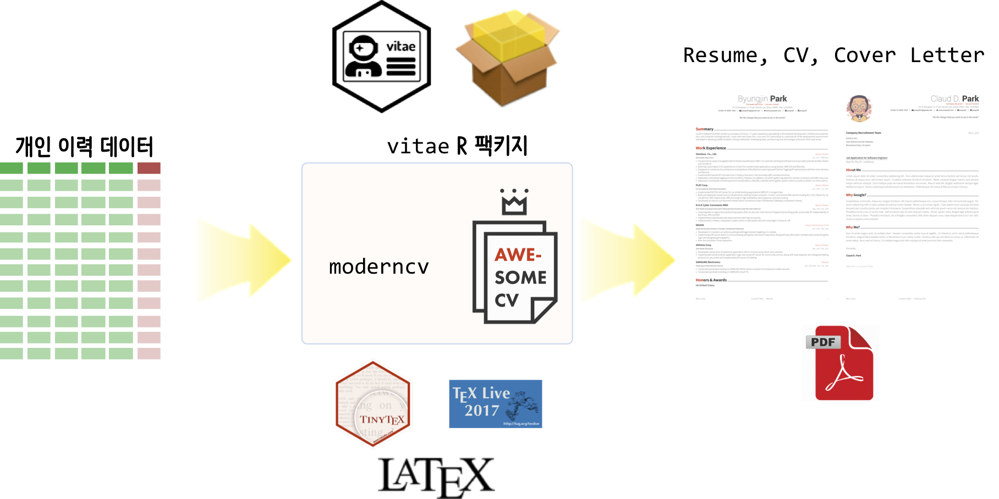

```{r setup, include=FALSE}
knitr::opts_chunk$set(echo = TRUE, message=FALSE, warning=FALSE,
                      comment="", digits = 3, tidy = FALSE, prompt = FALSE, fig.align = 'center')

library(reticulate)
# use_condaenv("anaconda3")
# reticulate::repl_python()
```

# 이력서관련 서류 [^resume-vs-cv] {#document-resume} 

[^resume-vs-cv]: [The Balance Careers, 'The Difference Between a Resume and a Curriculum Vitae'](https://www.thebalancecareers.com/cv-vs-resume-2058495)

직업을 구하기 위해서 이력서 관련 문서를 많이 만든다. 
국문 이력서, 영문 이력서, 레쥬메, 커버레터, CV 등등 용어도 많고 다양하다.
이와 관련된 문서를 정리하는 것도 나름 도움이 될 듯 싶다. 
먼저, 각각의 문서에 대한 정확한 정의부터 시작해보자.

- 커버레터(Cover Letter): 이력서가 있는데 커버레터를 작성하는 이유가 중요하다. 
인사 채용을 담당하는 사람입장에서 하루 수백명의 구직자 서류를 마주한다.
따라서, 이력서를 요약한 4~5문단으로 간결하게 구성된 표지가 필요한데 이런 역할을 
수행하는 것이 커버레터다. 이력서에 자세한 사항이 있기 때문에 채용공고(JD)와
관련된 핵심사항을 매칭되도록 (1)자기소개 및 경력기술 (2)회사에 지원 이유 
(3)본인이 채용되어야 하는 이유 (4)마무리 형식으로 작성한다.



- 이력서(Resume): 미국기준으로 이력서(resume)는 역량기반(competency-based)으로 개인 
마케팅 문서로 작성된다. 따라서, 지원자의 기술, 성과, 경력을 과장되지 않는 선에서 
본인이 해당 업무에 적합함을 기술한다.
- 이력서(Curriculum Vitae, CV): CV는 자격기반(credential-based)으로 출신학교, 자격증, 
연구논문, 특허, 과외활동 등을 쭉 적어 작성한다.


일반적인 영문 이력서 CV와 Resume에 대한 사례가 다음에 나와 있다.



# 영문 awesome-CV [^awesome-CV] {#document-resume-rmd2} 

[^awesome-CV]: [Awesome CV is LaTeX template for a CV(Curriculum Vitae), Résumé or Cover Letter](https://github.com/posquit0/Awesome-CV)

<https://github.com/posquit0/Awesome-CV> 웹사이트를 클론하여 관련된 사항을 정리하고 나서 
다음과 같이 단순하게 만든다. `cv.tex`, `resume.tex`가 중요한 $\LaTeX$ 파일이며 
복잡한 $\LaTeX$ 파일을 단순하게 하는 역할을 수행한다.
`Makefile` 파일도 다음과 같은 구조를 반영하여 `make resume.pdf` 명령어와 `make clean` 명령어로
항상 깔끔한 형태가 되도록 정리한다.

``` {r tree-structure, eval=FALSE}
resume/
├── Makefile
├── awesome-cv.cls
├── cv
│   ├── committees.tex
│   ├── education.tex
│   ├── experience.tex
│   ├── extracurricular.tex
│   ├── honors.tex
│   ├── presentation.tex
│   ├── skills.tex
│   └── writing.tex
├── cv.tex
├── fontawesome.sty
├── fonts
│   ├── FontAwesome.ttf
│   ├── Roboto-Bold.ttf
│   ├── Roboto-BoldItalic.ttf
│   ├── Roboto-Italic.ttf
│   ├── Roboto-Light.ttf
│   ├── Roboto-LightItalic.ttf
│   ├── Roboto-Medium.ttf
│   ├── Roboto-MediumItalic.ttf
│   ├── Roboto-Regular.ttf
│   ├── Roboto-Thin.ttf
│   └── Roboto-ThinItalic.ttf
├── icon.png
├── resume
│   ├── committees.tex
│   ├── education.tex
│   ├── experience.tex
│   ├── extracurricular.tex
│   ├── honors.tex
│   ├── presentation.tex
│   ├── summary.tex
│   └── writing.tex
├── resume.pdf
└── resume.tex
```

`resume.pdf` 파일을 생성하는데 필요한 `Makefile`을 다음과 같이 수정한다.

``` {r resume-makefile, eval=FALSE}
CC = xelatex

resume.pdf: resume.tex
    $(CC) $<

cv.pdf: cv.tex
    $(CC) $<

coverletter.pdf: coverletter.tex
    $(CC) $<

clean:
    -rm -f *.aux
    -rm -f *.log
    -rm -f *.toc
    -rm -f *.bbl
    -rm -f *.blg
    -rm -f *.out
```


# 국문 R마크다운 [^vitae] {#document-resume-rmd} 

[^vitae]: [Mitchell O'Hara-Wild (@mitchoharawild) Rob Hyndman (@robjhyndman), "`vitae`, Résumés and CVs for R Markdown"](https://slides.mitchelloharawild.com/vitae/)'

R마크다운으로 이력서를 제작하는 붐이 한때 일었다. 이에 대한 결론은 [`vitae`](https://github.com/ropenscilabs/vitae)
팩키지에 관련 내용이 담겨있다. `install.packages('vitae')` 명령어로 `vitae` 팩키지를 설치하게 되면 영문기준으로 [`tinytex`](https://github.com/yihui/tinytex)를
바탕으로 다양한 형태의 영문 CV, Résumés를 형태에 맞춰 작성할 수 있다.



원래 영문 이력서는 $\LaTeX$ 기반으로 작성된 템플릿을 사용하는데 이력서 데이터를 데이터프레임 형태로
변환된다는 점에 착안하여 `vitae` 프로젝트가 시작된 듯 싶다. 
사실 대부분의 HR 시스템에 인사관련 정보는 정형화된 형태 데이터로 저장되어 있는데 
반정형 이력서 텍스트 데이터를 다시 정형 데이터 형태로 변형시켜 저장하게 된다.



## 국문 이력서 {#korean-resume}

`vitae` 팩키지로 다양한 이력서 템플릿을 사용하여 제작이 가능하나 가장 큰 걸림돌은 아마도 한글을 제대로 사용할 수 없다는 것이다. 예를 들어 `vitae::hyndman:`을 템플릿 삼아 이력서를 제작할 때 `kotex`를 헤더에 포함시키고, `latex_engine: xelatex`으로 $\LaTeX$ 엔진을 지정하고, 한글 폰트를 `mainfont: NanumBarunpen` 지정할 경우 한글도 템플릿에 맞춰 제작이 가능하다.

```{r yaml-rmd, eval=FALSE}
---
name: 이광춘
surname: 
position: "데이터 과학자"
address: "서울특별시 강남구 역삼동 737"
phone: +82 010-7777-7777
www: tidyverse.info
email: "kwangchun.lee.7@gmail.com"
twitter: statkclee
github: statkclee
linkedin: statkclee
date: "`r format(Sys.time(), '%B %Y')`"
header-includes:
  - \usepackage{kotex}
output:
  vitae::hyndman:
    pdf_document:
      latex_engine: xelatex
mainfont: NanumBarunpen
---
```

## `BibTeX` 참고문헌 [^ris2bibtex] {#korean-resume-bibtex}

[^ris2bibtex]: [StackExchnage, "Convert RIS or NBIB or JSON to bibtex?"](https://tex.stackexchange.com/questions/270270/convert-ris-or-nbib-or-json-to-bibtex)

특히 `kwangchunlee.bib`에 학위논문과 저널에 기고한 학술논문을 `BibTeX` 형태 데이터베이스로 관리할 경우 이력서 제작에 탄력을 받을 수 있다.

```{bash kwangchun-bibtex}
cat tutorial/resume/kwangchunlee.bib | head -n 17
```

[구글 학술검색](https://scholar.google.com/)을 활용하여 `BibTeX` 학술 논문을 쉽게 얻을 수 있다. 하지만, 국내 대표적인 학술검색 엔진과 서비스는 `BibTeX`에 대한 제공이 없다.

- [네이버 학술정보](https://academic.naver.com/): EndNote (`.ris`), Scholar note (`.slf`)만 지원
- [RISS, 한국교육학술정보원](http://www.riss.kr/): EndNote, RefWorks 지원
- [DBpia](http://www.dbpia.co.kr/): `BibTeX`도 지원

이와 같이 EndNote (`.ris`)와 같은 형식으로 학술정보가 담겨진 경우 절대 당황하지 말고 `RIS to BibTeX` 변환방식을 구글링하여 찾아 자동 변환시킨다. 먼저 [`bibutils`](https://ctan.org/pkg/bibutils)을 설치한다. 맥의 경우 `brew install bibutils` 명령어를 사용하면 쉽게 설치할 수 있다.

```{bash install-bibutils}
brew install bibutils
```

다음으로 `ris2xml`, `xml2bib` 프로그램을 사용해서 EndNote (`.ris`) 서지목록파일을 BibTeX (`.bib`) 파일로 변환시킨다.

```{bash install-bibutils-convert}
ris2xml tutorial/resume/endNote.ris | xml2bib -b > py4inf.bib
```

<div class = "row">
  <div class = "col-md-6">
**EndNote .ris 서지목록 파일**

```{bash install-bibutils-ris}
cat tutorial/resume/endNote.ris
```

  </div>
  <div class = "col-md-6">
**BibTeX .bib 서지목록 파일**

```{bash install-bibutils-bib}
cat  tutorial/resume/py4inf.bib
```

  </div>
</div>


## 국문 이력서 {#korean-resume-bibtex-kwangchun}

앞서 학습한 내용을 바탕으로 국문 이력서를 `vitae` 팩키지를 통해 제작한 사례는 [이광춘](https://github.com/statkclee/comp_document/blob/gh-pages/tutorial/resume/resume.Rmd) Rmd 파일을 참고한다.

```{r kwanghcun}
library(magick)

kwangchun <- image_read_pdf("tutorial/resume/resume.pdf", density = 300)

kwangchun
```


