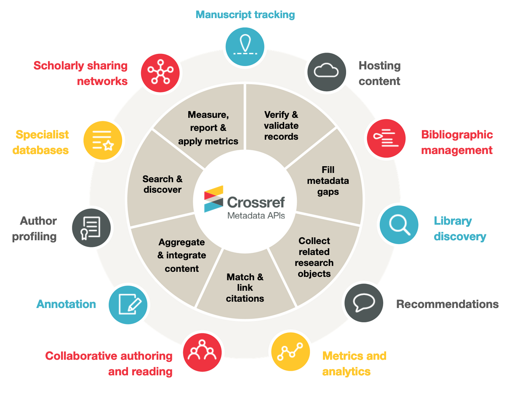

```{r setup, include=FALSE}
knitr::opts_chunk$set(echo = TRUE, message=FALSE, warning=FALSE,
                      comment="", digits = 3, tidy = FALSE, prompt = FALSE, fig.align = 'center')

library(tidyverse)
```


# [`crossref`](https://www.crossref.org/) 상호참조 [^rcrossref-tutorial] {#crossref}

[^rcrossref-tutorial]: [Clarke Iakovakis, "rcrossref", FSCI 2020 W24 Session](https://ciakovx.github.io/rcrossref.html)

[Crossref](https://www.crossref.org/) 웹사이트를 통해서 과학기술 저작물 상호참조를 확인할 수 있다.

## `crossref.org`에 대해서 {#about-crossref}

[Metadata Retrieval](https://www.crossref.org/services/metadata-retrieval/) 웹사이트에서 상호참조(Cross Reference)의 사용례를 확인할 수 있는데 [한국어 동영상](https://www.crossref.org/services/metadata-retrieval/#)을 통해서 활용사례를 살펴볼 수 있다.


## 환경설정 {#environment-setup}

`usethis::edit_r_environ()` 명령어를 통해서 "~/.Renviron" 파일을 열어 `crossref_email=name@example.com` 환경변수로 본인 전자우편주소를 등록한다.

```{r tidyverse-renviron}
library(tidyverse)

readRenviron("~/.Renviron")
```

## `rcrossref` 팩키지 [^paul-oldham-rcrossref] {#rcrossref-pkg}

[^paul-oldham-rcrossref]: [Paul Oldham, "Accessing the Scientific Literature with CrossRef"](https://poldham.github.io/abs/crossref.html)

[`rcrossref`](https://cran.r-project.org/web/packages/rcrossref/) 팩키지를 통해서 [Crossref REST API](https://github.com/CrossRef/rest-api-doc#readme)를 R에서 편하게 사용할 수 있다.

## 헬로우 월드 {#hello-world}

[ICSE, "International Conference on Software Engineering"](http://www.icse-conferences.org/) 컨퍼런스 관련 ISSN 번호가 "2308-4235" 인데 `rcrossref::cr_journals()` 함수로 검색이 되지 않는다. 대신 ["Information Sciences: Informatics and Computer Science Intelligent Systems Applications"](https://www.journals.elsevier.com/information-sciences) 저널의 ISSN 번호를 검색해 "0020-0255"을 확인하고 관련 정보를 가져온다.

```{r rcrossref-helloworld}
library(rcrossref)

# # ICSE ----------
# icse_issn <- "2308-4235"
# icse_details <- rcrossref::cr_journals(issn = icse_issn, works = FALSE)
# icse_details

# icse_issn <- "2331-8422"
info_sci_issn <- "0020-0255"
info_sci <- rcrossref::cr_journals(issn = info_sci_issn, works = FALSE)

info_sci %>% 
  pluck("data") %>% 
  select(title, publisher, issn, total_dois, deposits_funders_current)
```

`works = TRUE`로 두게 되면 해당 저널에 속한 논문에 대한 가져올 수 있는데... 앞서 `total_dois`에서 알 수 있듯이 10,000개가 넘어가기 때문에 10개만 표본으로 살펴보자.

```{r information-science-sci}
info_sci_df <- rcrossref::cr_journals(issn = info_sci_issn, works = TRUE, limit=10) %>% 
  pluck("data")

info_sci_df %>% 
  listviewer::jsonedit()
```


