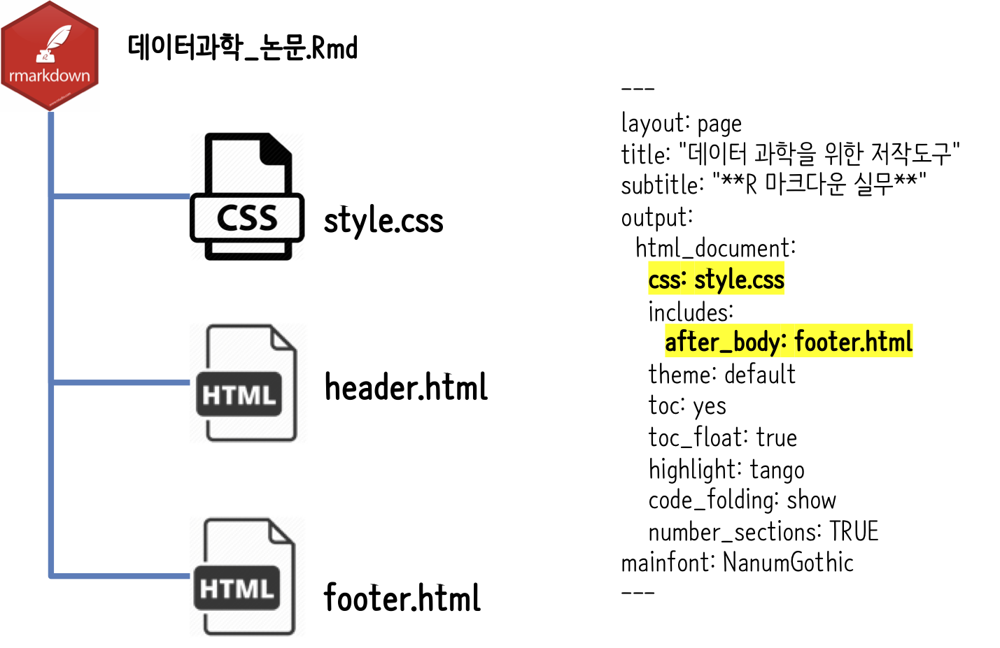

```{r, include=FALSE}
knitr::opts_chunk$set(echo = TRUE, message=FALSE, warning=FALSE,
                      comment="", digits = 3, tidy = FALSE, prompt = FALSE, fig.align = 'center')

library(tidyverse)
```


실무에서 많이 사용되는 R 마크다운 구문이 잘 정리된 블로그가 있어 [현대적인 과학논문 저작](http://statkclee.github.io/modern-scientific-authoring/index-kr.html)의 
내용에 더하여 R을 주로 사용하는 사용자에게 유용할 것으로 사료되어 블로그의 내용을 중심으로 내용을 정리하였고 몇가지 유용한 사례도 추가하였다. 특히, [Pimp my RMD: a few tips for R Markdown by Yan Holtz - 11 April 2018](https://holtzy.github.io/Pimp-my-rmd/) 내용이 많이 포함되어 있다. PIMP는 "**P**ut **I**n **M**y **P**ocket"으로 추청된다. 또한, [Pimp my RMD: a few tips for R Markdown by Yan Holtz - 10 December 2019](https://holtzy.github.io/Pimp-my-rmd/) 거의 1년만에 업데이트 되면서 추가로 추가된 사항도 많이 있다.

{#id .class width="100%"}

# 문서 형식 (Text formating) [^put-in-my-pocket-rmd] {#rmd}
***

[^put-in-my-pocket-rmd]: [Pimp my RMD: a few tips for R Markdown, by Yan Holtz - 11 April 2018](https://holtzy.github.io/Pimp-my-rmd/)

R 마크다운을 사용해서 쉽게 아무것도 없는 텍스트를 **강조**, *이태릭*은 물론이고 [링크](www.r-graph-gallery.com)도 추가할 수 있는데 자세한 내용은 [영문 컨닝쪽지(RStudio  cheatsheet)](https://www.rstudio.com/wp-content/uploads/2015/02/rmarkdown-cheatsheet.pdf)에서 확인 가능하고 한글은 [R 마크다운 컨닝쪽지](https://github.com/rstudio/cheatsheets/raw/master/translations/korean/rmarkdown-cheatsheet-kr.pdf)에서 확인 가능하다.

```{r pimp-text-format, eval=FALSE}
R 마크다운을 사용해서 쉽게 아무것도 없는 텍스트를 **강조**, *이태릭*은 물론이고 [링크](www.r-graph-gallery.com)도 추가할 수 있는데 자세한 내용은 [영문 컨닝쪽지(RStudio  cheatsheet)](https://www.rstudio.com/wp-content/uploads/2015/02/rmarkdown-cheatsheet.pdf)에서 확인 가능하고 한글은 [R 마크다운 컨닝쪽지](https://github.com/rstudio/cheatsheets/raw/master/translations/korean/rmarkdown-cheatsheet-kr.pdf)에서 확인 가능하다.
```

# 수평선 {#horizontal-line}
***
문서에 수평선을 넣어 문장이나 문단을 구분할 때 유용하게 사용될 수 있는데 이런 경우 별 3개로 간단히 처리가 된다.

``` {r horizontal-line, eval=FALSE}
***
```

***

# 제목 자동번호 넣기 {#auto-numbering}
***

큰제목, 중간제목, 작은제목, ... 표현하는데 `#`, `##`, `###`을 사용하는데 각각에 대해서 번호를 넣고자 하는 경우 YAML 헤더에 `number_sections: TRUE`를 넣어 사용하면 된다.

``` {r auto-numbering, eval=FALSE}
---
layout: page
title: 데이터 과학을 위한 저작도구
subtitle: R 마크다운 실무
output:
  html_document:
    theme: default
    toc: yes
    toc_float: true
    highlight: tango
    code_folding: show
    number_sections: TRUE
mainfont: NanumGothic
---

# 문서 형식(format) {#rmd}
## 수평선 {#horizontal-line}
## 제목 자동번호 넣기 {#auto-numbering}
```


# 줄간격 넓히기 {#skip-line}
***

줄간격을 넓혀 띄어쓰기를 하고자 할 경우 `<br>`을 넣어 준다.

``` {r skip-line, eval=FALSE}
헌법개정안 대통령 발의 
<br><br><br>
국회에서 응답
```

헌법개정안 대통령 발의 
<br><br><br>
국회에서 응답

# 이미지 가운데 정렬 {#center-image}
***

이미지를 가운데 정렬시키는데 다음 코드를 사용한다.
`{#id .class width="50%"}`을 통해 이미지 크기도 조정할 수 있다.

```{r image-center, eval=FALSE}
<center>
{#id .class width="50%"}
</center>
```

결과는 다음과 같다.

<center>
{#id .class width="50%"}
</center>


# 이미지 주변 공백 {#pimp-white-space}
***

이미지 주변 공백이 문제된다면 [Anna Quaglieri](https://twitter.com/annaquagli)님이 제안해 주신 `fig.asp` 인자값을 조정하여 해결한다. 예를 들어, `fig.asp=0.50` 값을 사용한다.

- fig.width=3,
- fig.height=3
- fig.align='center'
- cache=TRUE
- fig.cap="Lovely Kangaroo from the Mornington Peninsula."
- fig.asp=0.50

```{r fig.width=3,fig.height=3,fig.align='center',cache=TRUE,fig.cap="Lovely Kangaroo from the Mornington Peninsula.",fig.asp=0.50}
library(png)
library(grid)
img <- readPNG("fig/kan.png")
grid.raster(img)
```

# Footer and header {#add-footer}
***

HTML 문서의 `header.html`, `footer.html` HTML 파일에 관련된 내용을 저장시키고 나서 `.Rmd` 파일에 이를 반영시킨다. 필요한 경우, [fontawesome.com](https://fontawesome.com/) 웹사이트에서 적절한 아이콘을 선택한다.


```{r footer-header, eval=FALSE}
&nbsp;
<hr />
<p style="text-align: center;"> 데이터 과학자 <a href="https://github.com/statkclee/">이광춘</a> 저작</p>
<p style="text-align: center;"><span style="color: #808080;"><em>kwangchun.lee.7@gmail.com</em></span></p>
<!-- Add icon library -->
<link rel="stylesheet" href="https://cdnjs.cloudflare.com/ajax/libs/font-awesome/4.7.0/css/font-awesome.min.css">
<!-- Add font awesome icons -->
<p style="text-align: center;">
  <a href="https://education.rstudio.com/trainers/people/lee+kwangchun/" class="fa fa-registered"></a>
	<a href="https://www.facebook.com/groups/tidyverse/" class="fa fa-facebook"></a>
	<a href="https://www.linkedin.com/in/kwangchunlee/" class="fa fa-linkedin"></a>
	<a href="https://github.com/statkclee/" class="fa fa-github"></a>
</p>
&nbsp;
```

`footer.html` 파일에 상기 내용을 저장시키고 나서, `.Rmd` 파일 YAML 영역에 다음과 같이 포함시키도록 지정한다.


```{r pimp-footer-yaml, eval=FALSE}
layout: page
title: "데이터 과학을 위한 저작도구"
subtitle: "**R 마크다운 실무**"
output:
  html_document:
    includes:
      after_body: footer.html
    theme: default
    toc: yes
    toc_float: true
    highlight: tango
    code_folding: show
    number_sections: TRUE
mainfont: NanumGothic
```

`footer.html` 파일을 반영한 후 모습은 다음과 같다.

<center>

</center>


# 이미지 캡션(caption) {#add-caption}
***

다음과 같이 `fig.cap` 인자를 지정하여 이미지에 짧은 해설문(caption)을 단다. 즉, 그래프 캡션(caption)을 넣는 방식은 다음과 같이 R 코드 덩어리(chunk)에 `fig.cap`에 명세를 한다.

```{r add-figure-caption, eval=FALSE}
{r, fig.align="center", fig.width=6, fig.height=6, fig.cap="그림 1: 정말 짧은 해설문 을 caption이라고 영어로 번역한다."}
```

```{r added-ggplot, message=FALSE, warning=FALSE, fig.align="center", fig.width=6, fig.height=6, fig.cap="그림 1: 정말 짧은 해설문 을 caption이라고 영어로 번역한다."}
mpg %>%
  ggplot( aes(x=reorder(class, hwy), y=hwy, fill=class)) + 
    geom_boxplot() +
    xlab("class") +
    theme(legend.position="none")
```

# 고급 이미지 캡션(caption) {#add-caption-custom}

사용자 정의 캡션을 다음과 같이 `style.css` 파일에 적어 활용할 수 있다.
즉 `style.css` 파일에 `p.caption` 내부에 이미지에 대한 짧은 설명문 캡션을 원하는 형태로 기록해둔다.

```{r custom-caption, eval=FALSE}
<style>
p.caption {
  font-size: 0.9em;
  font-style: italic;
  color: grey;
  margin-right: 10%;
  margin-left: 10%;  
  text-align: justify;
}
</style>
```

<style>
div.custom_caption { font-size: 0.9em; font-style: italic; color: grey; margin-right: 10%; margin-left: 10%; text-align: justify;}
</style>
<div class = "custom_caption">

```{r added-ggplot2, echo=FALSE, message=FALSE, warning=FALSE, fig.align="center", fig.width=6, fig.height=6, fig.cap="그림 1: 정말 짧은 해설문 을 caption이라고 영어로 번역한다."}
mpg %>%
  ggplot( aes(x=reorder(class, hwy), y=hwy, fill=class)) + 
    geom_boxplot() +
    xlab("class") +
    theme(legend.position="none")
```
</div>

# $LaTeX$ 수식 {#math-equation}

수학공식 등 수식을 넣을 경우 `$` 사이에 $LaTeX$ 수식을 넣어 작성한다.

$$A = (\pi * \lambda \times r^{4}) / \alpha $$

```{r latex-math-formula, eval=FALSE}
$A = (\pi * \lambda \times r^{4}) / \alpha $
```


# R 코드 덩어리: verbatim [^verbatim-rcode]  {#columns2-graph}
***

[^verbatim-rcode]: [Get verbatim R chunks in R Markdown
](https://gist.github.com/jennybc/8add4496cbef43324c59)

R 코드 덩어리(R Code chunk)를 문자 그대로 `.Rmd` 파일에 담을 필요가 있다.
다양한 방법이 있는데, `<pre><code> R 코드 덩어리 </code></pre>`으로 감싸는 것이다.

```{r verbatim-code, comment = ""}
"{r whatever}
boxplot(1:10)
plot(rnorm(10))
" -> verbatim_string

cat("<pre><code>```", verbatim_string, "```</code></pre>", sep = "")
```

# 2칼럼 그래프 나란히 {#columns2-graph-side-by-side}
***

R 코드 덩어리(R Code chunk)에 `out.width=c('50%', '50%'), fig.show='hold', fig.align='default'`을 추가하면 생성되는 그래프를 나란히 놓을 수 있다.

<pre><code>```{r out.width=c('30%', '70%'), fig.show='hold', fig.align='default'}
boxplot(1:10)
plot(rnorm(10))```</code></pre>


```{r base_columns, out.width = c("30%","70%"), fig.show='hold', fig.align='default', echo=FALSE}

boxplot(1:10) # 주석

mpg %>% # ggplot
  ggplot( aes(x=reorder(class, hwy), y=hwy, fill=class)) + 
    geom_boxplot() +
    xlab("class") +
    theme(legend.position="none")
```

## 그래프를 나란히 {#side-by-side-graph}

그래프를 나란히 놓고자 할 경우 다음과 같이 코드를 작성한다.

${r two-figure, out.width=c('50%', '50%'), fig.show='hold'}$

``` {r two-figure, out.width=c('50%', '50%'), fig.show='hold', fig.align='default'}
boxplot(1:10)

plot(rnorm(10))
```

또다른 방식은 `gridExtra` 등 팩키지를 사용하여 그래프를 작성할 때 먼저 그래프를 

``` {r two-figure-gridextra}
library(gridExtra)
library(tidyverse)

smpl_df <- rnorm(100) %>% as_tibble()

box_g <- ggplot(smpl_df, aes(x="", y=value)) +
    geom_boxplot()

hist_g <- ggplot(smpl_df, aes(x=value)) +
    geom_histogram()


grid.arrange(box_g, hist_g, ncol=2)
```


# 다단 편집 {#multi-column-edit}
*** 

R 마크다운은 [bootstrap framework](https://getbootstrap.com/docs/4.0/layout/grid/)를 사용하기 때문에 화면을 횡으로 12칸으로 구분하기 때문에 이를 적절히 나눠서 $6 \times 2$, $4 \times 3$, $3 times 4$와 같이 나눠 다단 편집하여 사용할 수 있다.

```{r multi-column, eval=FALSE}
<div class = "row">
  
  <div class = "col-md-4">
  <br><br> **R 마크다운**이 bootstrap framework를 사용한다는 놀라운 사실
  </div>
  
  <div class = "col-md-4">
  <br><br> **bootstrap framework**
  
  - Bootstrap Theme: https://startbootstrap.com/themes/
  - Jekyll Themes: http://jekyllthemes.org/
  </div>
  
  <div class = "col-md-4">
  
  ``{r, message=FALSE, echo=TRUE, eval=FALSE}
  ggplot( mtcars, aes(x=mpg)) + 
    geom_histogram(fill="skyblue", alpha=0.5) + 
    theme_minimal()
  ``
  </div>
</div>
```

<div class = "row">
  
  <div class = "col-md-4">
  <br><br> **R 마크다운**이 bootstrap framework를 사용한다는 놀라운 사실
  </div>
  
  <div class = "col-md-4">
  <br><br> **bootstrap framework**
  
  - Bootstrap Theme: https://startbootstrap.com/themes/
  - Jekyll Themes: http://jekyllthemes.org/
  </div>
  
  <div class = "col-md-4">
  
  ```{r multi-column-ggplot, message=FALSE, echo=FALSE}
  ggplot( mtcars, aes(x=mpg)) + 
    geom_histogram(fill="skyblue", alpha=0.5) + 
    theme_minimal()
  ```
  </div>
</div>

## R 코드 나란히 {#rcode-side-by-side}

`<div>` 태글 사용하여 `col-md-6` 값을 조정해서 이등할 수도 있고, `col-md-4`를 3회 사용하여 3등분하는 것도 가능하다.

<div class = "row">
  <div class = "col-md-6">
**입력사례**

열심히... 입력합니다. 

  </div>
  <div class = "col-md-6">
**복사하여 붙여넣기**

컨트롤+C , 컨트롤+V

  </div>
</div>

***

```{r side-by-side, eval=FALSE}
<div class = "row">
  <div class = "col-md-6">
**입력사례**

열심히... 입력합니다. 

  </div>
  <div class = "col-md-6">
**복사하여 붙여넣기**

컨트롤+C , 컨트롤+V

  </div>
</div>

```


# R Meetup {#buttons .tabset .tabset-fade .tabset-pills}
***

`tabset`을 적용하여 각 하위 장이나 절마다 탭을 생성하는데 먼저 `style.css`에 다음 내용을 반영시킨다.

```{r css-button, eval=FALSE}
.btn {
    border-width: 0 0px 0px 0px;
    font-weight: normal;
    text-transform: ;
}
.btn-default {
    color: #2ecc71;
    background-color: #ffffff;
    border-color: #ffffff;
}
```

본격적으로 R 코드 청크를 작성한다.

```{r tab-button, eval=FALSE}
# R Meetup {.tabset .tabset-fade .tabset-pills}

Welcome to the R 커뮤니티!!!

## 첫번째 R Meetup
R Meetup의 성공을 기원합니다.

## 두번째 R Meetup
많은 분들이 모였습니다.

## 세번째 R Meetup
우와 ~~~
```

***

## 1번째 Meetup

Welcome to the R 커뮤니티!!!

## 2번째 Meetup

많은 분들이 모였습니다.

## 3번째 Meetup

R Meetup의 성공을 기원합니다.

# `DT` 인터랙티브 표 {#DT-interactive-table}

`DT` 팩키지를 사용해서 인터랙티브 표를 생성할 수 있다.
다음과 같은 설정을 하게 되면 좀더 수월하게 원하는 깔끔한 인터랙티브 표를 생성시킬 수 있다.

- 10줄 대신 5~7줄만 표로 출력
- 깔끔한 인터랙티브 표 외양 갖추기
- 검색기능
- 각 칼럼별로 필터 추가
- 등등...

```{r interactive-DT, warning=FALSE}
mtcars %>% 
  DT::datatable(rownames = FALSE, filter="top", options = list(pageLength = 5, scrollX=T) )
```

# 특정 문단 강조 {#text-really-highlight}
***

특정 문단을 강조하고자 할 경우 다음과 같이 `<style> ... </style>`을 정의하고 
`<div class = "blue"> ... </div>`로 뽑아내서 사용한다.


```{r text-highlight, eval=FALSE}
<style>
div.blue { background-color:#e6f0ff; border-radius: 5px; padding: 10px;}
</style>
<div class = "blue">

- R Meetup 10회
- 발표해주시고 참여해주신 분들 감사드립니다.

</div>
```

<style>
div.blue { background-color:#e6f0ff; border-radius: 5px; padding: 10px;}
</style>
<div class = "blue">

- R Meetup 10회
- 발표해주시고 참여해주신 분들 감사드립니다.
</div>

# `YAML` 헤더 {#yaml-header}
***

## 기본기능 [^yaml-theme] {#rcode-hide}

[^yaml-theme]: [R friend, "rmarkdown HTML 문서의 포맷 정하기"](https://rfriend.tistory.com/311)

- R 코드 보이기 숨기기
    - `code_folding: show`
    - `code_folding: hide`
- 목차 추가
    - `toc: yes`
- 코드 색상 강조
    - `highlight: tango`
- 단원별 숫자 자동 부여 
    - `number_sections: TRUE`

```{r yaml-header, eval=FALSE}
---
layout: page
title: "데이터 과학을 위한 저작도구"
subtitle: "**R 마크다운 실무**"
output:
  html_document:
    css: style.css
    includes:
      in_header: header.html
      after_body: footer.html
    theme: default
    toc: yes
    toc_float: true
    highlight: tango
    code_folding: show
    number_sections: TRUE
mainfont: NanumGothic
---
```


## PDF 파일 {#yaml-pdf}

`tinytex`를 설치한 후에 output:에서 `latex_engine: xelatex`로 지정하고, `pandoc_args`를 지정하여 PDF 파일을 하나로 만든다. 마지막으로 잊지 말아야 할 것이 `mainfont : NanumGothic`로 한글 폰트를 잊지말고 꼭 지정한다.

PDF 엔진 설치부터 한글 PDF 문서 출력을 위한 자세한 사항은 [$LaTeX$ PDF 문서](https://statkclee.github.io/comp_document/comp_doc_pdf.html)를 참조한다.

```{r yaml-header-pdf, eval=FALSE}
---
layout: page
title: "Computational Document"
subtitle: "$\LaTeX$ `PDF` 문서"
author:
    name: 이광춘 (KPMG)
    affilates: 데이터 과학자
date: "`r Sys.Date()`"
always_allow_html: yes
output:
    pdf_document :
      latex_engine : xelatex
      pandoc_args:
          - --standalone
mainfont : NanumGothic
---
```

# Github 리본 {#github-ribbons}

[GitHub 리본](http://tholman.com/github-corners/) 웹사이트에 적절한 GitHub 리본을 찾아 이를 `header.html` 파일에 저장시킨다. 그리고 나서 YAML 헤더에 `in_header: header.html`와 같이 지정하면 본 문서에 대한 HTML 원본 저작파일을 재현가능하게 GitHub 저장소에 연결시킬 수 있다.


