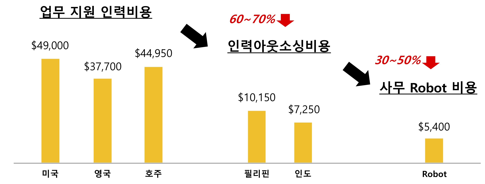
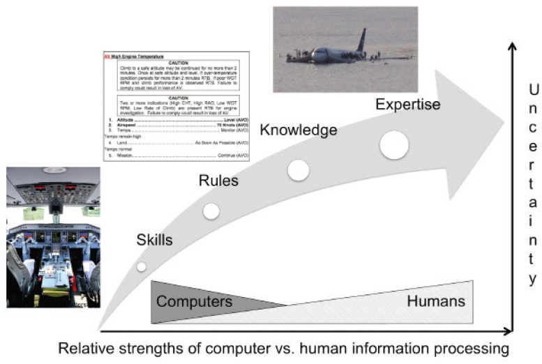

```{r setup, include=FALSE}
knitr::opts_chunk$set(echo = FALSE, message=FALSE, warning=FALSE,
                      comment="", digits = 3, tidy = FALSE, prompt = FALSE, fig.align = 'center')

library(tidyverse)
library(knitr)
library(kableExtra)
library(rvest)
library(extrafont)
loadfonts()


# 마크다운 표 --> 데이터프레임 변환 도우미 함수
# https://stackoverflow.com/questions/48087762/markdown-table-to-data-frame-in-r
read_markdown <- function(file, trim_ws = TRUE, ...){
    if (length(file) > 1) {
        lines <- file
    } else {
        lines <- readr::read_lines(file)
    }
    lines <- lines[!grepl('^[[:blank:]+-=:_|]*$', lines)]
    lines <- gsub('(^\\s*?\\|)|(\\|\\s*?$)', '', lines)
    readr::read_delim(paste(lines, collapse = '\n'), delim = '|', 
                      trim_ws = trim_ws, ...)
}

```


# 들어가며  {#intro}

과거에는 숫자를 다룰 수 있는 사람만이 암산으로 숫자 계산을 할 수 있었다. 그러나 주판의 탄생으로 주판을 사용하는 사람과 사용하지 못하는 사람의 생산성은 수십배에서 수천배의 차이가 나기 시작했다. 영국의 수학자인 찰스 배비지가 기계장치 계산기를 발명하면서 주판을 대체했으나 사칙연산의 이해만으로도 어마어마한 생산성과 정확도를 높인 것은 명확히 증명 되었다.

이후, 개인용 컴퓨터의 보급으로 비지칼크와 로터스 1-2-3가 그 가능성을 열었다면 마이크로소프트 엑셀 스프레드시트 프로그램이 세무사 업무 생산성 또한 엄창나게 올린 것도 사실이다. 

```{r, out.width = "100%", dpi = 200, fig.cap="세무 업무 변천사"}
knitr::include_graphics("fig/tax-preparation.png")
```

이제 문제가 되는 것은 PC 매거진\cite{yakal_2020}에 소개된 세금관련 프로그램이 $39 에 불과하다는 점이다. 1년 세무업무를 개인의 경우 4만원에 사용할 수 있으므로 세무사가 이런 자동화된 기계와 경쟁에서 승리할 수 있을까 많은 의문이 들기 시작했다.

```{r tax-exam}
library(tidyverse)
library(rvest)

tax_url <- "http://www.wcpa.co.kr/cta/info_ystats.php"

# Sys.setlocale("LC_ALL", "C")

exam_df <- tax_url %>% 
  read_html() %>% 
  html_node(xpath = '/html/body/div[1]/div[2]/div/div[2]/div[2]/div/ul[2]/li/div/table') %>% 
  html_table(fill = TRUE)

# Sys.setlocale("LC_ALL", "Korean")

exam_df %>% 
  gather(year, value, -`구분`) %>% 
  filter(구분 == "합격자") %>% 
  select(연도=year, 합격자=value) %>% 
  knitr::kable(format = "latex", booktabs = TRUE)

```
**Table 1 연도별 세무사 합격자**

인터넷 기사 \cite{tax_2019} 내용에 따르면 2008년부터 11년간 630명가량을 다소 편차가 있지만 꾸준히 뽑아왔다. 현재 한국세무사회에 등록된 [개인 및 법인현황](http://www.kacpta.or.kr/)을 통해 12,973명이 개업하여 활동하고 있는 것으로 집계된 것이 확인된다.

그러나 최근 인공지능의 발전으로 단순히 숫자 연산 외에도 자연어 처리 (NLP, Natural Language Processing) 기술도 가파른 속도로 발전하기 시작했다. 그래서 세무사와 유사한 직업군인 회계사 또는 주로 문자를 다루는 직업군인 법률/변호사 일자리를 위협하기 시작했다. 그 외에도 이미지 인식 기술도 급격히 향상되고 있어서 의사를 비록한 시각 인지 업무에 중요한 역할을 수행하고 있어 향후 다양한 측면의 직업군에 상당한 변화를 줄 것으로 예상된다.


# 기계에 대체되는 일자리  {#challenge-to-human}

바둑 역사상 최고의 기사 이창호를 이기고 최강자에 굴림해온 전설적인 이세돌 9단이 구글 (Google)의 딥마인드 회사가 개발한 인공지능 바둑 프로그램 ‘알파고’에 패배하며 전세계를 충격에 빠뜨렸다. 그 외에도 중국에서 랭킹 1위인 커제 9단도 알파고와의 대결에서 패하면서 울분을 참지 못하고 눈물을 흘리기도 했고 5명의 프로 기사가 그룹을 이뤄 집단지성을 적극 활용하여 알파고와 승부한 적도 있지만 결과는 달라지지 않았다. 비록 이세돌 9단은 대한민국 게임 서비스 회사인 NHN에서 20년 동안 학습한 바둑 프로그램 ‘한돌’과 2점을 먼저 놓는 접바둑으로 \cite{zdnet_2019} 대결을 했지만 2승 1패라는 결과로 평생 함께한 바둑의 길을 마쳤다.

기계\cite{brynjolfsson2014second, ford2015rise, kaplan2015humans, chang_2017}는 빠르게 부상하고 있으며 비교적으로 직업 능력이 낮은 기계 조립 같은 분야에는 인공지능 기술이 일자리를 대체하기 시작했다.

대부분의 사람은 오감(시각, 후각, 청각, 촉각, 미각) 중에서 시각을 가장 중요한 감각이라고 꼽는다. 그 이유는 감각기관을 통해서 획득하는 정보의 90% 이상이 시각을 통해서 얻어진다는 점에 기인한다. 이것이 의미하는 바는 그동안 기계에 대해 인간이 가지고 있는 절대우위가 사실 시각지능에 기인한다는 점이다.  또한, 창작은 기계가 범접할 수 없는 고유한 인간의 영역이라고 믿어졌지만, 생성적 적대 신경망 **GAN(Generative Adversarial Network)**\cite{brownlee_2019, hui_2018}의 등장으로 창작, 예술 분야에도 인간의 응전이 요구되기 시작했다. GAN은 이안 굿펠로우(Ian Goodfellow)가 신경 정보처리 시스템 학회 (NeurIPS) 에서 발표한 뒤로 딥러닝의 대가인 얀 르쿤(Yann Lecun) 교수도 GAN을 최근 10년간 머신러닝 연구 중 가장 혁신적인 아이디어로 극찬했다.

```{r, dpi = 200, out.width="49%", fig.show='hold',fig.align='center', fig.cap="GAN:생성,판별 모델링 과정"}
knitr::include_graphics(c("fig/generative-model.png", "fig/discriminative-model.png"))
```

그림을 그리는 것은 화가라는 전업 직업을 만들 만큼 인간 고유의 영역으로 생각되었으나 기계로부터 도전받는 가장 직관적인 설명이 가능한 분야 중 하나로 전락하고 말았다. [Keras-GAN](https://github.com/eriklindernoren/Keras-GAN) GitHub 사이트에는 `pix2pix`, `CycleGAN`을 포함한 다양한 시각적인 사례를 살펴볼 수 있다. 이외에도 인간 시각지능과 관련된 분야로 다음을 들 수 있다.

- 이미지 생성(Image generation): GAN을 사용하여 기계가 이미지를 자동으로 생성할 수 있다. 예를 들어 자동 로고생성기 등. [GitHub: alex-sage/logo-gen](https://github.com/alex-sage/logo-gen)
- 텍스트로 이미지 합성 (Text-to-image synthesis): 영화 산업에서 시나리오가 있는 상태에서 텍스트를 기초로 하여 이미지를 자동 생성시킴. [Nikunj Gupta, "Text-to-Image Synthesis", Medium](https://medium.com/datadriveninvestor/text-to-image-synthesis-6e5de1bf86ec), [GitHub, text-to-image](https://github.com/crisbodnar/text-to-image)
- 얼굴 노화(Face Aging): 연애 산업과 보안 산업에서 특히 유용한데 보안의 경우 얼굴 노화과정을 GAN을 통해 모델을 갖춤으로써 직원의 노화에 따라 신규 시스템으로 바꿀 필요가 없다. [GitHub, yuanzhaoYZ/Face-Aging-CAAE](https://github.com/yuanzhaoYZ/Face-Aging-CAAE)
- 이미지를 다른 이미지로 번역(image-to-image-translation): 흑백이미지를 칼러 이미지로, 스케치 이미지를 색칠된 이미지로, 이미지를 피카소나 반고흐 스타일로 번역하는 것을 통해 시간을 상당히 줄일 수 있다. [GitHub topics: image-to-image-translation](https://github.com/topics/image-to-image-translation)
- 고화질 이미지 생성(High-resolution image generation): 저해상도 카메라 이미지를 고화질 이미지로 변환. [david-gpu/srez](https://github.com/david-gpu/srez)
- 결측된 이미지 채워넣기(completing missing parts of images), [Github topic: image-completion](https://github.com/topics/image-completion): 이미지의 빠진 부분을 채워넣거나 불필요한 부분이 있다면 지워서 결측시킨 후에 이미지를 채워넣는다. 

최근 딥러닝을 이용한 분야가 이미지에만 한정된 것이 아니라 자연스럽게 사람들이 사용하는 자연어에도 사용이 된다. 
인공지능을 활용한 저작은 GitHub에도 특별한 주제로 다룰 정도로 다양한 프로젝트가 진행되고 있다. 기계는 텍스트를 생성하는 것 말고도 음악을 만드는 것도 가능해졌다. 이런한 추세가 대세로 잡은 이면에는 빅데이터로 회자되는 데이터 축적의 세대가 한동안 지속되면서 클라우드 기반 위에서 이를 활용하여 모형을 만들 수 있는 든든한 토대가 마련되었기 때문이다.
기계로 텍스트 외에도 그림도 생성하고 음악도 제작이 가능하게 되면서 이를 조합한 연극 또는 영화 제작도 당연히 가능하게 되었다.

- [GitHub topic: text-generation](https://github.com/topics/text-generation)
    - [Maluuba NewsQA dataset](https://github.com/Maluuba/newsqa)
    - [Multi-task Question and Answer Generation](https://github.com/Maluuba/qgen-workshop)
- 음악(music)
    - [museGAN](https://salu133445.github.io/musegan/)
    - [Rachel Chen (Dec 13, 2017), "Generating Ambient Music from WaveNet", Medium](https://medium.com/@rachelchen_49210/generating-ambient-noise-from-wavenet-95aa7f0a8f77)
    - [tensorflow/magenta](https://github.com/tensorflow/magenta)
    - [Abraham Khan(Dec 15, 2018), "Generating Pokemon-Inspired Music from Neural Networks", Medium](https://towardsdatascience.com/generating-pokemon-inspired-music-from-neural-networks-bc240014132)
- 연극(play)
    - [World Models](https://worldmodels.github.io/)
    - [Dylan's blog (June 06, 2018), "World Models applied to Sonic"](https://dylandjian.github.io/world-models/)


# 일자리 변동의 결과 {#wage-productivity-result}

생산성과 임금격차, 보울리의 법칙, 노동인력 참여율을 통해 확인되는 공통된 사항은 1980년 이후 일자리에 구조적인 변동이 생겼다는 점이다. 데이터 과학을 활용하여 생산성과 임금격차 데이터, 노동소득 분배율 데이터, 노동인력 참여율 데이터를 받아 시각화하게 되면 이러한 변화를 직관적으로 확인할 수 있다.

## 생산성과 임금 격차 {#wage-productivity-gap}

```{r productivity-gap, dev="cairo_pdf", out.width="100%", fig.cap="생산성과 시간당 급여"}
productivity_gap <- tribble(~"Year",~"Hourly compensation", ~"Net productivity",
"1948", "0.00%"  ,"0.00%",
"1949", "6.24%"  ,"1.55%",
"1950", "10.46%"  ,"9.34%",
"1951", "11.74%"  ,"12.24%",
"1952", "15.02%"  ,"15.49%",
"1953", "20.82%"  ,"19.41%",
"1954", "23.48%"  ,"21.44%",
"1955", "28.70%"  ,"26.38%",
"1956", "33.89%"  ,"26.59%",
"1957", "37.08%"  ,"30.04%",
"1958", "38.08%"  ,"32.72%",
"1959", "42.46%"  ,"37.63%",
"1960", "45.38%"  ,"40.06%",
"1961", "47.84%"  ,"44.37%",
"1962", "52.32%"  ,"49.80%",
"1963", "54.86%"  ,"55.03%",
"1964", "58.32%"  ,"59.94%",
"1965", "62.27%"  ,"64.92%",
"1966", "64.70%"  ,"69.95%",
"1967", "66.68%"  ,"71.98%",
"1968", "71.05%"  ,"77.13%",
"1969", "74.39%"  ,"77.85%",
"1970", "76.81%"  ,"80.35%",
"1971", "81.66%"  ,"87.10%",
"1972", "91.34%"  ,"92.20%",
"1973", "90.96%"  ,"96.96%",
"1974", "87.05%"  ,"93.83%",
"1975", "86.86%"  ,"98.11%",
"1976", "89.35%"  ,"103.59%",
"1977", "92.82%"  ,"106.05%",
"1978", "95.66%"  ,"108.27%",
"1979",  "93.25%",  "108.11%",
"1980", "88.05%"  ,"106.77%",
"1981", "87.36%"  ,"110.50%",
"1982", "87.70%"  ,"108.37%",
"1983", "88.49%"  ,"114.51%",
"1984", "87.03%"  ,"120.21%",
"1985", "86.18%"  ,"123.65%",
"1986", "87.25%"  ,"128.28%",
"1987", "84.67%"  ,"128.80%",
"1988", "84.02% ",  "132.01%",
"1989", "83.93%"  ,"134.12%",
"1990", "82.37%"  ,"136.95%",
"1991", "82.02%"  ,"138.50%",
"1992", "83.20%"  ,"147.48%",
"1993", "83.46%"  ,"148.51%",
"1994", "83.89%"  ,"150.54%",
"1995", "82.76%"  ,"151.59%",
"1996", "82.87%"  ,"156.24%",
"1997", "84.87%"  ,"160.72%",
"1998", "89.27%"  ,"166.21%",
"1999", "91.98%"  ,"173.46%",
"2000", "92.96%"  ,"179.47%",
"2001", "95.60%"  ,"183.71%",
"2002", "99.49%"  ,"191.50%",
"2003", "101.58%",  "201.22%",
"2004", "100.56%",  "209.29%",
"2005", "99.73%"  ,"215.29%",
"2006", "99.88%"  ,"217.61%",
"2007", "101.45%",  "219.78%",
"2008", "101.39%",  "221.39%",
"2009", "109.30%",  "228.75%",
"2010", "111.00%",  "238.23%",
"2011", "108.47%",  "238.21%",
"2012", "106.50%",  "239.57%",
"2013", "108.40%",  "240.96%",
"2014", "109.08%",  "242.91%",
"2015", "112.41%",  "245.75%",
"2016", "114.39%",  "246.34%",
"2017", "114.67%",  "249.78%",
"2018", "115.62%",  "252.90%")

productivity_gap_df <- productivity_gap %>% 
  mutate(`Hourly compensation` = parse_number(`Hourly compensation`) / 100,
         `Net productivity`    = parse_number(`Net productivity`) / 100,
         Year = as.integer(Year)) 

productivity_gap_long_df <- productivity_gap_df %>%
  mutate(gap = abs(`Net productivity` - `Hourly compensation`)) %>% 
  gather(metric, value, - Year)

productivity_gap_long_df %>% 
  ggplot(aes(x=Year, y=value, group=metric, color=metric)) +
    geom_line() +
    geom_point(size=0.3) +
    scale_y_continuous(labels = scales::percent) +
    theme_bw(base_family="NanumBarunpen") +
    labs(x="", y="", title="Productivity growth and hourly compensation growth, 1948-2018",
         color="생산성과 시간당 급여",
         caption="자료출처: https://www.epi.org/productivity-pay-gap/") +
    theme(legend.position = "top") +
    facet_wrap(~metric)
```

그동안 생산성이 오르면 임금도 따라 오른다고 믿어왔다. 그러나 경제 정책 연구소(Economic Policy Institute)\cite{economic_policy_institute_2019}에 따르면 생산성이 오른다고 임금도 같이 따라 오르지는 않는다는 현상이 1979년 부터 심화되고 있다는 최근 연구 결과를 발표했다. 데이터\cite{bivens2014raising}를 통해서 분석해본 결과 시간당 임금은 1980년부터 별다른 변동이 없으나 순생산성은 1980년 이전과 마찬가지로 꾸준히 오르고 있다. 따라서, 시간당 임금과 생산성의 차이는 지속적으로 벌어지고 있는 현실을 볼 수 있다.


## 보울리 법칙(Bowley's Law) {#bowley-law}

```{r labor-share-us, dev="cairo_pdf", out.width="100%", fig.cap="미국 노동소득분배율 연도별 추이 (1948 - 2018)"}
labor_share <- tribble(~"date",	~"share",
"1948-01-01",	"49.3",
"1949-01-01",	"49.7",
"1950-01-01",	"49.3",
"1951-01-01",	"49.9",
"1952-01-01",	"50.9",
"1953-01-01",	"51.6",
"1954-01-01",	"50.9",
"1955-01-01",	"50.1",
"1956-01-01",	"50.7",
"1957-01-01",	"50.6",
"1958-01-01",	"50.2",
"1959-01-01",	"49.8",
"1960-01-01",	"50.2",
"1961-01-01",	"49.8",
"1962-01-01",	"49.5",
"1963-01-01",	"49.3",
"1964-01-01",	"49.3",
"1965-01-01",	"49.0",
"1966-01-01",	"49.5",
"1967-01-01",	"50.1",
"1968-01-01",	"50.3",
"1969-01-01",	"51.0",
"1970-01-01",	"51.6",
"1971-01-01",	"50.6",
"1972-01-01",	"50.2",
"1973-01-01",	"49.9",
"1974-01-01",	"50.2",
"1975-01-01",	"48.7",
"1976-01-01",	"48.5",
"1977-01-01",	"48.2",
"1978-01-01",	"48.1",
"1979-01-01",	"48.5",
"1980-01-01",	"48.8",
"1981-01-01",	"47.7",
"1982-01-01",	"47.6",
"1983-01-01",	"46.9",
"1984-01-01",	"46.2",
"1985-01-01",	"46.3",
"1986-01-01",	"46.7",
"1987-01-01",	"46.9",
"1988-01-01",	"46.6",
"1989-01-01",	"46.3",
"1990-01-01",	"46.7",
"1991-01-01",	"46.4",
"1992-01-01",	"46.3",
"1993-01-01",	"45.9",
"1994-01-01",	"45.3",
"1995-01-01",	"45.3",
"1996-01-01",	"45.1",
"1997-01-01",	"45.2",
"1998-01-01",	"45.8",
"1999-01-01",	"46.1",
"2000-01-01",	"46.6",
"2001-01-01",	"46.3",
"2002-01-01",	"45.3",
"2003-01-01",	"44.8",
"2004-01-01",	"44.3",
"2005-01-01",	"43.4",
"2006-01-01",	"43.2",
"2007-01-01",	"44.3",
"2008-01-01",	"44.9",
"2009-01-01",	"43.8",
"2010-01-01",	"42.6",
"2011-01-01",	"42.4",
"2012-01-01",	"42.1",
"2013-01-01",	"41.9",
"2014-01-01",	"41.9",
"2015-01-01",	"42.5",
"2016-01-01",	"42.9",
"2017-01-01",	"43.2",
"2018-01-01",	"43.2")

library(dygraphs)
library(xts)

## Dataframe --> XTS
labor_share_df <- labor_share %>% 
  mutate(date = lubridate::ydm(date),
         share = parse_number(share)/100)

labor_share_df %>% 
  ggplot(aes(x=date, y=share)) +
    geom_line() +
    geom_point() +
    labs(title = "미국 노동소득분배율 연도별 추이 (1948 - 2018)", 
         y = "노동소득분배율(%)") +
    scale_y_continuous(labels = scales::percent) +
    theme_bw(base_family="NanumBarunpen")
```

앞서 언급한 임금과 노동생산성 간 격차의 지속적 증가는 노동소득분배율 (labour income share)의 감소로 연결된다. 노동소득분배율은 총국민소득 중 노동소득이 차지하는 비중이며 보울리의 법칙은 경제성장이나 발전과는 상관없이 기능적 소득분배(functional income distribution)가 장기적으로 일정하다는 가설\cite{lee_2014}이다. 그러나 최근에 이 가설에는 변화가 생기기 시작했다. 

FRED Economic Data [^share-income] 데이터를 분석해본 결과 미국은 1970년부터 2010년까지 노동소득분배율이 50%에서 42% 이하로 가파른 속도로 감소했다. International Labor Organization (ILO)의 세계 임금 보고서\cite{ilo2015labour}에는 산업구조 변화와 기술 변화, 세계화, 금융화(financialization), 노동시장과 복지정책의 약화 등이 감소 원인이라고 제시하고 있다.

[^share-income]: [Shares of gross domestic income: Compensation of employees, paid: Wage and salary accruals: Disbursements: to persons (W270RE1A156NBEA)](https://fred.stlouisfed.org/series/W270RE1A156NBEA)

## 노동인력 참여율 {#labor-participation}

```{r fred-data-labor-participation, dev="cairo_pdf", out.width="100%", fig.cap="미국 노동참여율 연도별 추이 (1948 - 2018)", eval=FALSE}
library(fredr)
library(xts)
fredr_set_key(FRED_KEY)

## Labor Force Participation Rate (CIVPART)	데이터 가져오기
labor_participation <- fredr(
  series_id = "CIVPART",
  observation_start = as.Date("1948-01-01")
) %>% 
  mutate(value = value/100)

labor_participation %>% 
  ggplot(aes(x=date, y=value)) +
    geom_line() +
    geom_point(size=.3) +
    labs(title = "미국 노동참여율 연도별 추이 (1948 - 2018)", 
         y = "노동참여율(%)") +
    scale_y_continuous(labels = scales::percent) +
    theme_bw(base_family="NanumBarunpen")
```

[Federal Reserve Bank of ST. Louis](https://research.stlouisfed.org/docs/api/api_key.html)에서 제공하는 데이터를 받아 분석한 결과 1965년부터 가파른 속도로 노동참여율이 증가했으나 2000년은 정점으로 하락하기 시작했다.


# 일자리 변동 원인 - 산업 {#automation-job-statistics} 

이러한 급격한 노동시장의 변화를 단순히 산업적인 요인만으로 설명을 하기에는 한계가 있으며 기술적인 면도 함께 살펴봐야 한다. 대표적으로 과거 세계화 전략을 통한 제조와 생산에 필요한 인력을 인건비가 저렴한 해외에서 찾았으나 인공지능 기술의 진화로 생산과 제조, 유통은 물론 마케팅과 고객 서비스 등 다양한 분야에서 효율적이고 경쟁력있게 사용되며 일자리에 커다란 변화가 생기기 시작했다.

## 소싱전략의 변화 {#strategy-change}

Kinetics consulting services / Automation Anywhere 자료에 의하면 비정규직 인력 아웃소싱 비용도 현재 시점에서 사무 로봇을 사용하게 되면 더욱 줄일 수 있다는 조사결과를 제시하고 있다. 예를 들면 미국, 영국, 호주 등 업무지원 인력 비용이 높은 선진국들은 경쟁력을 갖추고자 인력비용이 상대적으로 낮은 필리핀, 인도 등 영어가 가능하고 24시간 고객지원이 가능한 나라로 소싱 전략을 변경했다. 그러나 이제는 제3세계 업무지원 비용도 (사무)로봇을 활용하여 새로운 소싱 전략 변화를 실행에 옮기기 시작했다.

```{r, out.width = "100%", dpi = 200, fig.cap="소싱 전략의 변화"}

```

## 산업용 로봇  {#industrial-robot}

산업용 로봇에 대한 기사\cite{ahlstrom_2019}에 따르면 2010년을 기점으로 8년 동안 산업용 로봇은 대략 300,000대 이상 공급되며 엄청난 성장세로 증가했다. 특히 2008년 금융위기 후 산업용 로봇 공급이 급격히 늘어난 추세를 확인할 수 있다. 그 외에도 기사에 반영하지 못한 가장 최근 추세를 추가해서 시각화 해본 결과 그 범위와 자동화를 통한 일자리 영향이 어느 정도 될지 예측이 가능하다.

```{r industrial-robot, dev="cairo_pdf", out.width="100%", fig.cap="전세계 연간 산업용 로봇 공급대수"}
robot_url <- "https://en.wikipedia.org/wiki/Industrial_robot"

robot_dat <- robot_url %>%
  read_html() %>%
  html_nodes(xpath='//*[@id="mw-content-text"]/div/table[2]') %>%
  html_table(fill = TRUE) %>% 
  .[[1]]

robot_dat %>% 
  tbl_df %>% 
  mutate(supply = parse_number(supply)) %>% 
  ggplot(aes(x=Year, y=supply)) +
    geom_line() +
    geom_point() +
    expand_limits(y=0) +
    scale_y_continuous(labels = scales::comma) +
    theme_bw(base_family = "NanumBarunpen") +
    labs(x="", y="산업용 로봇 공급대수", title="전세계 연간 산업용 로봇 공급대수")
```


# 일자리 변동원인 - 자동화  {#automation-overview}

기계(Machine)라 하면 우선 기계장치를 떠올릴 수 있지만, 영어로 머신(machine)은 인공지능을 탑재한 컴퓨터로도 의미한다. 자동화 수준을 전혀 컴퓨터, 즉 기계의 도움없이 모든 결정과 행동을 사람이 취하는 수준과 인간을 배제하고 기계가 모든 의사결정을 내리고 자율적으로 운전, 판결, 세금계산 등 완전한 자동화\cite{cummings2014man}까지 수준을 나눌 수 있다. 이미 사회에 많은 부분이 자동화 되었거나 아니면 자동화가 진행 중이거나 혹은 완전한 자동화가 진행되었다.  


```{r automation-lvl}
auto_tbl <- "| 자동화 수준 | 자동화 수준 설명 |
|:-----------:|:------------------------------------------|
|     1       | 컴퓨터는 어떤 도움도 주고 있지 못함: 사람이 모든 결정을 해야하고 행동도 취해야 함 |
|     2       | 컴퓨터가 대안이 될 수 있는 의사결정 목록과 행동목록을 제시함 |
|    3       | 선택지를 몇개로 줄여줌 |
|    4       | 대안을 제시함  |
|    5       | 사람이 승인하면 제안된 것을 실행함.  |
|    6       | 자동 실행하기 전에 사람에게 거부권을 행사할 시간을 부여함 |
|    7       | 자동으로 실행하고 나서, 필요할 때만 인간에게 통보함 |
|    8       | 컴퓨터가 요청을 받을 때만 인간에게 통보함 |
|    9       | 컴퓨터가 결정을 내려야 될 때만, 인간에게 통보함 |
|   10       | 인간을 배제하고, 컴퓨터가 모든 결정을 내리고 행동도 자율적으로 취함."

read_markdown(auto_tbl) %>% 
  knitr::kable(format = "latex", booktabs = TRUE) %>% 
  kable_styling(latex_options = c("striped", "scale_down"))
```
**Table 2 자동화 수준**


## 사람과 기계 비교 {#man-human-comparison}

사람과 기계는 서로 잘하는 영역이 나눠져 있었다. 단어를 찾거나 글자 수를 세는 단순하고 반복적인 작업은 컴퓨터에게는 쉬운 작업이다. 반면, 논문이나 책을 읽는 것은 현재 기술로는 한계가 있다. 인간은 지루하고 반복된 문제를 해결하는데 적합하지 않지만 컴퓨터는 추상적이고 일반화하는 작업에 적합하지 않다. 이 사실은 1970년대 미국 카네기 멜론 대학 (CMU) 로봇 공학자 한스 모라벡(Hans Moravec) 교수의 **모라벡의 역설(Moravec's paradox)**로 잘 알려져 있다.

```{r human-comparison-rmarkdown}
md_tbl <- "|   속성  |        사람         |         기계        |
|:---------:|:---------------------:|:---------------------:|
|   속도  |  상대적으로 느림    |        탁월함       |
| 경격출력 | 상대적으로 약함    | 일관된 작업에 우수성을 보임 |
| 일관성  | 믿을 수 없는 학습능력과 피로 | 일관되고 반복적인 작업에 이상적임 |
| 정보처리능력 | 주로 한개 채널   | 멀티 채널 |
| 기억     | 원칙과 전략에 좋음. 다재다능하고 혁신적임 |문자 그대로 재현하는데 이상적임, 형식적임 |
| 추론 계산 | 귀납적, 프로그램하기 더 좋고, 느리고, 오류 수정 좋음 | 연역적, 프로그램하기 귀찮고, 빠르고 정확, 오류 수정 나쁨 |
| 감지(sensing) | 넓은 감지 반경, 다기능, 분별력 | 정량적 평가에 좋지만, 패턴인식에는 나쁨 |
| 인지(perceiving) | 변화에 더 잘 대응 | 잡음에 취약하여 변화에 잘 대응 못함. |"

read_markdown(md_tbl) %>% 
  knitr::kable(format = "latex", booktabs = TRUE) %>% 
  kable_styling(latex_options = c("striped", "scale_down"))
```
**Table 3 사람과 기계 차이점**

## 모라벡의 역설(Moravec's paradox)

한스 모라벡은 1970년대에 컴퓨터와 인간의 능력 차이를 역설적으로 표현하며 다소 직설적인 발언을 하였다. 즉, 인간은 걷기, 느끼기, 듣기, 보기, 의사소통 등의 일상적인 행위는 매우 쉽게 할 수 있는 반면 복잡한 수식 계산 등을 하기 위해서는 많은 시간과 에너지를 소비해야 한다. 반대로 컴퓨터는 인간이 하는 일상적인 행위를 수행하기 매우 어렵지만 수학적 계산, 논리 분석 등은 쉽게 해결할 수 있다.

[^moravec]: ‘it is comparatively easy to make computers exhibit adult level performance on intelligence tests or playing checkers, and difficult or impossible to give them the skills of a one-year-old when it comes to perception and mobility’

모라벡 역설의 사례로 최근 인공지능 학습의 난제중 하나를 꼽으라면 여전히 다음과 같은 분류 문제를 들 수 있다. 머핀과 치와와 혹은 아이스크림과 고양이를 분류 시켜야 하면 사람들은 쉽게 구분할 수 있으나 기계는 다양한 알고리즘을 사용하여 학습을 시켜 결과를 얻는다. 그러나 정확성은 높게 나오지 않는 경우가 많다.

```{r, out.width = "100%", dpi = 200, fig.cap="모라벡의 역설: 치와와와 머핀, 아이스크림과 고양이"}
knitr::include_graphics("fig/moravec-paradox.png")
```


## 중국어 방 주장 {#chinese-room}

중국어 방 혹은 중국인 방(영어: Chinese room) \cite{wikipedia_2019}은 존 설(John Searle)이 튜링 테스트로 기계의 인공지능 여부를 판정할 수 없다는 것을 논증하기 위해 고안한 사고실험이다.

> 우선 방 안에 영어만 할 줄 아는 사람이 들어간다. 그 방에 필담을 할 수 있는 도구와 미리 만들어 놓은 중국어 질문과 질문에 대한 대답 목록을 준비해 둔다. 이 방 안으로 중국인 심사관이 중국어로 질문을 써서 넣으면 방 안의 사람은 준비된 대응표에 따라 답변을 중국어로 써서 심사관에게 준다.

안에 어떤 사람이 있는지 모르는 심사관은 당연히 중국어를 할 줄 아는 사람이 있을 거라고 생각할 것이다. 그러나 안에 있는 사람은 중국어 질문을 이해하지 않고 주어진 표에 따라 대답할 뿐이다. 이를 통해 중국어로 질문과 답변을 받은 결과가 완벽해도 안에 있는 사람이 중국어를 정확히 이해했는지 판정하기 어렵다는 결론을 얻는다. 이와 마찬가지로 지능이 있어서 질문 답변을 수행할 수 있는 기계가 있어도 그것이 지능을 가졌는지는 **튜링 테스트**로만 판정할 수 없다는 주장이다. 

결국 다음과 같이 컴퓨터, 인간, 인공지능을 비교할 수 있다.
중국어 방을 인간으로 비유하면 외형적인 몸체이고 컴퓨터를 하드웨어라고 가정하면 질문과 답변을 입출력으로 정의할 수 있으며 질문&대답 목록과 처리 규칙을 담은 알고리즘을 데이터베이스/알고리즘, 습득된 경험, 지식, 지능으로 대응할 수 있다. 

```{r latex-table-info}
ai_comp_tbl <- '|  인공지능 |       컴퓨터      |       인간            |
|:---------:|:-----------------:|:---------------------:|
| 중국어 방 |      하드웨어     | 인간의 외형적인 몸체  |
| 영어만 할 줄 아는 사람| 소프트웨어| 인간의 지능 |
| 중국어로 된 질문 | 입력(Input) | 인간이 외부에서 접할 수 있는 자극 |
| 중국어로 된 답변 | 출력(Output) | 인간이 외부에서 접한 자극에 대한 반응 |
| 질문&대답 목록 | 데이터베이스(Database) | 습득된 기억 |'

read_markdown(ai_comp_tbl) %>% 
  knitr::kable(format = "latex", booktabs = TRUE) %>% 
  kable_styling(latex_options = c("striped", "scale_down"))
```
**Table 4 컴퓨터와 인간 비교**

# 사람과 기계 업무 분장 {#man-human-boundary}

자동화 수준을 1에서 10 등급으로 구분 한다면 사람과 기계 사이의 업무 분장 경계를 적당한 등급으로 나눠야 자동화 처리를 통해 해당 문제에 최선의 결과를 얻어낼 수 있다. 달에 사람을 보내는 아폴로 계획에서 사람과 기계의 역할을 어떻게 구분하는 것이 좋은지는 오랜동안 사람과 기계의 업무 분장에 대해 논란이 되었던 대표적인 사례이다. 


```{r, out.width = "77%", dpi = 200, fig.cap="S-R-K-E 비행기 적용 업무분장"}

```


듀크 대학과 MIT 소속 매리 커밍스(Mary Cummings) 교수는 기존 (Skill-Rule-Knowledge, S-R-K) 틀에 E(Expertise)를 추가하여 다음과 같이 기계와 사람이 잘하는 분야, 즉 자동화가 되는 영역과 자동화의 도움을 받아 더 효과를 볼 수 있는 영역으로 범주화 시켰다. 매리 커밍스 교수가 F-18 여성 조종사 경력이 있어 이를 일반인들이 이해하기 쉽도록 항공 사례를 예시로 들고 있다.


```{r, out.width = "77%", dpi = 200, fig.cap="사람 감독 아래 제어(Human Supervisory Control)"}
knitr::include_graphics("fig/human-supervisory-control.png")
```


매리 커밍스 교수는 이를 '사람 감독 아래 제어'(Human Supervisory Control)로 명명하였다.
최근 자동화 기계는 드론, 무인 자동차, 무인 화물자동차, 무인 비행기, 무인 선박 모두 센서와 액추에이터를 통해서 자동으로 설정한 목표를 달성하게 되어 있지만 이는 중앙 컴퓨터의 제어를 받는다. 중앙 컴퓨터 제어는 결국 사람이 화면을 보고 제어 로직을 심어둔 것으로 크게 볼 수 있다. 


```{r test-rmarkdown}
srke_tbl <- "| 인지 작업 (cognitive behavior/task) | 자동화 정도(degree of automation) |
|:--------------------------:|--------------------------|
| 기량(skill-based)        | 자동화에 최적화됨. 물론 내외부 상태와 오류 피드백에 대한 신뢰성있는 센서를 가정 |
| 규칙(rule-based)         | 자동화 가능한 대상. 물론 규칙집합이 잘 만들어지고 테스트된 것을 가정 |
| 지식(knowledge-based)    | 일부 자동화를 통해 데이터를 조직화하고, 필터링하고, 합성하는데 도움을 줌 |
| 전문적 식견(expertise)   | 사람이 가장 잘 할 수 있지만, 팀동료로 자동화 기계를 통해 도움을 받을 수 있음 |"

read_markdown(srke_tbl) %>% 
  knitr::kable(format = "latex", booktabs = TRUE) %>% 
  kable_styling(latex_options = c("striped", "scale_down"))
```
**Table 5 인지 작업과 자동화 정도**


# 결어 {#conclusion}

문헌조사와 실증 데이터 분석을 통해 일자리 구조에 근본적인 변화가 일어난 것을 확인했다.
이러한 구조 변화의 원인으로 소싱전략의 변화 등 산업적인 요인도 작용했으나 그보다는 근본적으로 인공지능 기계의 부상으로 인해 인지기능을 장착한 기계가 앞으로 인간의 일자리 대체를 가속화시킬 것으로 예상된다.

하지만, 기계가 가지고 있는 본질적인 한계가 존재하는 바, 이를 인간이 상대우위를 갖는 점을 적극 활용하여 사람 주도하에 기계를 제어하는 체계가 열어가는 일자리에 좀더 많은 관심을 가져야 된다.
과거 인간과 기계의 경쟁구도로 일자리를 제로썸 게임으로 바라봤다면, 이제는 기계를 통한 자동화의 본질을 직시하고, 기계와 인간이 공존하며 만들어가는 새로운 패러다임을 받아들일 준비를 할 시점이 되었다. 

