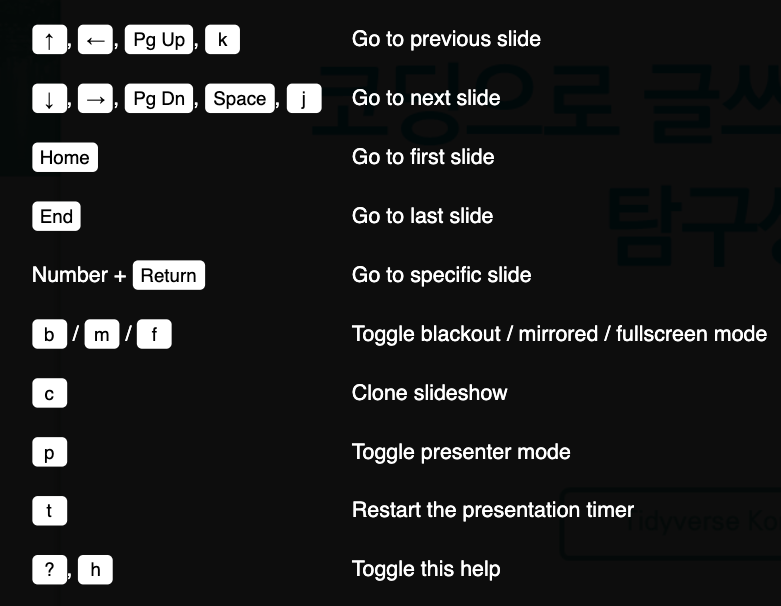

```{r setup, include=FALSE}
options(htmltools.dir.version = FALSE)
knitr::opts_chunk$set(echo = TRUE, message=FALSE, warning=FALSE,
                      comment="", digits = 3, tidy = FALSE, prompt = FALSE, fig.align = 'center')

library(tidyverse)

```

```{r xaringan-themer, include=FALSE, warning=FALSE}
library(xaringanthemer)
style_duo_accent(
  primary_color = "#1381B0",
  secondary_color = "#FF961C",
  inverse_header_color = "#FFFFFF"
)
```

background-image: url(https://upload.wikimedia.org/wikipedia/commons/b/be/Sharingan_triple.svg)

???

Image credit: [Wikimedia Commons](https://commons.wikimedia.org/wiki/File:Sharingan_triple.svg)

---
# 2 칼럼 - 5:5 비율

.pull-left[

### R 코드 

```{r hello-world}
random_var <- rnorm(1000); mean(random_var)
```

```{r hello-world-ggplot}
random_df <- tibble(var = random_var)

random_df %>% ggplot(aes(x=var)) +
    geom_histogram()
```

]
.pull-right[

### 외부 그림 이미지


]


---
# 2 칼럼 - 2:8 비율


.left-column[
### 외부 그림

]

.right-column[
### R 코드 

```{r hello-world-two-columns, fig.height=2}
random_var <- rnorm(1000); mean(random_var)

random_df <- tibble(var = random_var)

random_df %>% ggplot(aes(x=var)) +
    geom_histogram()
```
]

---
# Tidyverse Korea

--
KRUG Fork?

--
### Facebook 페북 그룹

--
## Seoul R 미트업

---
# 코드 강조

.pull-left[
R 코드

````markdown
`r ''````{r code-highlight}
random_var <- rnorm(1000)
# mean(random_var)

random_df <- tibble(var = random_var)

random_df %>% 
  ggplot(aes(x=var)) + #<<
    geom_histogram()
```
````
]

.pull-right[
출력결과

```{r code-highlight-output, eval = TRUE, fig.height=4}
random_var <- rnorm(1000)
# mean(random_var)

random_df <- tibble(var = random_var)

random_df %>% 
  ggplot(aes(x=var)) + #<<
    geom_histogram()
```

]

---
# 출력결과 강조

.pull-left[
R 코드

````markdown
`r ''````{r 출력결과, highlight.output=c(1, 5, 7)}
random_df %>% 
  sample_n(10)
```
````
]

.pull-right[
출력결과

``` {r 출력결과, highlight.output=c(1, 5, 7), echo=FALSE}
random_df %>% 
  sample_n(10)
```

]

---
# 이미지 크기 조정

R마크다운에서 많이 사용되는 이미지 삽입 구문, 예를 들어, `{width=17px}`은 사용될 수 없어 다음과 같이 HTML `img` 태그를 사용하거나, `knitr::include_graphics()` 태그를 사용한다. 

.pull-left[
### HTML `img` 태그

``

]

.pull-right[
### R 코드 덩어리

````markdown
`r ''````{r image-resize}
knitr::include_graphics("fig/xaringan-hex.png")
```
````

```{r xaringan-logo, out.width = "20%", echo=FALSE}
knitr::include_graphics("fig/xaringan-hex.png")
```
]

---
background-image: url(fig/xaringan-hex.png), url(fig/xaringan-hex.png) 
background-position: 5% 100%, 100% 5%
background-size: 5%, 10%

# 로고 삽입

좌측하단, 우측상단에 다음과 같이 로고를 삽입한다. 

```{r insert-logo, eval = FALSE}
background-image: url(fig/xaringan-hex.png), url(fig/xaringan-hex.png) 
background-position: 5% 100%, 100% 5%
background-size: 5%, 10%
```

---
# 키보드 단축키


```{r keyboard-shortcuts, fig.align="center", fig.width=3, echo=FALSE}

```


